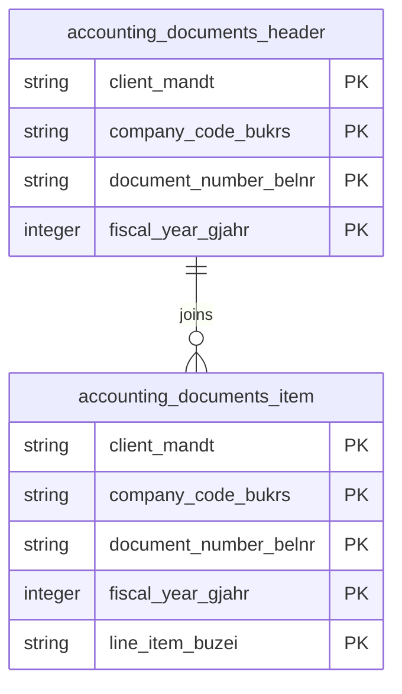

# Accounting Documents Data Product

This data product includes information about SAP accounting documents from the Financial Accounting (FI) module in the Finance domain in SAP S/4HANA or SAP ECC. The Accounting Documents data product provides clean, analytics-ready financial transaction models from SAP ERP accounting document headers and segments. It enables high-fidelity financial reporting, auditing, and general ledger line item analytics for enterprise finance teams.

## 1. Overview & Business Value

*   **Business Purpose:** Captures header and line-item financial transaction records across SAP ECC and S/4HANA systems. It resolves currency decimal shifts dynamically via `tcurx` and enriches posting/entry dates with calendar date dimensions to provide a consistent foundation for financial balance sheet and P&L analysis.
*   **Key Metrics & Use Cases:**
    *   **Financial Reporting & Dashboards:** Balance sheet preparation, P&L statements, and executive finance dashboards.
    *   **Audit & Compliance:** Line item transaction tracing, document flow auditing, and clearing reconciliation.

## 2. Data Assets Catalog

This data product exposes the following BigQuery data assets:

| Data Asset | Description | Source Systems |
| :--- | :--- | :--- |
| `accounting_documents_header` | This view is based on SAP S/4HANA or SAP ECC Financial Accounting (FI) module in the Finance domain and provides accounting document header metadata from SAP BKPF (e.g., posting dates, entry dates, user details, document status, and currency keys), enriched with calendar date dimensions for financial reporting. The data is captured at the granularity of Client (System), Company Code, Accounting Document Number, and Fiscal Year, ensuring a unique audit trail for every record. | `SAP ECC` / `SAP S/4HANA` |
| `accounting_documents_item` | This view is based on SAP S/4HANA or SAP ECC Financial Accounting (FI) module in the Finance domain and provides detailed accounting document line items from SAP BSEG (e.g., amounts, taxes, accounts, and order details) with dynamically adjusted currency decimal shifts, enriched with calendar date dimensions. The data is captured at the granularity of Client (System), Company Code, Accounting Document Number, Fiscal Year, and Line Item, ensuring a unique audit trail for every record. | `SAP ECC` / `SAP S/4HANA` |### Entity Relationship Diagram (ERD)

## 3. Data Foundation & Source Tables

To build these assets, the following source tables must be available in the data foundation layer:

| Source Table | Name / Description | System Source | Used by Asset(s) |
| :--- | :--- | :--- | :--- |
| `bkpf` | Accounting Document Header | `Common` | `accounting_documents_header`, `accounting_documents_item` |
| `bseg` | Accounting Document Segment | `Common` | `accounting_documents_item` |
| `tcurx` | Decimal Places for Currency Codes | `Common` | `accounting_documents_item` |
| `t005` | Countries Table | `S4-only` | `accounting_documents_item` |

## 4. Transformations & Design Decisions

This section details the critical engineering and design decisions behind the transformations.

### A. Granularity & Primary Keys

*   **`accounting_documents_header`**: Granularity is one row per accounting document header. Primary keys are `client_mandt`, `company_code_bukrs`, `document_number_belnr`, and `fiscal_year_gjahr`.
*   **`accounting_documents_item`**: Granularity is one row per document line item. Primary keys are `client_mandt`, `company_code_bukrs`, `document_number_belnr`, `fiscal_year_gjahr`, and `line_item_buzei`.

### B. Joins & Relationship Logic

*   **`accounting_documents_header`**: LEFT JOINed to `calendar_date_dim` three times to resolve document date (`bldat`), posting date (`budat`), and entry date (`cpudt`).
*   **`accounting_documents_item`**: LEFT JOINed to `bkpf` to align header context, joined to `tcurx` to perform currency decimal shifts for monetary fields, and joined to `calendar_date_dim` to resolve clearing date (`augdt`) and value date (`valut`).

### C. Incremental Load Strategy

*   **Supported Materialization Types:** `incremental`
*   **Incremental Logic:**
    *   **`accounting_documents_header`**: Delta updates are performed using the `recordstamp` column on `bkpf`.
    *   **`accounting_documents_item`**: Delta updates are performed using the `GREATEST` `recordstamp` comparison between `bseg` and `bkpf`.
    *   **Merge Policy:** `EXTEND` on schema change.

### D. ERP Source System Differences (ECC vs. S/4HANA)

*   **`accounting_documents_header` & `accounting_documents_item`**: Separate Dataform `.js` definitions are maintained in `ecc/` and `s4/` subdirectories to accommodate schema differences (e.g. S/4HANA specific fields and header currency replication differences in BSEG).

### E. Field Conversions & Calculations

*   **Decimal Shifts (Currency):** Uses helper logic joining `tcurx` to adjust decimal representations of currency amounts based on currency codes.

## 5. Change Log

| Date | Type of change | Change details |
| :--- | :--- | :--- |
| 24.06.2026 | Release | Release candidate validation completed. |
