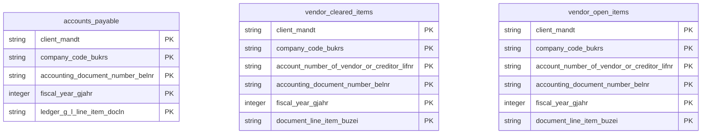

# Accounts Payable Data Product

This data product includes information about SAP accounts payable from the Financial Accounting (FI) module in the Finance domain in SAP S/4HANA or SAP ECC. It provides a unified view of accounts payable across legacy open items, cleared transactions, and universal ledger journal entries. It covers core financial domains including vendor ledger accounting, payment terms optimization, and liability tracking, supporting enterprise cash-flow analytics and automated reconciliation pipelines.

## 1. Overview & Business Value

*   **Business Purpose:** Provides a unified view of accounts payable across legacy open items, cleared transactions, and universal ledger journal entries. It covers core financial domains including vendor ledger accounting, payment terms optimization, and liability tracking, supporting enterprise cash-flow analytics and automated reconciliation pipelines.

*   **Key Metrics & Use Cases:**
    *   **Metric/Use Case 1:** Unified enterprise reporting and operational tracking.
    *   **Metric/Use Case 2:** High-fidelity analytics and AI-ready data ingestion.

## 2. Data Assets Catalog

This data product exposes the following BigQuery data assets:

| Data Asset | Description | Source Systems |
| :--- | :--- | :--- |
| `accounts_payable` | This view is based on SAP S/4HANA Financial Accounting (FI) module in the Finance domain and provides a unified view of accounts payable from the SAP S/4HANA universal ledger journal entries (ACDOCA, BKPF, BSEG), filtered by Vendor account type to support cash-flow analytics and liability tracking. The data is captured at the granularity of Client (System), Company Code, Accounting Document Number, Fiscal Year, and Ledger G L Line Item, ensuring a unique audit trail for every record. | `SAP S/4HANA` |
| `vendor_open_items` | This view is based on SAP ECC Financial Accounting (FI) module in the Finance domain and provides a detailed view of open vendor transaction line items from SAP ECC (BSIK) to support operational tracking and outstanding liability analysis. The data is captured at the granularity of Client (System), Company Code, Account Number Of Vendor Or Creditor, Accounting Document Number, Fiscal Year, and Document Line Item, ensuring a unique audit trail for every record. | `SAP ECC` |
| `vendor_cleared_items` | This view is based on SAP ECC Financial Accounting (FI) module in the Finance domain and provides a detailed view of cleared vendor transaction line items from SAP ECC (BSAK) to support automated reconciliation and historical payment auditing. The data is captured at the granularity of Client (System), Company Code, Account Number Of Vendor Or Creditor, Accounting Document Number, Fiscal Year, and Document Line Item, ensuring a unique audit trail for every record. | `SAP ECC` |### Entity Relationship Diagram (ERD)

## 3. Data Foundation & Source Tables

To build these assets, the following source tables must be available in the data foundation layer:

| Source Table | Name / Description | System Source | Used by Asset(s) |
| :--- | :--- | :--- | :--- |
| `bsik` | Operational source table. | `Common` | `vendor_open_items` |
| `bsak` | Operational source table. | `Common` | `vendor_cleared_items` |
| `acdoca` | Operational source table. | `Common` | `accounts_payable` |
| `bkpf` | Operational source table. | `Common` | `accounts_payable` |
| `bseg` | Operational source table. | `Common` | `accounts_payable` |

## 4. Transformations & Design Decisions

This section details the critical engineering and design decisions behind the transformations.

### A. Granularity & Primary Keys

* `vendor_open_items` (ECC): One record per vendor transaction line item (defined by BSIK primary keys).
* `vendor_cleared_items` (ECC): One record per cleared vendor transaction line item (defined by BSAK primary keys).
* `accounts_payable` (S4): One record per vendor accounting entry line item (filtered by KOART = 'K' from ACDOCA joined to BKPF).
* `vendor_open_items` (ECC): `client_mandt`, `company_code_bukrs`, `vendor_lifnr`, `sp_g_l_trans_type_umsks`, `special_g_l_ind_umskz`, `clearing_date_augdt`, `clearing_document_augbl`, `assignment_zuonr`, `fiscal_year_gjahr`, `document_number_belnr`, `line_item_buzei`.
* `vendor_cleared_items` (ECC): Same as `vendor_open_items`.
* `accounts_payable` (S4): `client_rclnt`, `ledger_rldnr`, `company_code_rbukrs`, `fiscal_year_gjahr`, `document_number_belnr`, `line_item_docln`.

### B. Joins & Relationship Logic

* `accounts_payable` (S4): `acdoca` is joined to `bkpf` on client (`rclnt`/`mandt`), company code (`rbukrs`/`bukrs`), fiscal year (`gjahr`), and document number (`belnr`) to filter for vendor entries. Additionally, `acdoca` is left joined to `bseg` on client (`rclnt`/`mandt`), company code (`rbukrs`/`bukrs`), fiscal year (`gjahr`), document number (`belnr`), and line item (`buzei`) to enrich with operational subledger fields.

### C. Incremental Load Strategy

*   **Supported Materialization Types:** `incremental` | `table` | `view`
*   **Incremental Logic:**
* `vendor_open_items` (ECC): `incremental`
* `vendor_cleared_items` (ECC): `incremental`
* `accounts_payable` (S4): `incremental`
* `vendor_open_items` (ECC): Filtered dynamically using `bsik.recordstamp` timestamp.
* `vendor_cleared_items` (ECC): Filtered dynamically using `bsak.recordstamp` timestamp.
* `accounts_payable` (S4): Filtered dynamically using `acdoca.recordstamp`, `bkpf.recordstamp`, or `bseg.recordstamp` timestamps.

### D. ERP Source System Differences (ECC vs. S/4HANA)

* `vendor_open_items` (ECC) and `vendor_cleared_items` (ECC) are legacy ECC transactional tables (`bsik`, `bsak`). In S4, they are combined into the unified journal table `acdoca`. We select vendor specific entries (`koart = 'K'`) in S4 to represent similar accounts payable records.
* **Field Selections:**
* `vendor_open_items` (ECC): All operational fields from BSIK.
* `vendor_cleared_items` (ECC): All operational fields from BSAK.
* `accounts_payable` (S4): All operational fields from ACDOCA joined to BKPF, and enriched with subledger-specific logistical fields (payment terms, blocks, dunning, withholding tax, etc.) from BSEG.

### E. Field Conversions & Calculations

*   **Currency & Conversions:** Standardized using built-in currency shift logic for currencies with non-standard decimal formats (e.g. JPY, IDR).
*   **Field Selections:** Enriched with operational data and standard language text mappings where applicable.

## 5. Change Log

| Date | Type of change | Change details |
| :--- | :--- | :--- |
| 24.06.2026 | Release | Release candidate validation completed. |
