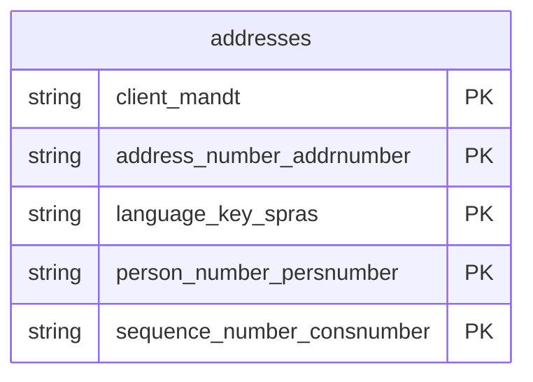

# Addresses Data Product

This data product includes information about SAP addresses from the Financial Accounting (FI), Sales and Distribution (SD), Materials Management (MM) module in the Cross-Functional domain in SAP S/4HANA or SAP ECC. It offers a centralized and globally consistent view of geographical and communication addresses for business partners, customers, and organizational units. It enables geospatial analytics, supply-chain routing optimization, and high-fidelity customer master data consolidation.

## 1. Overview & Business Value

*   **Business Purpose:** Offers a centralized and globally consistent view of geographical and communication addresses for business partners, customers, and organizational units. It enables geospatial analytics, supply-chain routing optimization, and high-fidelity customer master data consolidation.

*   **Key Metrics & Use Cases:**
    *   **Metric/Use Case 1:** Unified enterprise reporting and operational tracking.
    *   **Metric/Use Case 2:** High-fidelity analytics and AI-ready data ingestion.

## 2. Data Assets Catalog

This data product exposes the following BigQuery data assets:

| Data Asset | Description | Source Systems |
| :--- | :--- | :--- |
| `addresses` | This view is based on SAP S/4HANA or SAP ECC Financial Accounting (FI), Sales and Distribution (SD), Materials Management (MM) module in the Cross-Functional domain and provides a centralized, globally consistent master data view of geographical and communication addresses for business partners, customers, vendors, and organizational units (from ADRC, ADR6, and ADRCT) to support geospatial analytics and supply-chain routing. The data is captured at the granularity of Client (System), Address Number Addrnumber, Language Key, Person Number Persnumber, and Sequence Number Consnumber, ensuring a unique audit trail for every record. | `SAP ECC` / `SAP S/4HANA` |### Entity Relationship Diagram (ERD)

## 3. Data Foundation & Source Tables

To build these assets, the following source tables must be available in the data foundation layer:

| Source Table | Name / Description | System Source | Used by Asset(s) |
| :--- | :--- | :--- | :--- |
| `adrc` | Operational source table. | `Common` | `addresses` |
| `adr6` | Operational source table. | `Common` | `addresses` |
| `adrct` | Operational source table. | `Common` | `addresses` |

## 4. Transformations & Design Decisions

This section details the critical engineering and design decisions behind the transformations.

### A. Granularity & Primary Keys

* **addresses:** Client (`client_client`), Address Number (`address_number_addrnumber`), Address Version (`version_id_for_international_addresses_nation`), Person Number (`person_number_persnumber`), and Sequence Number (`sequence_number_consnumber`).
* **addresses:** `client_client`, `address_number_addrnumber`, `valid_from_date_date_from`, `version_id_for_international_addresses_nation`, `person_number_persnumber`, `sequence_number_consnumber`.

### B. Joins & Relationship Logic

* **addresses:**
* `adrc` (Addresses) is the primary table.
* `adr6` (E-Mail Addresses) is `LEFT OUTER JOIN`ed to retrieve associated email details, preserving all address master records even if no email is maintained.
* `adrct` (Address Texts) is `LEFT OUTER JOIN`ed to retrieve remarks/notes for addresses.
* *Note on text joins:* Joining `adrct` will multiply rows if multiple languages are present, but we join on `adrc.langu = adrct.langu` to match the language defined in the address record.

### C. Incremental Load Strategy

*   **Supported Materialization Types:** `incremental` | `table` | `view`
*   **Incremental Logic:**
* **addresses:** Materialized as `incremental` table by default.
* **addresses:** Delta filter applied using the greatest of `recordstamp` columns across `adrc`, `adr6`, and `adrct`.

### D. ERP Source System Differences (ECC vs. S/4HANA)

* **addresses:** Unified version-agnostic model. Although some S4 live table columns like `_DATAAGING`, `DUNS`, and `DUNSP4` exist in the backend, they are excluded from the V7 target model to maintain schema parity since they are not present in the unified V7 data foundation annotations for `adrc.yaml`.
* Field Selections:**
* **addresses:** Maps all fields defined in the data foundation annotations for `adrc`, `adr6`, and `adrct` in their original live SAP system column ordering.

### E. Field Conversions & Calculations

*   **Currency & Conversions:** Standardized using built-in currency shift logic for currencies with non-standard decimal formats (e.g. JPY, IDR).
*   **Field Selections:** Enriched with operational data and standard language text mappings where applicable.

## 5. Change Log

| Date | Type of change | Change details |
| :--- | :--- | :--- |
| 24.06.2026 | Release | Release candidate validation completed. |
