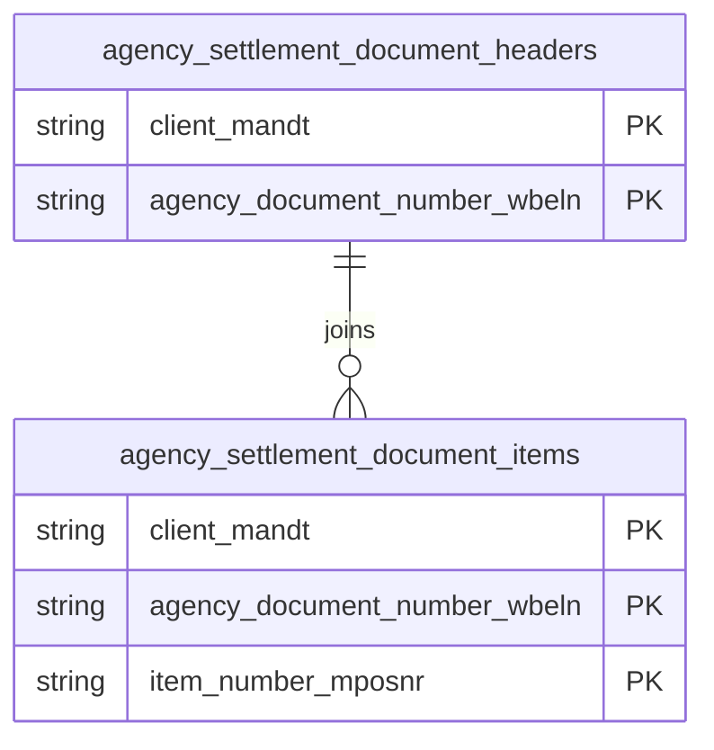

# Agency Settlement Documents Data Product

This data product includes information about SAP agency settlement documents from the Sales and Distribution (SD), Materials Management (MM) module in the Sales, Supply Chain domain in SAP S/4HANA or SAP ECC. The Agency Settlement Documents data product provides analytics-ready models for agency business and settlement document headers and items from SAP ERP (WBRK/WBRP). It supports sales rebate tracking, commission settlement analytics, and third-party purchasing/sales flow reporting.

## 1. Overview & Business Value

*   **Business Purpose:** Captures header and line-item agency settlement transaction records across SAP ECC and S/4HANA systems. It tracks incremental updates via recordstamps and provides structured data for settlement financial reconciliation.
*   **Key Metrics & Use Cases:**
    *   **Rebate & Commission Analytics:** Vendor and customer rebate settlements, broker commissions, and payment agency fees.
    *   **Document Flow Auditing:** Tracking settlement status, billing document types, and partner assignments.

## 2. Data Assets Catalog

This data product exposes the following BigQuery data assets:

| Data Asset | Description | Source Systems |
| :--- | :--- | :--- |
| `agency_settlement_document_headers` | This view is based on SAP S/4HANA or SAP ECC Sales and Distribution (SD), Materials Management (MM) module in the Sales, Supply Chain domain and provides header-level agency business and settlement document metadata from SAP WBRK (e.g., partner details, posting status, and currency keys) to support rebate tracking and commission settlement analytics. The data is captured at the granularity of Client (System) and Agency Document Number, ensuring a unique audit trail for every record. | `SAP ECC` / `SAP S/4HANA` |
| `agency_settlement_document_items` | This view is based on SAP S/4HANA or SAP ECC Sales and Distribution (SD), Materials Management (MM) module in the Sales, Supply Chain domain and provides line-item agency business and settlement document details from SAP WBRP (e.g., material numbers, quantities, pricing conditions, and net values) to support financial reconciliation and third-party purchase/sales flow reporting. The data is captured at the granularity of Client (System), Agency Document Number, and Item Number Mposnr, ensuring a unique audit trail for every record. | `SAP ECC` / `SAP S/4HANA` |### Entity Relationship Diagram (ERD)

## 3. Data Foundation & Source Tables

To build these assets, the following source tables must be available in the data foundation layer:

| Source Table | Name / Description | System Source | Used by Asset(s) |
| :--- | :--- | :--- | :--- |
| `wbrk` | Agency Business: Document Header | `Common` | `agency_settlement_document_headers`, `agency_settlement_document_items` |
| `wbrp` | Agency Business: Document Item | `Common` | `agency_settlement_document_items` |

## 4. Transformations & Design Decisions

This section details the critical engineering and design decisions behind the transformations.

### A. Granularity & Primary Keys

*   **`agency_settlement_document_headers`**: Granularity is one row per agency document header. Primary keys are `client_mandt` and `agency_document_number_wbeln`.
*   **`agency_settlement_document_items`**: Granularity is one row per settlement line item. Primary keys are `client_mandt`, `agency_document_number_wbeln`, and `item_number_mposnr`.

### B. Joins & Relationship Logic

*   **`agency_settlement_document_headers`**: Sourced directly from `wbrk`.
*   **`agency_settlement_document_items`**: s4/ecc models join `wbrp` with `wbrk` on `client_mandt` and `agency_document_number_wbeln` to align header timestamps and partner context.

### C. Incremental Load Strategy

*   **Supported Materialization Types:** `incremental`
*   **Incremental Logic:**
    *   **`agency_settlement_document_headers`**: Delta updates are performed using the `recordstamp` column on `wbrk`.
    *   **`agency_settlement_document_items`**: Delta updates track modifications using the `GREATEST` `recordstamp` comparison between `wbrp` and `wbrk`.
    *   **Merge Policy:** `EXTEND` on schema change.

### D. ERP Source System Differences (ECC vs. S/4HANA)

*   **`agency_settlement_document_headers` & `agency_settlement_document_items`**: Separate JS definitions are maintained in `ecc/` and `s4/` subdirectories to handle version-specific fields and status columns.

### E. Field Conversions & Calculations

*   **Monetary & Quantity Mappings:** Maps technical SAP settlement fields to standardized business naming conventions.

## 5. Change Log

| Date | Type of change | Change details |
| :--- | :--- | :--- |
| 24.06.2026 | Release | Release candidate validation completed. |
