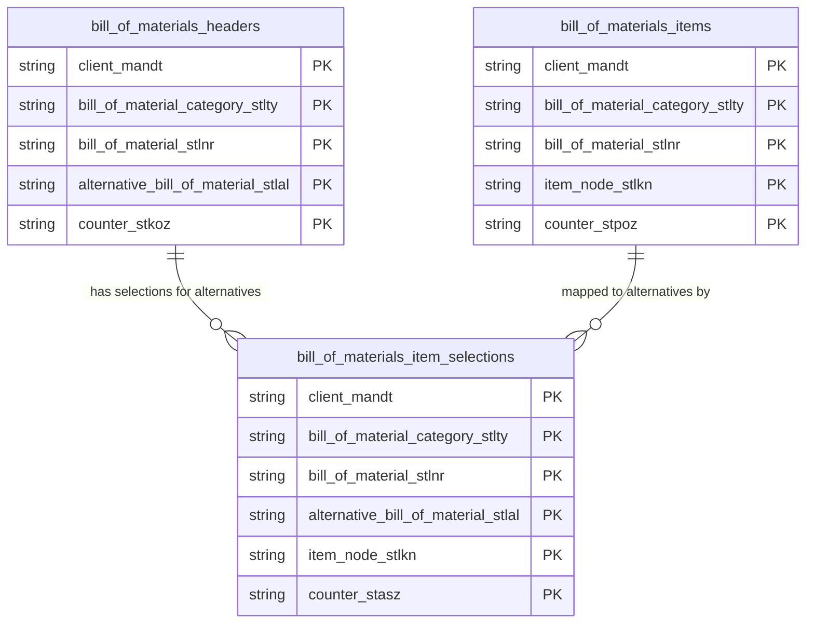

# Bill of Materials ER Diagram

This document describes the Entity-Relationship (ER) model for the `bill_of_materials` data product, showing the primary keys and how they relate to one another.

```mermaid
erDiagram
    bill_of_materials_headers ||--o{ bill_of_materials_item_selections : "has selections for alternatives"
    bill_of_materials_items ||--o{ bill_of_materials_item_selections : "mapped to alternatives by"

    bill_of_materials_headers {
        string client_mandt PK
        string bill_of_material_category_stlty PK
        string bill_of_material_stlnr PK
        string alternative_bill_of_material_stlal PK
        string counter_stkoz PK
    }

    bill_of_materials_items {
        string client_mandt PK
        string bill_of_material_category_stlty PK
        string bill_of_material_stlnr PK
        string item_node_stlkn PK
        string counter_stpoz PK
    }

    bill_of_materials_item_selections {
        string client_mandt PK
        string bill_of_material_category_stlty PK
        string bill_of_material_stlnr PK
        string alternative_bill_of_material_stlal PK
        string item_node_stlkn PK
        string counter_stasz PK
    }
```
