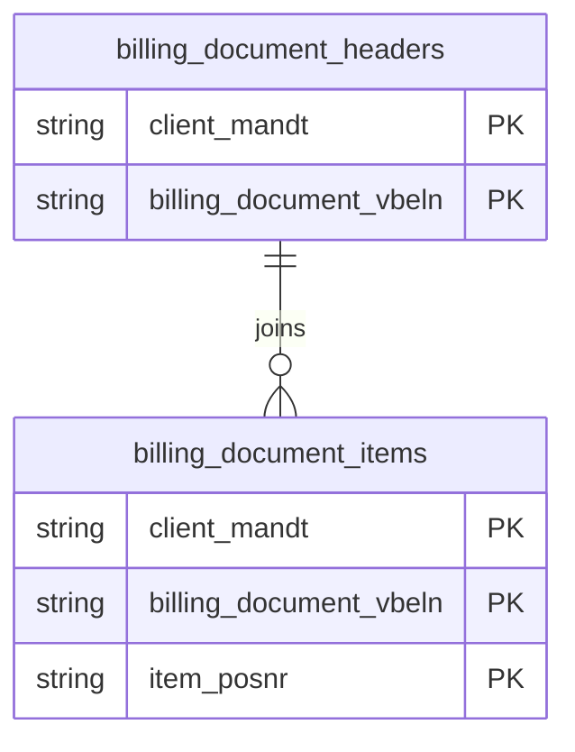

# Billing Documents Data Product

This data product includes information about SAP billing documents from the Sales and Distribution (SD) module in the Sales domain in SAP S/4HANA or SAP ECC. It captures comprehensive billing lifecycle metrics spanning header transactions, granular item-level pricing, and document blocking reasons. It establishes a robust foundation for revenue recognition forecasting, margin analysis, and customer profitability reporting.

## 1. Overview & Business Value

*   **Business Purpose:** Captures comprehensive billing lifecycle metrics spanning header transactions, granular item-level pricing, and document blocking reasons. It establishes a robust foundation for revenue recognition forecasting, margin analysis, and customer profitability reporting.

*   **Key Metrics & Use Cases:**
    *   **Metric/Use Case 1:** Unified enterprise reporting and operational tracking.
    *   **Metric/Use Case 2:** High-fidelity analytics and AI-ready data ingestion.

## 2. Data Assets Catalog

This data product exposes the following BigQuery data assets:

| Data Asset | Description | Source Systems |
| :--- | :--- | :--- |
| `billing_document_headers` | This view is based on SAP S/4HANA or SAP ECC Sales and Distribution (SD) module in the Sales domain and provides billing document header-level transaction metadata from SAP VBRK (e.g., company code, billing type, net value, tax amount, and billing dates), enriched with calendar date dimensions to support revenue recognition forecasting and margin analysis. The data is captured at the granularity of Client (System) and Billing Document, ensuring a unique audit trail for every record. | `SAP ECC` / `SAP S/4HANA` |
| `billing_document_items` | This view is based on SAP S/4HANA or SAP ECC Sales and Distribution (SD) module in the Sales domain and provides billing document item-level transaction details from SAP VBRP (e.g., material number, plant, storage location, billed quantity, net value, cost, and preceding reference documents) to support customer profitability and margin reporting. The data is captured at the granularity of Client (System), Billing Document, and Item, ensuring a unique audit trail for every record. | `SAP ECC` / `SAP S/4HANA` |
| `billing_blocking_reasons` | This view is based on SAP S/4HANA or SAP ECC Sales and Distribution (SD) module in the Sales domain and provides language-specific descriptions and codes of reasons for blocking billing documents from SAP TVFST to support order-to-cash process flow auditing. The data is captured at the granularity of system default keys, ensuring a unique audit trail for every record. | `SAP ECC` / `SAP S/4HANA` |### Entity Relationship Diagram (ERD)

## 3. Data Foundation & Source Tables

To build these assets, the following source tables must be available in the data foundation layer:

| Source Table | Name / Description | System Source | Used by Asset(s) |
| :--- | :--- | :--- | :--- |
| `vbrk` | Operational source table. | `Common` | `billing_document_headers` |
| `vbrp` | Operational source table. | `Common` | `billing_document_items` |
| `tvfst` | Operational source table. | `Common` | `billing_blocking_reasons` |

## 4. Transformations & Design Decisions

This section details the critical engineering and design decisions behind the transformations.

### A. Granularity & Primary Keys

* **billing_document_headers:** Client (`client_mandt`) and Billing Document (`billing_document_vbeln`).
* **billing_document_items:** Client (`client_mandt`), Billing Document (`billing_document_vbeln`), and Billing Document Item (`item_posnr`).
* **billing_blocking_reasons:** Client (`client_mandt`), Language Key (`language_key_spras`), and Block (`block_faksp`).
* **billing_document_headers:** `client_mandt`, `billing_document_vbeln`.
* **billing_document_items:** `client_mandt`, `billing_document_vbeln`, `item_posnr`.
* **billing_blocking_reasons:** `client_mandt`, `language_key_spras`, `block_faksp`.

### B. Joins & Relationship Logic

* **billing_document_headers:** LEFT JOINed to `tcurx` (via `currencyDecimalShift` helper) to shift currency values, and LEFT JOINed to `date_dimension` (three times: `erdat`, `fkdat`, `aedat`) to resolve calendar dimensions.
* **billing_document_items:** LEFT JOINed to `tcurx` to shift currency values, and LEFT JOINed to `date_dimension` (`erdat`) to resolve calendar dimensions.
* *Note on text joins:* No text table joins are performed in these models.
* **billing_blocking_reasons:** No joins. Standard text table selection directly from foundation `tvfst`.

### C. Incremental Load Strategy

*   **Supported Materialization Types:** `incremental` | `table` | `view`
*   **Incremental Logic:**
* **billing_document_headers:** Delta filter applied using `recordstamp` column on `vbrk`.
* **billing_document_items:** Delta filter applied using `recordstamp` column on `vbrp`.
* **billing_blocking_reasons:** Delta filter applied using `recordstamp` column on `tvfst`.

### D. ERP Source System Differences (ECC vs. S/4HANA)

* **billing_document_headers:** Unified model, no structural differences.
* **billing_document_items:** Unified model, no structural differences.
* **billing_blocking_reasons:** Unified model, no structural differences.
* Field Selections:**
* **billing_document_headers:** Captures all header metrics, cancel/reversal indicators, company codes, currency keys, and created/changed dates.
* **billing_document_items:** Captures pricing values, batches, quantities, preceding/originating documents, and plant/storage locations.
* **billing_blocking_reasons:** Captures block code and billing blocking reason descriptions.

### E. Field Conversions & Calculations

*   **Currency & Conversions:** Standardized using built-in currency shift logic for currencies with non-standard decimal formats (e.g. JPY, IDR).
*   **Field Selections:** Enriched with operational data and standard language text mappings where applicable.

## 5. Change Log

| Date | Type of change | Change details |
| :--- | :--- | :--- |
| 24.06.2026 | Release | Release candidate validation completed. |
