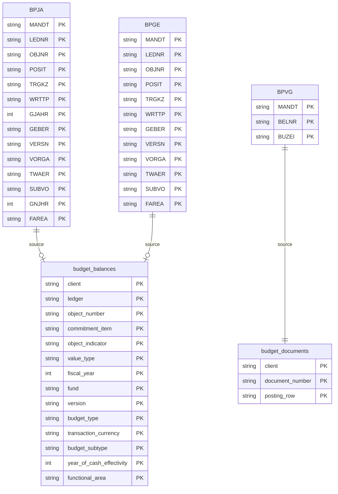

# Budget Allocations Data Product

This data product includes information about SAP budget allocations from the Financial Accounting (FI), Project System (PS), Controlling (CO) module in the Finance domain in SAP S/4HANA or SAP ECC. The Budget Allocations data product provides comprehensive visibility into SAP budget structures, including annual and overall budget allocations, balances, and individual budget posting documents.

## 1. Overview & Business Value

*   **Business Purpose:** Solves the challenge of tracking budget allocations and consumption across project systems (PS), funds management (FM), and controlling (CO) modules. It allows stakeholders to monitor budget availability and audit changes.
*   **Key Metrics & Use Cases:**
    *   **Budget Availability Control:** Track budget balances against actual commitments and postings.
    *   **Budget Auditing:** Trace budget changes and document flows via posting line items.

## 2. Data Asset Catalog

This data product exposes the following BigQuery data assets:

| Data Asset | Description | Source Systems |
| :--- | :--- | :--- |
| `budget_balances` | This view is based on SAP S/4HANA or SAP ECC Financial Accounting (FI), Project System (PS), Controlling (CO) module in the Finance domain and provides Annual and overall budget allocations and balances per budget object. The data is captured at the granularity of Client, Ledger, Object Number, Commitment, Object Indicator, Value, Fiscal, Fund, Version, Budget, Transaction Currency, Budget Subtype, Year Of Cash Effectivity, and Functional, ensuring a unique audit trail for every record. | `SAP ECC` / `SAP S/4HANA` |
| `budget_documents` | This view is based on SAP S/4HANA or SAP ECC Financial Accounting (FI), Project System (PS), Controlling (CO) module in the Finance domain and provides Budget allocation document line items representing budget postings. The data is captured at the granularity of Client, Document Number, and Posting, ensuring a unique audit trail for every record. | `SAP ECC` / `SAP S/4HANA` |## 3. Data Foundation & Source Tables

To build these assets, the following source tables must be available in the data foundation layer:

| Source Table | Name / Description | System Source | Used by Asset(s) |
| :--- | :--- | :--- | :--- |
| `bpja` | Budget Values (Annual) | `Common` | `budget_balances` |
| `bpge` | Budget Values (Overall) | `Common` | `budget_balances` |
| `bpvg` | Document Line Items | `Common` | `budget_documents` |

<!-- ERD_START -->

<!-- ERD_END -->

## 4. Transformations & Design Decisions

### A. Granularity & Primary Keys

*   **`budget_balances`**: The grain is one row per budget object, value type, version, budget type, and fiscal year. Primary keys are: `client`, `ledger`, `object_number`, `commitment_item`, `object_indicator`, `value_type`, `fiscal_year`, `fund`, `version`, `budget_type`, `transaction_currency`, `budget_subtype`, `year_of_cash_effectivity`, `functional_area`.
*   **`budget_documents`**: The grain is one row per budget document line item. Primary keys are: `client`, `document_number`, `posting_row`.

### B. Joins & Relationship Logic

*   **`budget_balances`**:
    *   Joined `BPJA` (annual values) with `BPGE` (overall values) using a `LEFT JOIN` on the common key fields.
    *   *Rationale:* `BPJA` contains the annual breakdown which is the primary driver of yearly reporting, and joining `BPGE` provides the overall totals context for the same budget objects.

### C. Incremental Load Strategy

*   **Supported Materialization Types:** `incremental`
*   **Incremental Logic:**
    *   **`budget_balances`**: Delta updates are performed using the greatest recordstamp of both `BPJA` and `BPGE`.
    *   **`budget_documents`**: Delta updates are performed using `BPVG`'s recordstamp.

### D. ERP Source System Differences (ECC vs. S/4HANA)

*   **`budget_balances` & `budget_documents`**:
    *   *Comparison:* No schema or structural differences exist between SAP ECC and S/4HANA for these tables.

## 5. Change Log

| Date | Type of change | Change details |
| :--- | :--- | :--- |
| 02.07.2026 | Feature | Initial creation of the `budget_allocations` data product. |
