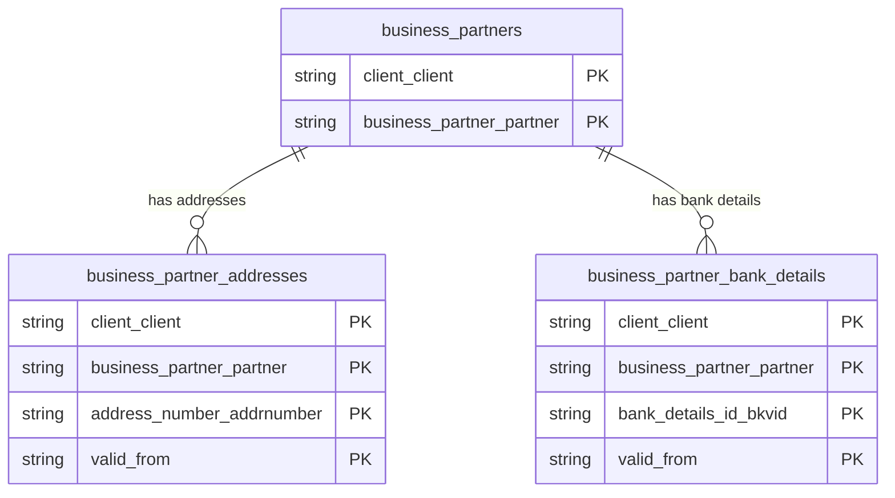

# Business Partners Data Product

This data product includes information about SAP business partners from the Financial Accounting (FI), Sales and Distribution (SD), Materials Management (MM) module in the Cross-Functional domain in SAP S/4HANA or SAP ECC. The Business Partners data product exposes unified, central master data models for SAP Business Partners (individuals, organizations, or groups), including physical addresses, contact information, and registered bank details.

## 1. Overview & Business Value

*   **Business Purpose:** Provides a single source of truth for Business Partner master records across SAP ECC and S/4HANA systems. It consolidates general profile data (`BUT000`) with time-dependent address records (`BUT020`, `ADRC`) and financial bank account credentials (`BUT0BK`).
*   **Key Metrics & Use Cases:**
    *   **Master Data Management (MDM):** Centralized vendor/customer master auditing and partner profile management.
    *   **Financial Operations:** Payment routing via bank details, IBAN validation, and address verification.

## 2. Data Assets Catalog

This data product exposes the following BigQuery data assets:

| Data Asset | Description | Source Systems |
| :--- | :--- | :--- |
| `business_partners` | This view is based on SAP S/4HANA or SAP ECC Financial Accounting (FI), Sales and Distribution (SD), Materials Management (MM) module in the Cross-Functional domain and provides central master profile details for SAP Business Partners (individuals, organizations, or groups) from BUT000, including profile categories, roles, and status details to support central partner auditing. The data is captured at the granularity of Client Client and Business Partner Partner, ensuring a unique audit trail for every record. | `SAP ECC` / `SAP S/4HANA` |
| `business_partner_addresses` | This view is based on SAP S/4HANA or SAP ECC Financial Accounting (FI), Sales and Distribution (SD), Materials Management (MM) module in the Cross-Functional domain and provides physical addresses, contact emails (ADR6), and address remarks (ADRCT) associated with SAP Business Partners from BUT020 and ADRC to support geographical and communication master data verification. The data is captured at the granularity of Client Client, Business Partner Partner, Address Number Addrnumber, and Valid, ensuring a unique audit trail for every record. | `SAP ECC` / `SAP S/4HANA` |
| `business_partner_bank_details` | This view is based on SAP S/4HANA or SAP ECC Financial Accounting (FI), Sales and Distribution (SD), Materials Management (MM) module in the Cross-Functional domain and provides financial bank account credentials, IBANs, and validity periods for SAP Business Partners from BUT0BK to support payment routing, financial operations, and security validation. The data is captured at the granularity of Client Client, Business Partner Partner, Bank Details Id, and Valid, ensuring a unique audit trail for every record. | `SAP ECC` / `SAP S/4HANA` |### Entity Relationship Diagram (ERD)

## 3. Data Foundation & Source Tables

To build these assets, the following source tables must be available in the data foundation layer:

| Source Table | Name / Description | System Source | Used by Asset(s) |
| :--- | :--- | :--- | :--- |
| `but000` | BP: General Data I | `Common` | `business_partners` |
| `but020` | BP: Addresses | `Common` | `business_partner_addresses` |
| `adrc` | Address Services: Address Table | `Common` | `business_partner_addresses` |
| `adr6` | Address Services: Email Addresses | `Common` | `business_partner_addresses` |
| `adrct` | Address Services: Address Texts | `Common` | `business_partner_addresses` |
| `but0bk` | BP: Bank Details | `Common` | `business_partner_bank_details` |

## 4. Transformations & Design Decisions

This section details the critical engineering and design decisions behind the transformations.

### A. Granularity & Primary Keys

*   **`business_partners`**: Granularity is one row per Business Partner. Primary keys are `client_client` and `business_partner_partner`.
*   **`business_partner_addresses`**: Granularity is one row per BP address version. Primary keys are `client_client`, `business_partner_partner`, `address_number_addrnumber`, and `valid_from`.
*   **`business_partner_bank_details`**: Granularity is one row per bank details record. Primary keys are `client_client`, `business_partner_partner`, `bank_details_id_bkvid`, and `valid_from`.

### B. Joins & Relationship Logic

*   **`business_partners`**: Sourced directly from `but000`.
*   **`business_partner_addresses`**: `but020` is LEFT JOINed to `adrc` on `client` and `addrnumber`. It is further joined to `adr6` for emails and `adrct` for remarks. Filtered by `adrc.date_to = '9999-12-31'` for current active addresses.
*   **`business_partner_bank_details`**: Sourced directly from `but0bk`.

### C. Incremental Load Strategy

*   **Supported Materialization Types:** `incremental`
*   **Incremental Logic:**
    *   **`business_partners`**: Evaluates changes on `but000` using `recordstamp`.
    *   **`business_partner_addresses`**: Evaluates changes using the `GREATEST` `recordstamp` across `but020`, `adrc`, `adr6`, and `adrct`.
    *   **`business_partner_bank_details`**: Evaluates changes on `but0bk` using `recordstamp`.
    *   **Merge Policy:** `EXTEND` on schema change.

### D. ERP Source System Differences (ECC vs. S/4HANA)

*   **`business_partners` & `business_partner_addresses`**: Shared unified definitions across ECC and S/4HANA.
*   **`business_partner_bank_details`**: S/4HANA maintains dedicated definitions in `s4/` to capture the `sensitivity_protect` (`protect`) field (not present in ECC).

### E. Field Conversions & Calculations

*   **Person & Organization Mapping:** Consolidates person names (first/last name) and organization names into standardized output attributes based on partner category.

## 5. Change Log

| Date | Type of change | Change details |
| :--- | :--- | :--- |
| 24.06.2026 | Release | Release candidate validation completed. |
