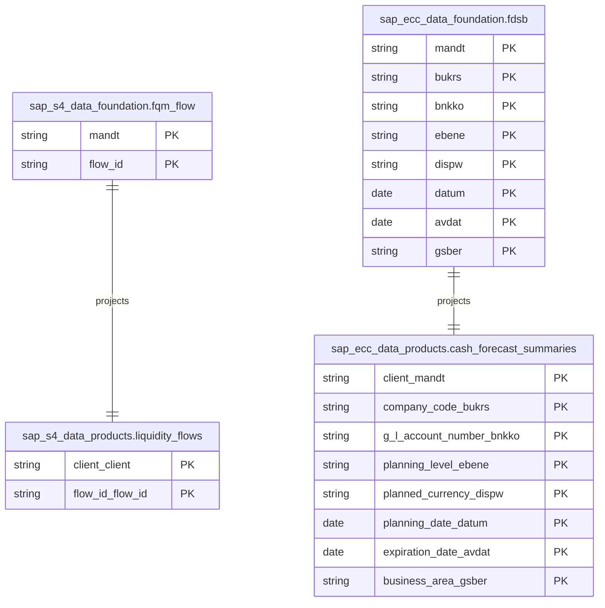

# Cash and Liquidity Management Data Product

This data product includes information about SAP cash and liquidity management from the Financial Accounting (FI), Financial Supply Chain Management (FSCM) module in the Finance domain in SAP S/4HANA or SAP ECC. The Cash and Liquidity Management data product provides a comprehensive and unified view of cash positions, forecasts, and liquidity flows across the enterprise. It consolidates S/4HANA One Exposure flows and classic ECC cash management summary records to support cash flow analysis, treasury positioning, and short-to-medium term liquidity forecasting.

## 1. Overview & Business Value

*   **Business Purpose:** Enables treasury and finance departments to monitor cash positions and forecast liquidity accurately. It helps optimize working capital, manage FX risks, and ensure sufficient liquidity to meet operational needs by providing real-time visibility into cash inflows and outflows.
*   **Key Metrics & Use Cases:**
    *   **Liquidity Position Monitoring:** Real-time visibility into cash balances and flows.
    *   **Short-Term Cash Forecasting:** Predicts cash positions based on G/L account summaries and planning levels.
    *   **Treasury Integration:** Feeds cash flow data into treasury management processes.

## 2. Data Assets Catalog

This data product exposes the following BigQuery data assets:

| Data Asset | Description | Source Systems |
| :--- | :--- | :--- |
| `liquidity_flows` | This view is based on SAP S/4HANA Financial Accounting (FI), Financial Supply Chain Management (FSCM) module in the Finance domain and provides granular, real-time liquidity flows from the S/4HANA One Exposure from Operations (FQM_FLOW) table. The data is captured at the granularity of system default keys, ensuring a unique audit trail for every record. | `SAP S/4HANA` |
| `cash_forecast_summaries` | This view is based on SAP ECC Financial Accounting (FI), Financial Supply Chain Management (FSCM) module in the Finance domain and provides summary records of cash management and forecast data for G/L accounts from the ECC FDSB table. The data is captured at the granularity of system default keys, ensuring a unique audit trail for every record. | `SAP ECC` |## 3. Data Foundation & Source Tables

To build these assets, the following source tables must be available in the data foundation layer:

| Source Table | Name / Description | System Source | Used by Asset(s) |
| :--- | :--- | :--- | :--- |
| `fqm_flow` | One Exposure from Operations | `S4-only` | `liquidity_flows` |
| `fdsb` | Cash Management and Forecast Summary Records | `ECC-only` | `cash_forecast_summaries` |

### Entity-Relationship (ER) Diagram

<!-- ERD_START -->

<!-- ERD_END -->

## 4. Transformations & Design Decisions

### A. Granularity & Primary Keys

*   **`liquidity_flows`**: The grain of this asset is one row per liquidity flow record. Row uniqueness is strictly enforced on `client_client` and `flow_id_flow_id`.
*   **`cash_forecast_summaries`**: The grain of this asset is one row per cash forecast summary record. Row uniqueness is strictly enforced on `client_mandt`, `company_code_bukrs`, `g_l_account_number_bnkko`, `planning_level_ebene`, `planned_currency_dispw`, `planning_date_datum`, `expiration_date_avdat`, and `business_area_gsber`.

### B. Joins & Relationship Logic

*   **`liquidity_flows`**: Direct projection from `fqm_flow` with field renaming.
*   **`cash_forecast_summaries`**: Direct projection from `fdsb` with field renaming.

### C. Incremental Load Strategy

*   **Supported Materialization Types:** `incremental`
*   **Incremental Logic:**
    *   **`liquidity_flows`**: Delta updates are performed using `IFNULL(fqm_flow.recordstamp, TIMESTAMP('1900-01-01 00:00:00+00'))`.
    *   **`cash_forecast_summaries`**: Delta updates are performed using `IFNULL(fdsb.recordstamp, TIMESTAMP('1900-01-01 00:00:00+00'))`.
    *   **Merge Policy:** `EXTEND` on schema change.

### D. ERP Source System Differences (ECC vs. S/4HANA)

*   **`liquidity_flows`**: S/4HANA only (One Exposure from Operations).
*   **`cash_forecast_summaries`**: ECC only (classic Cash Management). Separate JS definitions are maintained in `ecc/` and `s4/` folders to handle this distinction.

### E. Field Conversions & Calculations

*   **None-safety:** All `recordstamp` fields are wrapped in `IFNULL` falling back to `1900-01-01` to ensure incremental load stability.

## 5. Change Log

| Version | Type of change | Change details |
| :--- | :--- | :--- |
| 7.0.0 | Feature | Initial onboarding of Cash and Liquidity Management data product with `liquidity_flows` and `cash_forecast_summaries` assets. |
