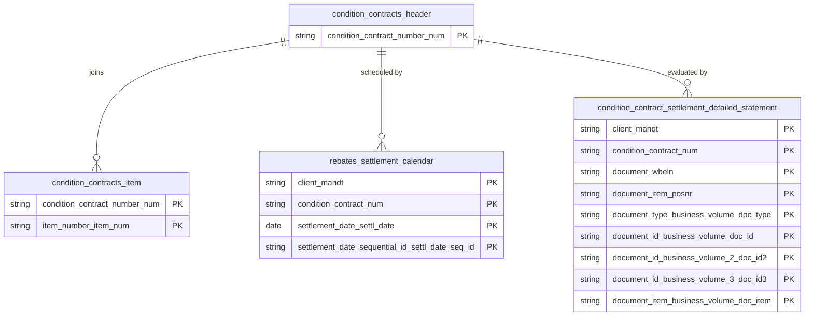

# Condition Contracts Data Product

This data product includes information about SAP condition contracts from the Sales and Distribution (SD), Materials Management (MM) module in the Sales, Supply Chain domain in SAP S/4HANA or SAP ECC. The Condition Contracts data product models SAP Condition Contract Settlement (CCS) master data, settlement calendars, business volume details, and detailed settlement statements across ECC and S/4HANA systems.

## 1. Overview & Business Value

*   **Business Purpose:** Captures condition contract definitions (`WCOCOH`, `WCOCOI`) alongside settlement calendar schedules and detailed settlement evaluation statements. It provides enterprise sales and purchasing operations with full visibility into commercial rebate contracts and settlement timelines.
*   **Key Metrics & Use Cases:**
    *   **Commercial Rebate Management:** Tracking customer rebates, vendor volume rebates, and contract validity periods.
    *   **Settlement Scheduling:** Monitoring settlement calendar dates, evaluation frequencies, and payout statuses.

## 2. Data Assets Catalog

This data product exposes the following BigQuery data assets:

| Data Asset | Description | Source Systems |
| :--- | :--- | :--- |
| `condition_contracts_header` | This view is based on SAP S/4HANA or SAP ECC Sales and Distribution (SD), Materials Management (MM) module in the Sales, Supply Chain domain and provides header-level SAP Condition Contract Settlement (CCS) definitions from WCOCOH (e.g., partner numbers, contract types, and validity dates) to track commercial rebate contracts. The data is captured at the granularity of Condition Contract Number, ensuring a unique audit trail for every record. | `SAP ECC` / `SAP S/4HANA` |
| `condition_contracts_item` | This view is based on SAP S/4HANA or SAP ECC Sales and Distribution (SD), Materials Management (MM) module in the Sales, Supply Chain domain and provides line-item SAP Condition Contract Settlement rules from WCOCOI (e.g., eligibility criteria, materials, and settlement parameters) to define contract settlement conditions. The data is captured at the granularity of Condition Contract Number and Item Number Item, ensuring a unique audit trail for every record. | `SAP ECC` / `SAP S/4HANA` |
| `rebates_settlement_calendar` | This view is based on SAP S/4HANA or SAP ECC Sales and Distribution (SD), Materials Management (MM) module in the Sales, Supply Chain domain and provides scheduled settlement calendar dates and settlement document references from WB2_D_SETTL_CAL to monitor payout status and evaluation frequencies. The data is captured at the granularity of Client (System), Condition Contract, Settlement Date Settl, and Settlement Date Sequential Id Settl Date Seq, ensuring a unique audit trail for every record. | `SAP ECC` / `SAP S/4HANA` |
| `condition_contract_settlement_detailed_statement` | This view is based on SAP S/4HANA or SAP ECC Sales and Distribution (SD), Materials Management (MM) module in the Sales, Supply Chain domain and provides a detailed settlement evaluation statement from WB2_D_BVDETAIL, reflecting business volume and settlement amounts, to support commercial rebate audits. The data is captured at the granularity of Client (System), Condition Contract, Document, Document Item, Document Type Business Volume Doc, Document Id Business Volume Doc, Document Id Business Volume 2 Doc, Document Id Business Volume 3 Doc, and Document Item Business Volume Doc, ensuring a unique audit trail for every record. | `SAP ECC` / `SAP S/4HANA` |### Entity Relationship Diagram (ERD)

## 3. Data Foundation & Source Tables

To build these assets, the following source tables must be available in the data foundation layer:

| Source Table | Name / Description | System Source | Used by Asset(s) |
| :--- | :--- | :--- | :--- |
| `wcocoh` | Condition Contract Header | `Common` | `condition_contracts_header`, `condition_contracts_item`, etc. |
| `wcocoi` | Condition Contract Item | `Common` | `condition_contracts_item` |
| `wb2_d_settl_cal` | Settlement Calendar | `Common` | `rebates_settlement_calendar` |
| `wb2_d_bvdetail` | Business Volume Detailed Statement | `Common` | `condition_contract_settlement_detailed_statement` |

## 4. Transformations & Design Decisions

This section details the critical engineering and design decisions behind the transformations.

### A. Granularity & Primary Keys

*   **`condition_contracts_header`**: Granularity is one row per condition contract header. Primary key is `condition_contract_number_num`.
*   **`condition_contracts_item`**: Granularity is one row per contract item. Primary keys are `condition_contract_number_num` and `item_number_item_num`.
*   **`rebates_settlement_calendar`**: Granularity is one row per settlement schedule entry.
*   **`condition_contract_settlement_detailed_statement`**: Granularity is one row per settlement statement line item.

### B. Joins & Relationship Logic

*   **`condition_contracts_header`**: Sourced directly from `wcocoh`.
*   **`condition_contracts_item`**: Sourced from `wcocoi` joined with `wcocoh` context.
*   **`rebates_settlement_calendar`**: Sourced from `wb2_d_settl_cal`.
*   **`condition_contract_settlement_detailed_statement`**: Sourced from `wb2_d_bvdetail`.

### C. Incremental Load Strategy

*   **Supported Materialization Types:** `incremental`
*   **Incremental Logic:**
    *   Evaluates delta changes using `recordstamp` columns across contract tables.
    *   **Merge Policy:** `EXTEND` on schema change.

### D. ERP Source System Differences (ECC vs. S/4HANA)

*   All assets maintain separate JS definitions in `ecc/` and `s4/` subdirectories to handle technical field differences and version-specific condition contract enhancements.

### E. Field Conversions & Calculations

*   **Contract Status & Validity:** Standardizes SAP condition contract status flags and valid date ranges.

## 5. Change Log

| Date | Type of change | Change details |
| :--- | :--- | :--- |
| 24.06.2026 | Release | Release candidate validation completed. |
