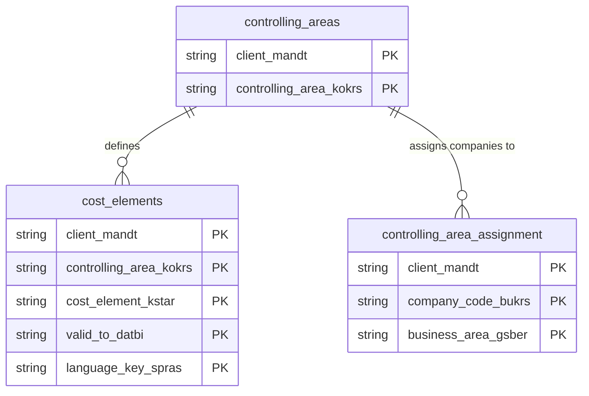

# Controlling Areas and Cost Elements Data Product

This data product includes information about SAP controlling areas and cost elements from the Controlling (CO) module in the Finance domain in SAP S/4HANA or SAP ECC. It standardizes and exposes SAP controlling areas, company-to-controlling area assignments, and cost elements to enable corporate overhead allocation, profitability tracking, and cost accounting.

## 1. Overview & Business Value

*   **Business Purpose:** Standardizes and exposes SAP controlling areas, company-to-controlling area assignments, and cost elements. This forms the foundational framework for corporate overhead allocation, profitability tracking, and detailed cost accounting across various legal entities.

*   **Key Metrics & Use Cases:**
    *   **Metric/Use Case 1:** Corporate overhead allocation and cost center hierarchy reporting.
    *   **Metric/Use Case 2:** Cost analysis preparation (CO-PA) and fiscal consolidation routing.

## 2. Data Assets Catalog

This data product exposes the following BigQuery data assets:

| Data Asset | Description | Source Systems |
| :--- | :--- | :--- |
| `controlling_areas` | This view is based on SAP S/4HANA or SAP ECC Controlling (CO) module in the Finance domain and provides master data details about SAP configured controlling areas from TKA01, including standard hierarchies, currency settings, chart of accounts, and fiscal year variants, to enable corporate overhead allocation. The data is captured at the granularity of Client (System) and Controlling Area, ensuring a unique audit trail for every record. | `SAP ECC` / `SAP S/4HANA` |
| `cost_elements` | This view is based on SAP S/4HANA or SAP ECC Controlling (CO) module in the Finance domain and provides cost element master definitions from CSKB and CSKU, including valid date ranges, cost element categories, planning indicators, and multi-lingual descriptions, to support cost accounting and profitability tracking. The data is captured at the granularity of Client (System), Controlling Area, Cost Element, Valid To, and Language Key, ensuring a unique audit trail for every record. | `SAP ECC` / `SAP S/4HANA` |
| `controlling_area_assignment` | This view is based on SAP S/4HANA or SAP ECC Controlling (CO) module in the Finance domain and provides Maps company codes and business areas to their designated controlling areas from TKA02, facilitating cross-company controlling relationships and fiscal consolidation routing. The data is captured at the granularity of Client (System), Company Code, and Business Area, ensuring a unique audit trail for every record. | `SAP ECC` / `SAP S/4HANA` |### Entity Relationship Diagram (ERD)

## 3. Data Foundation & Source Tables

To build these assets, the following source tables must be available in the data foundation layer:

| Source Table | Name / Description | System Source | Used by Asset(s) |
| :--- | :--- | :--- | :--- |
| `tka01` | Controlling Areas | `Common` | `controlling_areas`, `cost_elements` |
| `tka02` | Controlling Area Assignment (Company/Business Area) | `Common` | `controlling_area_assignment` |
| `cskb` | Cost Elements (Controlling Area Data) | `Common` | `cost_elements` |
| `csku` | Cost Element Texts | `Common` | `cost_elements` |

## 4. Transformations & Design Decisions

This section details the critical engineering and design decisions behind the transformations.

### A. Granularity & Primary Keys

*   **`controlling_areas`:** Client (`client_mandt`) and Controlling Area (`controlling_area_kokrs`).
*   **`cost_elements`:** Client (`client_mandt`), Controlling Area (`controlling_area_kokrs`), Cost Element (`cost_element_kstar`), Valid To Date (`valid_to_datbi`), and Language (`language_key_spras`).
*   **`controlling_area_assignment`:** Client (`client_mandt`), Company Code (`company_code_bukrs`), and Business Area (`business_area_gsber`).

### B. Joins & Relationship Logic

*   **`controlling_areas`:** Built directly from `tka01`.
*   **`cost_elements`:** Inner joins `cskb` with `tka01` on client and controlling area to validate controlling area association, and LEFT JOINs `csku` (Cost Element Texts) matching Client, Chart of Accounts (from `tka01`), and Cost Element to append descriptions.
*   **`controlling_area_assignment`:** Built directly from `tka02`.

### C. Incremental Load Strategy

*   **Supported Materialization Types:** `incremental` | `table` | `view`
*   **Incremental Logic:**
    *   **`controlling_areas`:** Incremental delta is determined using the `recordstamp` from `tka01`.
    *   **`cost_elements`:** Incremental delta is determined using the greatest value of `recordstamp` from source tables `cskb`, `tka01`, and `csku`.
    *   **`controlling_area_assignment`:** Incremental delta is determined using the `recordstamp` from `tka02`.

### D. ERP Source System Differences (ECC vs. S/4HANA)

*   **`controlling_areas`:** S/4HANA versions select an additional field `f_obsolete` (hide entry in input help) and use the standard S/4HANA columns where applicable. ECC maps version-agnostic fields to a common schema.

### E. Field Conversions & Calculations

*   **Text & Language Resolution:** Left joins text tables (`csku`) on the specific language key to resolve localized descriptions.

## 5. Change Log

| Date | Type of change | Change details |
| :--- | :--- | :--- |
| 24.06.2026 | Release | Release candidate validation completed. |
