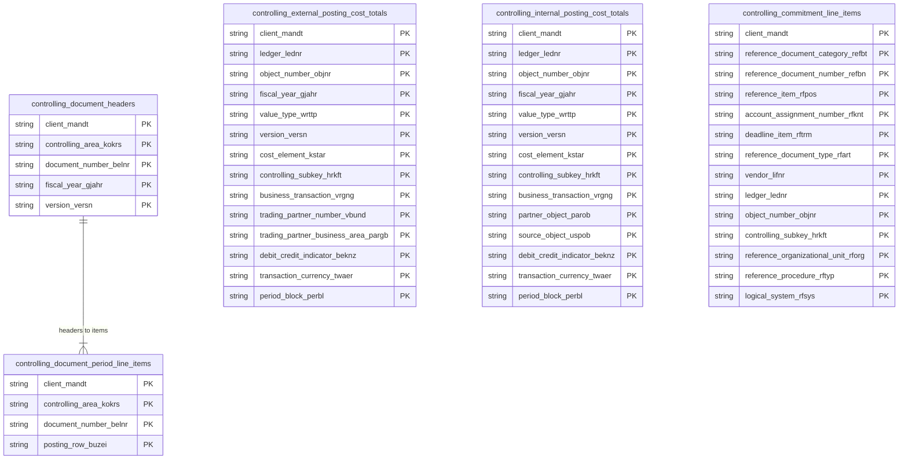

# Controlling Documents Data Product

This data product includes information about SAP controlling documents from the Controlling (CO) module in the Finance domain in SAP S/4HANA or SAP ECC. It provides comprehensive views for SAP Controlling (CO) transactions, including document headers, line items, external and internal cost totals, and commitments.

## 1. Overview & Business Value

*   **Business Purpose:** Controlling (CO) supports the coordination, monitoring, and optimization of all processes in an organization. This data product exposes transactional data to enable deep financial analysis, cost center reporting, internal allocations tracking, and commitment analysis.
*   **Key Metrics & Use Cases:**
    *   **Financial Auditing & Reporting:** Exposes core CO transactional records to audit internal cost movements and external postings.
    *   **Cost Center Analytics:** Supports tracking and reporting of cost totals across cost centers and other CO objects.
    *   **Commitment Analysis:** Tracks commitments and obligations (like Purchase Order commitments) against budgets.

## 2. Data Assets Catalog

This data product exposes the following BigQuery data assets:

| Data Asset | Description | Source Systems |
| :--- | :--- | :--- |
| `controlling_document_headers` | This view is based on the SAP S/4HANA or SAP ECC Controlling (CO) module and provides document header metadata from SAP COBK (such as business transactions, entry times, document dates, user details, and controlling area currencies). It serves as the master tracking record for all controlling postings and allocations. The data is captured at the granularity of Client, Controlling Area, and Document Number, establishing a clear administrative trail for internal cost accounting. | `SAP ECC` / `SAP S/4HANA` |
| `controlling_document_period_line_items` | This view is based on the SAP S/4HANA or SAP ECC Controlling (CO) module and provides detailed period-based line item records from SAP COEP. It tracks cost allocations, activity quantities, transaction/controlling area values, offsetting accounts, plants, and references to upstream SD/MM transactions (like sales orders and purchasing documents). The data is captured at the granularity of Client, Controlling Area, Document Number, Posting Row, Period, Ledger, Object Number, Fiscal Year, and Version to support granular, multi-dimensional profitability analysis. | `SAP ECC` / `SAP S/4HANA` |
| `controlling_external_posting_cost_totals` | This view is based on the SAP S/4HANA or SAP ECC Controlling (CO) module and provides aggregated cost totals for external postings from SAP COSP (e.g., primary cost element postings). It consolidates period-block values in transaction, object, and controlling area currencies to track external cost movements. The data is captured at the granularity of Client, Ledger, Object Number, Fiscal Year, Value Type, Version, Cost Element, Controlling Subkey, Business Transaction, Trading Partner Number, Partner Business Area, Debit/Credit Indicator, Transaction Currency, and Period Block to support aggregated external cost center auditing. | `SAP ECC` / `SAP S/4HANA` |
| `controlling_internal_posting_cost_totals` | This view is based on the SAP S/4HANA or SAP ECC Controlling (CO) module and provides aggregated cost totals for internal allocations from SAP COSS (e.g., secondary cost element postings). It tracks internal cost shifts between cost centers, WBS elements, and orders. The data is captured at the granularity of Client, Ledger, Object Number, Fiscal Year, Value Type, Version, Cost Element, Controlling Subkey, Business Transaction, Partner Object, Source Object, Debit/Credit Indicator, Transaction Currency, and Period Block to enable precise internal cost-allocation auditability. | `SAP ECC` / `SAP S/4HANA` |
| `controlling_commitment_line_items` | This view is based on the SAP S/4HANA or SAP ECC Controlling (CO) module and provides detailed line items for commitments from SAP COOI (e.g., Purchase Order commitments). It tracks obligations and financial reservations against cost objects and projects before actual expenses occur. The data is captured at the granularity of Client, Reference Document Category, Reference Document Number, Reference Item, Account Assignment Number, Deadline Item, Reference Document Type, Vendor, Ledger, Object Number, Controlling Subkey, Reference Organizational Unit, Reference Procedure, and Logical System to support proactive budget control. | `SAP ECC` / `SAP S/4HANA` |

## 3. Data Foundation & Source Tables

To build these assets, the following source tables must be available in the data foundation layer:

| Source Table | Name / Description | System Source | Used by Asset(s) |
| :--- | :--- | :--- | :--- |
| `cobk` | CO Object: Document Header | `Common` | `controlling_document_headers` |
| `coep` | CO Object: Line Items (by Period) | `Common` | `controlling_document_period_line_items` |
| `cosp` | CO Object: Cost Totals for External Postings | `Common` | `controlling_external_posting_cost_totals` |
| `coss` | CO Object: Cost Totals for Internal Postings | `Common` | `controlling_internal_posting_cost_totals` |
| `cooi` | Commitments Management: Line Items | `Common` | `controlling_commitment_line_items` |
| `tcurx` | Decimal Places for Currency Codes | `Common` | Declared dependency |

### Entity-Relationship (ER) Diagram

<!-- ERD_START -->

<!-- ERD_END -->

## 4. Transformations & Design Decisions

This section details the critical engineering and design decisions behind the transformations.

### A. Granularity & Primary Keys

*   **`controlling_document_headers`**: The grain of this asset is one row per CO document header. Uniqueness is enforced on `client_mandt`, `controlling_area_kokrs`, and `document_number_belnr`.
*   **`controlling_document_period_line_items`**: The grain of this asset is one row per CO document line item. Uniqueness is enforced on `client_mandt`, `controlling_area_kokrs`, `document_number_belnr`, and `posting_row_buzei` (and in S/4HANA, additionally `period_perio`, `ledger_lednr`, `object_number_objnr`, `fiscal_year_gjahr`, and `version_versn` to represent period/ledger-specific slices).
*   **`controlling_external_posting_cost_totals`**: The grain of this asset is summarized cost totals for external postings. Uniqueness is enforced on the combination of keys including `client_mandt`, `ledger_lednr`, `object_number_objnr`, `fiscal_year_gjahr`, `value_type_wrttp`, `version_versn`, `cost_element_kstar`, `controlling_subkey_hrkft`, `business_transaction_vrgng`, `trading_partner_number_vbund`, `trading_partner_business_area_pargb`, `debit_credit_indicator_beknz`, `transaction_currency_twaer`, and `period_block_perbl`.
*   **`controlling_internal_posting_cost_totals`**: The grain of this asset is summarized cost totals for internal allocations. Uniqueness is enforced on keys including `client_mandt`, `ledger_lednr`, `object_number_objnr`, `fiscal_year_gjahr`, `value_type_wrttp`, `version_versn`, `cost_element_kstar`, `controlling_subkey_hrkft`, `business_transaction_vrgng`, `partner_object_parob`, `source_object_uspob`, `debit_credit_indicator_beknz`, `transaction_currency_twaer`, and `period_block_perbl`.
*   **`controlling_commitment_line_items`**: The grain of this asset is one row per commitment line item. Uniqueness is enforced on the combination of keys including `client_mandt`, `reference_document_category_refbt`, `reference_document_number_refbn`, `reference_item_rfpos`, `account_assignment_number_rfknt`, `deadline_item_rftrm`, `reference_document_type_rfart`, `vendor_lifnr`, `ledger_lednr`, `object_number_objnr`, `controlling_subkey_hrkft`, `reference_organizational_unit_rforg`, `reference_procedure_rftyp`, and `logical_system_rfsys`.

### B. Joins & Relationship Logic

*   **CO Assets**:
    *   No complex joins are performed in these models. They project directly from their respective source tables (`cobk`, `coep`, `cosp`, `coss`, `cooi`).

### C. Incremental Load Strategy

*   **Supported Materialization Types:** `incremental` | `table` | `view`
*   **Incremental Logic:**
    *   **All Assets**: Delta updates are performed using the `recordstamp` column of the base tables via the shared `incremental.js` helper.
    *   **Merge Policy:** `EXTEND` on schema change to allow seamless field additions.

### D. ERP Source System Differences (ECC vs. S/4HANA)

*   **`controlling_document_headers`**:
    *   *Comparison:* S/4HANA features additional columns such as `ledger_group_ldgrp`, `object_key_awkey`, and sender-related metadata.
*   **`controlling_document_period_line_items`**:
    *   *Comparison:* S/4HANA version projects a much wider set of fields (including profit centers, activity types, WBS elements, sales order references, and quantities) and defines a broader set of unique keys in the `publishConfig` than ECC (which only includes `client_mandt`, `controlling_area_kokrs`, `document_number_belnr`, and `posting_row_buzei`).
    *   *Field Mapping Difference:* ECC maps `coep.gkont` as `offsetting_account_no_gkont` while S/4HANA maps it as `offsetting_account_gkont`.

### E. Field Conversions & Calculations

*   **Decimal Shifts (Currency):** Handled during down-stream consumption or configuration (if required). Currently, no inline decimal shifts are applied to value fields.

## 5. Change Log

| Version | Type of change | Change details |
| :--- | :--- | :--- |
| 7.0.0 | Feature | Initial version conforming to Cortex v7 specifications. |
