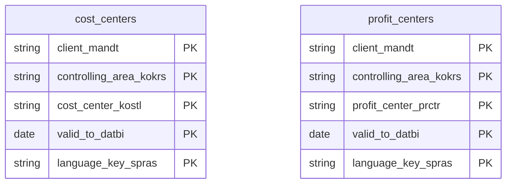

# Cost and Profit Centers Data Product

This data product includes information about SAP cost and profit centers from the Controlling (CO) module in the Finance domain in SAP S/4HANA or SAP ECC. It standardizes and exposes SAP cost centers and profit centers, complete with standard hierarchies and texts. This enables organizational spend mapping, profitability analysis, and responsibility accounting.

## 1. Overview & Business Value

*   **Business Purpose:** Standardizes and exposes SAP cost centers and profit centers. This enables clean organizational spend mapping, segmental profitability analysis, and responsibility-based accounting across various lines of business.

*   **Key Metrics & Use Cases:**
    *   **Metric/Use Case 1:** Corporate spend tracking and departmental budget analysis.
    *   **Metric/Use Case 2:** Profit center performance evaluation and segment reporting.

## 2. Data Assets Catalog

This data product exposes the following BigQuery data assets:

| Data Asset | Description | Source Systems |
| :--- | :--- | :--- |
| `cost_centers` | This view is based on SAP S/4HANA or SAP ECC Controlling (CO) module in the Finance domain and provides cost center master definitions from CSKS and CSKT, including valid date ranges, company codes, departments, responsible persons, lock indicators, and multi-lingual names/descriptions, to support corporate spend tracking. The data is captured at the granularity of Client (System), Controlling Area, Cost Center, Valid To, and Language Key, ensuring a unique audit trail for every record. | `SAP ECC` / `SAP S/4HANA` |
| `profit_centers` | This view is based on SAP S/4HANA or SAP ECC Controlling (CO) module in the Finance domain and provides profit center master definitions from CEPC and CEPCT, including valid date ranges, company codes, segments, responsible persons, lock indicators, and multi-lingual names/descriptions, to enable profit center performance evaluation and segment reporting. The data is captured at the granularity of Client (System), Controlling Area, Profit Center, Valid To, and Language Key, ensuring a unique audit trail for every record. | `SAP ECC` / `SAP S/4HANA` |### Entity Relationship Diagram (ERD)

## 3. Data Foundation & Source Tables

To build these assets, the following source tables must be available in the data foundation layer:

| Source Table | Name / Description | System Source | Used by Asset(s) |
| :--- | :--- | :--- | :--- |
| `csks` | Cost Center Master Data | `Common` | `cost_centers` |
| `cskt` | Cost Center Texts | `Common` | `cost_centers` |
| `cepc` | Profit Center Master Data | `Common` | `profit_centers` |
| `cepct` | Profit Center Texts | `Common` | `profit_centers` |

## 4. Transformations & Design Decisions

This section details the critical engineering and design decisions behind the transformations.

### A. Granularity & Primary Keys

*   **`cost_centers`:** Client (`client_mandt`), Controlling Area (`controlling_area_kokrs`), Cost Center (`cost_center_kostl`), Valid To Date (`valid_to_datbi`), and Language (`language_spras`).
*   **`profit_centers`:** Client (`client_mandt`), Profit Center (`profit_center_prctr`), Valid To Date (`valid_to_date_datbi`), Controlling Area (`controlling_area_kokrs`), and Language (`language_spras`).

### B. Joins & Relationship Logic

*   **`cost_centers`:** LEFT JOINs `csks` (Master) with `cskt` (Texts) on Client, Controlling Area, Cost Center, and Valid To Date, to append general name and description fields without dropping un-described master records.
*   **`profit_centers`:** LEFT JOINs `cepc` (Master) with `cepct` (Texts) on Client, Profit Center, Valid To Date, and Controlling Area, to append names and long text fields.

### C. Incremental Load Strategy

*   **Supported Materialization Types:** `incremental` | `table` | `view`
*   **Incremental Logic:**
    *   **`cost_centers`:** Incremental delta is determined using the greatest value of `recordstamp` from source tables `csks` and `cskt`.
    *   **`profit_centers`:** Incremental delta is determined using the greatest value of `recordstamp` from source tables `cepc` and `cepct`.

### D. ERP Source System Differences (ECC vs. S/4HANA)

*   **`cost_centers`** and **`profit_centers`** maintain parity between ECC and S/4HANA schemas by mapping version-specific properties to unified target column layouts.

### E. Field Conversions & Calculations

*   **Text & Language Resolution:** Resolves localized descriptions by joining texts on the language keys.

## 5. Change Log

| Date | Type of change | Change details |
| :--- | :--- | :--- |
| 24.06.2026 | Release | Release candidate validation completed. |
