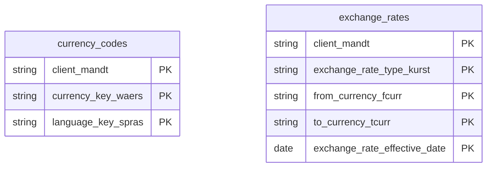

# Currency Conversion Data Product

This data product includes information about SAP currency conversion from the Financial Accounting (FI) module in the Finance domain in SAP S/4HANA or SAP ECC. It normalizes global financial and transactional figures through consistent exchange rate applications and decimal shifting logic. Essential for multinational consolidation, it provides reliable real-time and historical currency conversions for enterprise-wide fiscal reporting.

## 1. Overview & Business Value

*   **Business Purpose:** Normalizes global financial and transactional figures through consistent exchange rate applications and decimal shifting logic. Essential for multinational consolidation, it provides reliable real-time and historical currency conversions for enterprise-wide fiscal reporting.

*   **Key Metrics & Use Cases:**
    *   **Metric/Use Case 1:** Unified enterprise reporting and operational tracking.
    *   **Metric/Use Case 2:** High-fidelity analytics and AI-ready data ingestion.

## 2. Data Assets Catalog

This data product exposes the following BigQuery data assets:

| Data Asset | Description | Source Systems |
| :--- | :--- | :--- |
| `currency_codes` | This view is based on SAP S/4HANA or SAP ECC Financial Accounting (FI) module in the Finance domain and provides a standardized, global dictionary of active currency codes from SAP TCURC, TCURT, and TCURX, translating raw technical codes into standard ISO-4217 references with accurate decimal configurations and multilingual names. The data is captured at the granularity of Client (System), Currency Key, and Language Key, ensuring a unique audit trail for every record. | `SAP ECC` / `SAP S/4HANA` |
| `exchange_rates` | This view is based on SAP S/4HANA or SAP ECC Financial Accounting (FI) module in the Finance domain and provides Delivers daily, fully-expanded conversion exchange rates between currency pairs from SAP TCURR and TCURF, enabling accurate financial conversions for cross-border transactions and consolidated financial auditing. The data is captured at the granularity of Client (System), Exchange Rate Type, From Currency, To Currency, and Exchange Rate Effective, ensuring a unique audit trail for every record. | `SAP ECC` / `SAP S/4HANA` |### Entity Relationship Diagram (ERD)

## 3. Data Foundation & Source Tables

To build these assets, the following source tables must be available in the data foundation layer:

| Source Table | Name / Description | System Source | Used by Asset(s) |
| :--- | :--- | :--- | :--- |
| `tcurc` | Operational source table. | `Common` | `currency_codes` |
| `tcurt` | Operational source table. | `Common` | `currency_codes` |
| `tcurr` | Operational source table. | `Common` | `exchange_rates` |
| `tcurf` | Operational source table. | `Common` | `exchange_rates` |

## 4. Transformations & Design Decisions

This section details the critical engineering and design decisions behind the transformations.

### A. Granularity & Primary Keys

* **currency_codes:** Client (`client_mandt`), Currency Code (`currency_code_waers`), and Language (`language_spras`).
* **exchange_rates:** Client (`client_mandt`), Exchange Rate Type (`exchange_rate_type_kurst`), From Currency (`from_currency_fcurr`), To Currency (`to_currency_tcurr`), and Conversion Date (`conv_date`).
* **currency_codes:** `client_mandt`, `currency_code_waers`, and `language_spras`.
* **exchange_rates:** `client_mandt`, `exchange_rate_type_kurst`, `from_currency_fcurr`, `to_currency_tcurr`, and `conv_date`.

### B. Joins & Relationship Logic

* **currency_codes:**
* `tcurc` is LEFT JOINed to `tcurx` on `waers = currkey`. Note that `tcurx` does not have a `mandt` (client) column as decimal definitions are cross-client in SAP.
* `tcurc` is LEFT JOINed to `tcurt` on `waers` and `mandt` to enrich with localized language texts.
* **exchange_rates:**
* `TCURR` is INNER JOINed with `TCURF` on `mandt`, `kurst`, `fcurr`, and `tcurr` with an overlapping date range check (`tcurr.start_date <= tcurf.end_date AND tcurr.end_date >= tcurf.start_date`) to handle factors that change over time.
* Joins use `GREATEST` and `LEAST` on the start and end dates of both tables to construct the correct active range of each conversion rate factor.

### C. Incremental Load Strategy

*   **Supported Materialization Types:** `incremental` | `table` | `view`
*   **Incremental Logic:**
* **currency_codes:** Incremental filtering is enabled across source tables `tcurc`, `tcurt`, and `tcurx` using the `GREATEST` recordstamp pattern via `incremental.getFilter`.
* **exchange_rates:** Incremental filtering is enabled on `CurrencyConversion` records using the `GREATEST` recordstamp of `tcurr` and `tcurf` via `incremental.getFilter`. It restricts `conv_date` to a rolling window between 10 years in the past and 6 months in the future.

### D. ERP Source System Differences (ECC vs. S/4HANA)

* **currency_codes:** None. The table structures and relationships of `tcurc`, `tcurt`, and `tcurx` are identical across both versions.
* **exchange_rates:** None. Both versions use the identical `tcurr` and `tcurf` schema structures.
* Field Selections:**
* **currency_codes:**
* `tcurc.mandt` -> `client_mandt`
* `tcurc.waers` -> `currency_code_waers`
* `tcurc.isocd` -> `currency_iso_isocd`
* `tcurx.currdec` -> `currency_decimals_currdec`
* `tcurt.spras` -> `language_spras`
* `tcurt.ktext` -> `curr_short_text_ktext`
* `tcurt.ltext` -> `curr_long_text_ltext`
* **exchange_rates:**
* `mandt` -> `client_mandt`
* `kurst` -> `exchange_rate_type_kurst`
* `fcurr` -> `from_currency_fcurr`
* `tcurr` -> `to_currency_tcurr`
* `ukurs` -> `exchange_rate_ukurs`
* `start_date`, `end_date`, `conv_date`
* Handled specific edge cases:
* Direct rate calculation including division for indirect rates (`IF(tcurr.ukurs < 0, SAFE_DIVIDE(1, ABS(tcurr.ukurs)), tcurr.ukurs)`).
* Rate factor scaling applied using `tcurr.ukurs * (tcurf.tfact / tcurf.ffact)`.
* Same-to-same currency pair conversions are generated with `ukurs = 1` over a default 10-year range, but protected with a `WHERE NOT EXISTS` check to prevent duplicate records if same-to-same pairings are explicitly maintained in `tcurr`.
* Supported limitations documented: Triangulation (via reference currency) and Alternative Exchange Rate Types (fallback types) are not supported.

### E. Field Conversions & Calculations

*   **Currency & Conversions:** Standardized using built-in currency shift logic for currencies with non-standard decimal formats (e.g. JPY, IDR).
*   **Field Selections:** Enriched with operational data and standard language text mappings where applicable.

## 5. Change Log

| Date | Type of change | Change details |
| :--- | :--- | :--- |
| 24.06.2026 | Release | Release candidate validation completed. |
