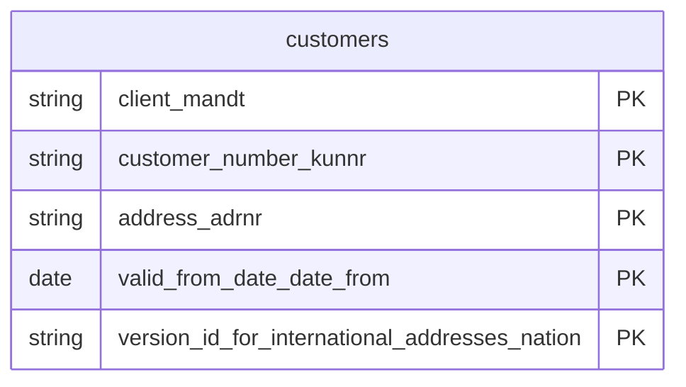

# Customers Data Product

This data product includes information about SAP customers from the Sales and Distribution (SD), Financial Accounting (FI) module in the Sales, Finance domain in SAP S/4HANA or SAP ECC. It offers an authoritative, 360-degree profile of customer master data, integrating core attributes, organizational assignments, and partner functions. It acts as a cornerstone for customer relationship management, localized marketing analytics, and AI-ready churn prediction models.

## 1. Overview & Business Value

*   **Business Purpose:** Offers an authoritative, 360-degree profile of customer master data, integrating core attributes, organizational assignments, and partner functions. It acts as a cornerstone for customer relationship management, localized marketing analytics, and AI-ready churn prediction models.

*   **Key Metrics & Use Cases:**
    *   **Metric/Use Case 1:** Unified enterprise reporting and operational tracking.
    *   **Metric/Use Case 2:** High-fidelity analytics and AI-ready data ingestion.

## 2. Data Assets Catalog

This data product exposes the following BigQuery data assets:

| Data Asset | Description | Source Systems |
| :--- | :--- | :--- |
| `customers` | This view is based on SAP S/4HANA or SAP ECC Sales and Distribution (SD), Financial Accounting (FI) module in the Sales, Finance domain and provides a single, comprehensive, and consistent view of customer master records across the business. By integrating core details (such as customer identifiers, group attributes, and account controls) with standardized address data, it enables customer relationship management, master data auditing, localized sales execution, and geo-analytics. The data is captured at the granularity of Client (System), Customer Number, Address, Valid From Date Date, and Version Id For International Addresses Nation, ensuring a unique audit trail for every record. | `SAP ECC` / `SAP S/4HANA` |### Entity Relationship Diagram (ERD)

## 3. Data Foundation & Source Tables

To build these assets, the following source tables must be available in the data foundation layer:

| Source Table | Name / Description | System Source | Used by Asset(s) |
| :--- | :--- | :--- | :--- |
| `kna1` | Operational source table. | `Common` | `customers` |
| `adrc` | Operational source table. | `Common` | `customers` |

## 4. Transformations & Design Decisions

This section details the critical engineering and design decisions behind the transformations.

### A. Granularity & Primary Keys

* **customers:** Client (`client_mandt`), Customer Number (`customer_number_kunnr`), Address Number (`address_adrnr`), Valid From Date (`valid_from_date_date_from`), and Version ID for International Addresses (`version_id_for_international_addresses_nation`).
* **customers:** `client_mandt`, `customer_number_kunnr`, `address_adrnr`, `valid_from_date_date_from`, and `version_id_for_international_addresses_nation`.

### B. Joins & Relationship Logic

* **customers:**
* `kna1` is LEFT JOINed with `adrc` on matching address number (`adrnr = addrnumber`) and client (`mandt = client`).
* A filter of `adrc.date_to = CAST('9999-12-31' AS DATE)` and `COALESCE(adrc.nation, '') = ''` is applied during the join to ensure only the current/standard address version is selected, preventing row multiplication from historic or multi-nation addresses.

### C. Incremental Load Strategy

*   **Supported Materialization Types:** `incremental` | `table` | `view`
*   **Incremental Logic:**
* **customers:** Incremental filtering is applied using a `GREATEST` recordstamp comparison between `kna1.recordstamp` and `adrc.recordstamp` (defaulting null values to `1900-01-01 00:00:00+00`).

### D. ERP Source System Differences (ECC vs. S/4HANA)

* **customers:** None. The table structure, relationships, and key fields of `kna1` and `adrc` are identical across ECC and S4.
* Field Selections:**
* **customers:**
* Standard customer attributes selected from `kna1` (e.g., `kunnr` -> `customer_number_kunnr`, `land1` -> `country_key_land1`, `name1` -> `name1_name1`).
* Detailed address properties selected from `adrc` (e.g., `addrnumber` -> `address_number_addrnumber`, `street` -> `street_street`, `house_num1` -> `house_number_house_num1`).
* Handled fallback logic using `COALESCE` for postal code (`COALESCE(kna1.pstlz, adrc.post_code1)`) and region (`COALESCE(kna1.regio, adrc.region)`) to ensure clean field fallbacks.

### E. Field Conversions & Calculations

*   **Currency & Conversions:** Standardized using built-in currency shift logic for currencies with non-standard decimal formats (e.g. JPY, IDR).
*   **Field Selections:** Enriched with operational data and standard language text mappings where applicable.

## 5. Change Log

| Date | Type of change | Change details |
| :--- | :--- | :--- |
| 24.06.2026 | Release | Release candidate validation completed. |
