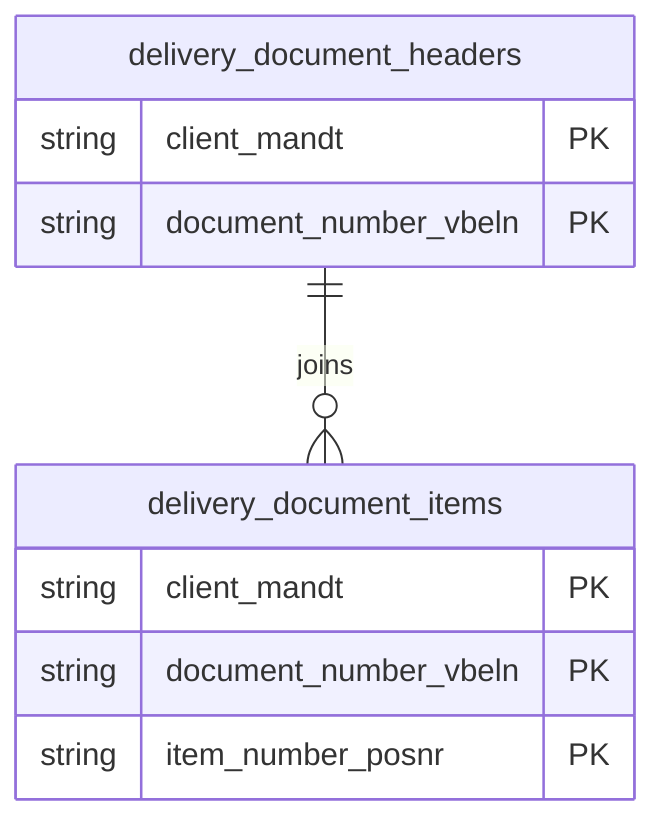

# Delivery Documents Data Product

This data product includes information about SAP delivery documents from the Sales and Distribution (SD) module in the Supply Chain, Sales domain in SAP S/4HANA or SAP ECC. It details the logistical flow of outbound and inbound deliveries across headers, items, status indicators, and delivery reasons. It supports end-to-end supply chain visibility, OTIF (On-Time In-Full) performance tracking, and distribution optimization algorithms.

## 1. Overview & Business Value

*   **Business Purpose:** Details the logistical flow of outbound and inbound deliveries across headers, items, status indicators, and delivery reasons. It supports end-to-end supply chain visibility, OTIF (On-Time In-Full) performance tracking, and distribution optimization algorithms.

*   **Key Metrics & Use Cases:**
    *   **Metric/Use Case 1:** Unified enterprise reporting and operational tracking.
    *   **Metric/Use Case 2:** High-fidelity analytics and AI-ready data ingestion.

## 2. Data Assets Catalog

This data product exposes the following BigQuery data assets:

| Data Asset | Description | Source Systems |
| :--- | :--- | :--- |
| `delivery_blocking_reasons` | This view is based on SAP S/4HANA or SAP ECC Sales and Distribution (SD) module in the Supply Chain, Sales domain and provides language-dependent descriptive names for delivery block reasons from SAP TVLST, allowing business analysts to understand the root causes of shipping blocks and holds. The data is captured at the granularity of system default keys, ensuring a unique audit trail for every record. | `SAP ECC` / `SAP S/4HANA` |
| `delivery_document_headers` | This view is based on SAP S/4HANA or SAP ECC Sales and Distribution (SD) module in the Supply Chain, Sales domain and provides Serves as the central record of SAP outbound or inbound delivery headers from LIKP, tracking logistical and shipping details including creation dates, shipping points, delivery types, weights, routing, and shipment release statuses. The data is captured at the granularity of Client (System) and Document Number, ensuring a unique audit trail for every record. | `SAP ECC` / `SAP S/4HANA` |
| `delivery_document_items` | This view is based on SAP S/4HANA or SAP ECC Sales and Distribution (SD) module in the Supply Chain, Sales domain and provides individual line-item data for SAP deliveries from LIPS, capturing quantities delivered, materials, units of measure, plants, net values, and preceding order references for fulfillment and invoicing. The data is captured at the granularity of Client (System), Document Number, and Item Number, ensuring a unique audit trail for every record. | `SAP ECC` / `SAP S/4HANA` |### Entity Relationship Diagram (ERD)

## 3. Data Foundation & Source Tables

To build these assets, the following source tables must be available in the data foundation layer:

| Source Table | Name / Description | System Source | Used by Asset(s) |
| :--- | :--- | :--- | :--- |
| `tvlst` | Operational source table. | `Common` | `delivery_blocking_reasons` |
| `likp` | Operational source table. | `Common` | `delivery_document_headers`, `delivery_document_items` |
| `lips` | Operational source table. | `Common` | `delivery_document_items` |

## 4. Transformations & Design Decisions

This section details the critical engineering and design decisions behind the transformations.

### A. Granularity & Primary Keys

* **delivery_blocking_reasons:** Client (`client_mandt`), Language (`language_key_spras`), and Default Delivery Block Reason (`default_delivery_block_lifsp`).
* **delivery_document_headers:** Client (`client_mandt`) and Delivery Document Number (`document_number_vbeln`).
* **delivery_document_items:** Client (`client_mandt`), Delivery Document Number (`document_number_vbeln`), and Item Number (`item_number_posnr`).
* **delivery_blocking_reasons:** `client_mandt`, `language_key_spras`, and `default_delivery_block_lifsp`.
* **delivery_document_headers:** `client_mandt` and `document_number_vbeln`.
* **delivery_document_items:** `client_mandt`, `document_number_vbeln`, and `item_number_posnr`.

### B. Joins & Relationship Logic

* **delivery_blocking_reasons:** No joins. Represents a direct text table lookup from `tvlst`.
* **delivery_document_headers:**
* `likp` is LEFT JOINed to the `currency_decimal` CTE (generated via `currency.currencyDecimalShift` on `tcurx`) matching `likp.waerk = currency_decimal.currkey` to apply proper currency decimal shifts.
* `likp` is LEFT JOINed to the `date_dimension` table on fields `lfdat` (delivery date), `podat` (proof of delivery date), and `bldat` (document date) to extract rich calendar metrics (years, months, weeks, quarters).
* **delivery_document_items:**
* `lips` is LEFT JOINed to `likp` on `mandt` and `vbeln` to pull header-level document currencies (`waerk`) and reference indicators.
* `lips` is LEFT JOINed to the `date_dimension` table on `erdat` (creation date) to extract calendar attributes.
* `likp` header currency keys are matched against the `currency_decimal` CTE to adjust net value and net price fields with the appropriate decimal shifts at the line-item level.

### C. Incremental Load Strategy

*   **Supported Materialization Types:** `incremental` | `table` | `view`
*   **Incremental Logic:**
* **delivery_blocking_reasons:** Incremental updates are driven by the `recordstamp` on `tvlst`.
* **delivery_document_headers:** Incremental logic filters new and modified headers using the `recordstamp` on the `likp` source table.
* **delivery_document_items:** Incremental logic is based on the `recordstamp` of the primary `lips` item table.

### D. ERP Source System Differences (ECC vs. S/4HANA)

* **delivery_blocking_reasons:** No differences. The schema of `tvlst` remains consistent.
* **delivery_document_headers:** S4 contains an extended set of fields compared to ECC, requiring separate definition scripts for S4 and ECC implementations to map all system-specific columns accurately.
* **delivery_document_items:** S4 implements an extended set of item-level columns compared to ECC. Separate definition files are maintained for each version to handle these schema variances seamlessly.
* Field Selections:**
* **delivery_blocking_reasons:** Maps `mandt` -> `client_mandt`, `spras` -> `language_key_spras`, `lifsp` -> `default_delivery_block_lifsp`, and `vtext` -> `delivery_blocking_reason_vtext`.
* **delivery_document_headers:** Maps structural header values from `likp` (e.g., `vbeln` -> `document_number_vbeln`, weights `btgew` / `ntgew`, volumes, and route data) alongside calendar components resolved from the joins. Applying currency-adjusted values to net header totals (`netwr`).
* **delivery_document_items:** Maps quantities (`lfimg`), base/sales units, and preceding document flows (`vgbel`, `vgpos`, `kdauf`, `kdpos`) to track order-to-delivery fulfillment. Decimal shifts are applied using currency functions to values like net price (`netpr`), cost (`wavwr`), and sub-totals (`kzwi1` - `kzwi6`).

### E. Field Conversions & Calculations

*   **Currency & Conversions:** Standardized using built-in currency shift logic for currencies with non-standard decimal formats (e.g. JPY, IDR).
*   **Field Selections:** Enriched with operational data and standard language text mappings where applicable.

## 5. Change Log

| Date | Type of change | Change details |
| :--- | :--- | :--- |
| 24.06.2026 | Release | Release candidate validation completed. |
