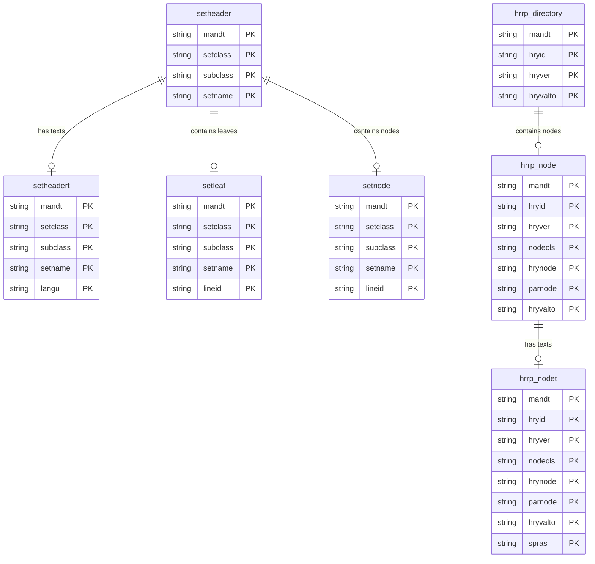

# Financial Hierarchies Data Product

This data product includes information about SAP financial hierarchies from the Financial Accounting (FI), Controlling (CO) module in the Finance domain in SAP S/4HANA or SAP ECC. This data product provides a consolidated view of financial hierarchies and sets from SAP ERP (ECC and S/4HANA). It supports both classic SAP Sets (common to ECC and S/4HANA) and the newer S/4HANA HANA Runtime Replication (HRRP) hierarchies, enabling unified reporting on cost centers, profit centers, and other financial groupings.

## 1. Overview & Business Value

*   **Business Purpose:** Financial hierarchies are critical for reporting and analysis in SAP. They define how cost centers, profit centers, G/L accounts, and other financial entities are grouped. This data product enables hierarchical reporting, aggregation of costs/revenues along organizational hierarchies, and dynamic navigation of cost center and profit center groups.
*   **Key Metrics & Use Cases:**
    *   **Financial Reporting:** Aggregate financial data (e.g., P&L, Balance Sheet) across hierarchical structures.
    *   **Cost & Profit Center Analysis:** Analyze performance by cost center or profit center groups.
    *   **Master Data Auditing:** Verify the integrity and structure of financial sets and hierarchies.

## 2. Data Assets Catalog

This data product exposes the following BigQuery data assets:

| Data Asset | Description | Source Systems |
| :--- | :--- | :--- |
| `financial_hierarchy_nodes` | This view is based on SAP S/4HANA Financial Accounting (FI), Controlling (CO) module in the Finance domain and provides Nodes of the financial hierarchies. Joined view of `hrrp_node` and `hrrp_nodet`. The data is captured at the granularity of system default keys, ensuring a unique audit trail for every record. | `SAP S/4HANA` |
| `financial_hierarchy_directories` | This view is based on SAP S/4HANA Financial Accounting (FI), Controlling (CO) module in the Finance domain and provides Directory of financial hierarchies. Base view of `hrrp_directory`. The data is captured at the granularity of system default keys, ensuring a unique audit trail for every record. | `SAP S/4HANA` |
| `set_headers` | This view is based on SAP S/4HANA or SAP ECC Financial Accounting (FI), Controlling (CO) module in the Finance domain and provides Joined view of `setheader` and `setheadert` containing set headers and descriptions. The data is captured at the granularity of system default keys, ensuring a unique audit trail for every record. | `SAP ECC` / `SAP S/4HANA` |
| `set_leaves` | This view is based on SAP S/4HANA or SAP ECC Financial Accounting (FI), Controlling (CO) module in the Finance domain and provides Base view of `setleaf` containing values (leaves) in sets. The data is captured at the granularity of system default keys, ensuring a unique audit trail for every record. | `SAP ECC` / `SAP S/4HANA` |
| `set_nodes` | This view is based on SAP S/4HANA or SAP ECC Financial Accounting (FI), Controlling (CO) module in the Finance domain and provides Base view of `setnode` containing lower-level sets in sets. The data is captured at the granularity of system default keys, ensuring a unique audit trail for every record. | `SAP ECC` / `SAP S/4HANA` |
| `cost_center_group_hierarchy` | This view is based on SAP S/4HANA or SAP ECC Financial Accounting (FI), Controlling (CO) module in the Finance domain and provides Master data / hierarchy for Cost Center Groups. In S/4HANA, this is the HANA-optimized hierarchy. In ECC, it is the master data (texts) for cost center sets. The data is captured at the granularity of system default keys, ensuring a unique audit trail for every record. | `SAP ECC` / `SAP S/4HANA` |
| `profit_center_group_hierarchy` | This view is based on SAP S/4HANA or SAP ECC Financial Accounting (FI), Controlling (CO) module in the Finance domain and provides Master data / hierarchy for Profit Center Groups. In S/4HANA, this is the HANA-optimized hierarchy. In ECC, it is the master data (texts) for profit center sets. The data is captured at the granularity of system default keys, ensuring a unique audit trail for every record. | `SAP ECC` / `SAP S/4HANA` |
| `cost_center_hierarchy_flattened` | This view is based on SAP S/4HANA or SAP ECC Financial Accounting (FI), Controlling (CO) module in the Finance domain and provides Flattened cost center hierarchy mapping each cost center to all its ancestor nodes with texts. The data is captured at the granularity of system default keys, ensuring a unique audit trail for every record. | `SAP ECC` / `SAP S/4HANA` |
| `profit_center_hierarchy_flattened` | This view is based on SAP S/4HANA or SAP ECC Financial Accounting (FI), Controlling (CO) module in the Finance domain and provides Flattened profit center hierarchy mapping each profit center to all its ancestor nodes with texts. The data is captured at the granularity of system default keys, ensuring a unique audit trail for every record. | `SAP ECC` / `SAP S/4HANA` |## 3. Data Foundation & Source Tables

To build these assets, the following source tables must be available in the data foundation layer:

| Source Table | Name / Description | System Source | Used by Asset(s) |
| :--- | :--- | :--- | :--- |
| `setheader` | Set Header and Directory | `Common` | `set_headers`, `cost_center_hierarchy_flattened` (ECC), `profit_center_hierarchy_flattened` (ECC) |
| `setheadert` | Short Description of Sets | `Common` | `set_headers`, `cost_center_group_hierarchy` (ECC), `profit_center_group_hierarchy` (ECC), `cost_center_hierarchy_flattened` (ECC), `profit_center_hierarchy_flattened` (ECC) |
| `setleaf` | Values in Sets | `Common` | `set_leaves`, `cost_center_hierarchy_flattened` (ECC), `profit_center_hierarchy_flattened` (ECC) |
| `setnode` | Lower-level sets in sets | `Common` | `set_nodes`, `cost_center_hierarchy_flattened` (ECC), `profit_center_hierarchy_flattened` (ECC) |
| `hrrp_directory` | Directory of financial hierarchies | `S4-only` | `financial_hierarchy_directories` |
| `hrrp_node` | Nodes of the financial hierarchies | `S4-only` | `financial_hierarchy_nodes` |
| `hrrp_nodet` | Texts for hierarchy nodes | `S4-only` | `financial_hierarchy_nodes` |
| `sethanahier0101` | HANA-optimized view for Cost Center Groups | `S4-only` | `cost_center_group_hierarchy` (S4), `cost_center_hierarchy_flattened` (S4) |
| `sethanahier0106` | HANA-optimized view for Profit Center Groups | `S4-only` | `profit_center_group_hierarchy` (S4), `profit_center_hierarchy_flattened` (S4) |
| `csks` | Cost Center Master Data | `Common` | `cost_center_hierarchy_flattened` |
| `cskt` | Cost Center Texts | `Common` | `cost_center_hierarchy_flattened` |
| `cepc` | Profit Center Master Data | `Common` | `profit_center_hierarchy_flattened` |
| `cepct` | Profit Center Texts | `Common` | `profit_center_hierarchy_flattened` |
| `t002` | Language Keys | `Common` | `cost_center_hierarchy_flattened`, `profit_center_hierarchy_flattened` |

### Entity Relationship (ER) Diagram

<!-- ERD_START -->

<!-- ERD_END -->

## 4. Transformations & Design Decisions

This section details the critical engineering and design decisions behind the transformations.

### A. Granularity & Primary Keys

*   **`financial_hierarchy_nodes`**: The grain is one row per hierarchy node text. Row uniqueness is strictly enforced on `client_mandt`, `hierarchy_id_hryid`, `hierarchy_version_hryver`, `node_class_nodecls`, `hierarchy_node_hrynode`, `parent_node_parnode`, `valid_to_hryvalto`, and `language_key_spras`.
*   **`financial_hierarchy_directories`**: The grain is one row per hierarchy directory entry. Unique on `client_mandt`, `hierarchy_id_hryid`, `hierarchy_version_hryver`, and `valid_to_hryvalto`.
*   **`set_headers`**: The grain is one row per set header text. Unique on `client_mandt`, `set_class_setclass`, `subclass_subclass`, `set_name_setname`, and `language_key_langu`.
*   **`set_leaves`**: The grain is one row per set leaf value. Unique on `client_mandt`, `set_class_setclass`, `subclass_subclass`, `set_name_setname`, and `line_id_lineid`.
*   **`set_nodes`**: The grain is one row per set node relationship. Unique on `client_mandt`, `set_class_setclass`, `subclass_subclass`, `set_name_setname`, and `line_id_lineid`.
*   **`cost_center_group_hierarchy`**:
    *   **S/4HANA**: The grain is one row per hierarchy node. Unique on `client_mandt`, `set_class_setclass`, `subclass_subclass`, `hierarchy_base_hierbase`, and `successor_node_succ`.
    *   **ECC**: The grain is one row per cost center set text. Unique on `client_mandt`, `set_class_setclass`, `subclass_subclass`, `set_name_setname`, and `language_key_langu`.
*   **`profit_center_group_hierarchy`**:
    *   **S/4HANA**: The grain is one row per hierarchy node. Unique on `client_mandt`, `set_class_setclass`, `subclass_subclass`, `hierarchy_base_hierbase`, and `successor_node_succ`.
    *   **ECC**: The grain is one row per profit center set text. Unique on `client_mandt`, `set_class_setclass`, `subclass_subclass`, `set_name_setname`, and `language_key_langu`.
*   **`cost_center_hierarchy_flattened`**: The grain is one row per ancestor-descendant relationship per language. Unique on `client_mandt`, `hierarchy_class_setclass`, `hierarchy_subclass_subclass`, `hierarchy_type_hierbase`, `language_key_spras`, `cost_center_kostl`, `cost_center_node`, and `parent_node`.
*   **`profit_center_hierarchy_flattened`**: The grain is one row per ancestor-descendant relationship per language. Unique on `client_mandt`, `hierarchy_class_setclass`, `hierarchy_subclass_subclass`, `hierarchy_type_hierbase`, `language_key_spras`, `profit_center_prctr`, `profit_center_node`, and `parent_node`.

### B. Joins & Relationship Logic

*   **`set_headers`**: Joined `setheader` with `setheadert` using a `LEFT JOIN` to retain all set headers even if descriptions are missing.
*   **`financial_hierarchy_nodes`**: Joined `hrrp_node` with `hrrp_nodet` using a `LEFT JOIN` to retain all nodes even if texts are missing in the target language.
*   **`cost_center_hierarchy_flattened` & `profit_center_hierarchy_flattened`**:
    *   Joined the flattened hierarchy with `cost_center_group_hierarchy` (or `profit_center_group_hierarchy`) to get parent and node texts.
    *   Joined with `csks` / `cskt` (or `cepc` / `cepct`) tables to get the leaf-level descriptions.
    *   Cross-joined with `LanguageKey` (derived from `t002` table filtered by `filters.languages` in table settings) to support multi-language reporting.

### C. Incremental Load Strategy

*   **Supported Materialization Types:** `incremental` | `table` | `view`
*   **Incremental Logic:**
    *   **Standard Assets**: Delta updates are performed using `recordstamp` comparison.
    *   **Flattened Hierarchies (`cost_center_hierarchy_flattened`, `profit_center_hierarchy_flattened`)**: 
        *   **Design Decision: Table Materialization**: These assets use `table` materialization (rebuilt from scratch) instead of `incremental`. 
        *   *Rationale*: Hierarchies are built using recursive CTEs. A change in a single node relationship (e.g., moving a node to a different parent) cascades and affects the path and level of all its descendants. Since incremental loads only capture the changed rows in the delta, they cannot easily update the paths of unchanged descendants. Rebuilding the entire hierarchy ensures data consistency. Given that hierarchy master data is typically small (thousands of rows), rebuilding it as a table is highly efficient and cost-effective in BigQuery.

### D. ERP Source System Differences (ECC vs. S/4HANA)

*   **`cost_center_group_hierarchy` & `profit_center_group_hierarchy`**:
    *   *Comparison:* S/4HANA utilizes HANA-optimized hierarchy tables (`sethanahier0101` and `sethanahier0106`) which contain the pre-flattened hierarchy structure. ECC does not have these tables; instead, it relies on the classic set tables.
    *   *Design:* Separate JS definitions are maintained in `ecc/` and `s4/` folders.
        *   The **S/4HANA** version queries the HANA-optimized hierarchy tables directly.
        *    the **ECC** version queries `setheadert` to provide the master data (texts) for the groups, filtered by the respective set class (`0101` for Cost Centers, `0106` for Profit Centers). This filter is configurable via `table_settings.default.yaml`.

*   **`cost_center_hierarchy_flattened` & `profit_center_hierarchy_flattened`**:
    *   *Design*: Separate JS definitions are maintained in `ecc/` and `s4/` folders to handle the source table differences.
        *   **S/4HANA**: Resolves parent-child relationships using `sethanahier*`. It performs **range expansion** by joining with `cost_centers` / `profit_centers` master data (to expand ranges like `1000-1099` into individual values) and then applies a recursive CTE to flatten the hierarchy.
        *   **ECC**: Lacks the pre-consolidated `sethanahier*` tables. It must first resolve the hierarchy structure by tracing relationships in `setnode` back to their roots (found in `setheader` but not in `setnode` as children) to identify the hierarchy name (`hiername`). Then it performs range expansion on `setleaf` and applies the recursive CTE to flatten the hierarchy.

### E. Field Conversions & Calculations

*   **Range Expansion**: Leaf nodes in SAP sets often define ranges of values (e.g., `valoption = 'BT'` with `valfrom = '1000'` and `valto = '1099'`). The flattening logic expands these ranges into individual cost center/profit center codes by joining with the master data tables on `BETWEEN` conditions.

## 5. Change Log

| Version | Type of change | Change details |
| :--- | :--- | :--- |
| 7.0.0 | Feature | Added `cost_center_hierarchy_flattened` and `profit_center_hierarchy_flattened` data assets (supporting both ECC and S/4HANA), and split group hierarchies into source-specific implementations to support ECC. |
