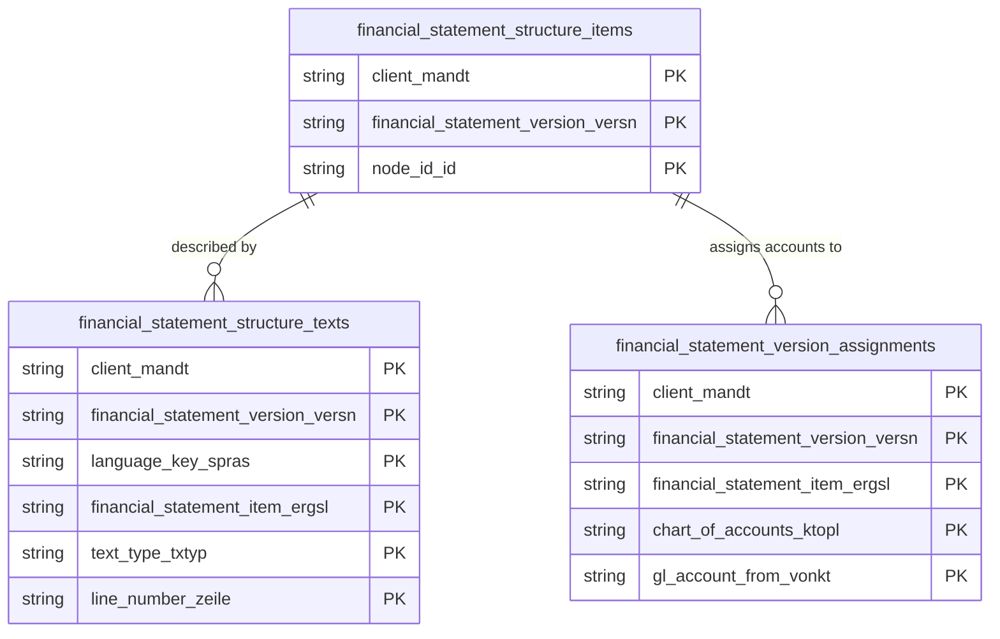

# Financial Statement Structure & Versions Data Product

This data product includes information about SAP financial statement structure versions from the Financial Accounting (FI) module in the Finance domain in SAP S/4HANA or SAP ECC. The Financial Statement Structure & Versions data product encapsulates SAP Financial Statement Versions (FSVs) hierarchy, item definitions, and the assignments of Financial Statement Items to General Ledger (G/L) accounts across ECC and S/4HANA systems.

## 1. Overview & Business Value

*   **Business Purpose:** Structures balance sheet and profit & loss (P&L) statement reporting hierarchies by extracting financial statement version definitions (`FAGL_011PC`), item texts (`FAGL_011QT`), and G/L account assignments (`FAGL_011ZC`).
*   **Key Metrics & Use Cases:**
    *   **Financial Reporting Hierarchies:** Automated balance sheet and P&L hierarchy generation in BigQuery.
    *   **G/L Account Mapping:** Verifying chart of accounts assignments and financial reporting node structures.

## 2. Data Assets Catalog

This data product exposes the following BigQuery data assets:

| Data Asset | Description | Source Systems |
| :--- | :--- | :--- |
| `financial_statement_structure_texts` | This view is based on SAP S/4HANA or SAP ECC Financial Accounting (FI) module in the Finance domain and provides language-dependent text descriptions for Financial Statement Items from SAP FAGL_011QT to support financial reporting hierarchies. The data is captured at the granularity of Client (System), Financial Statement Version, Language Key, Financial Statement Item, Text Type, and Line Number, ensuring a unique audit trail for every record. | `SAP ECC` / `SAP S/4HANA` |
| `financial_statement_structure_items` | This view is based on SAP S/4HANA or SAP ECC Financial Accounting (FI) module in the Finance domain and provides hierarchical node items and structure layouts for Financial Statement Versions from SAP FAGL_011PC to automate balance sheet and P&L hierarchy generation. The data is captured at the granularity of Client (System), Financial Statement Version, and Node Id, ensuring a unique audit trail for every record. | `SAP ECC` / `SAP S/4HANA` |
| `financial_statement_version_assignments` | This view is based on SAP S/4HANA or SAP ECC Financial Accounting (FI) module in the Finance domain and provides Maps and assigns Financial Statement Items to General Ledger (G/L) accounts from SAP FAGL_011ZC, verifying chart of accounts assignments and reporting node structures. The data is captured at the granularity of Client (System), Financial Statement Version, Financial Statement Item, Chart Of Accounts, and Gl Account From, ensuring a unique audit trail for every record. | `SAP ECC` / `SAP S/4HANA` |### Entity Relationship Diagram (ERD)

## 3. Data Foundation & Source Tables

To build these assets, the following source tables must be available in the data foundation layer:

| Source Table | Name / Description | System Source | Used by Asset(s) |
| :--- | :--- | :--- | :--- |
| `fagl_011qt` | Fin. Statement Structure: Text for Fin. Statement Items | `Common` | `financial_statement_structure_texts` |
| `fagl_011pc` | Fin. Statement Version: Items in FS Version | `Common` | `financial_statement_structure_items` |
| `fagl_011zc` | Fin. Statement Version: Assignment of FS Items to G/L Accounts | `Common` | `financial_statement_version_assignments` |

## 4. Transformations & Design Decisions

This section details the critical engineering and design decisions behind the transformations.

### A. Granularity & Primary Keys

*   **`financial_statement_structure_texts`**: Granularity is Client, FS Version, Language Key, FS Item, Text Type, and Line.
*   **`financial_statement_structure_items`**: Granularity is Client, FS Version, and Node ID.
*   **`financial_statement_version_assignments`**: Granularity is Client, FS Version, FS Item, Chart of Accounts, and G/L Account From.

### B. Joins & Relationship Logic

*   **`financial_statement_structure_texts`**: Sourced directly from `fagl_011qt`.
*   **`financial_statement_structure_items`**: Sourced directly from `fagl_011pc`.
*   **`financial_statement_version_assignments`**: Sourced directly from `fagl_011zc`.

### C. Incremental Load Strategy

*   **Supported Materialization Types:** `incremental`
*   **Incremental Logic:**
    *   Delta loading is performed utilizing the `recordstamp` field to track modifications on base tables.
    *   **Merge Policy:** `EXTEND` on schema change.

### D. ERP Source System Differences (ECC vs. S/4HANA)

*   Unified definition models supporting both ECC and S/4HANA seamlessly.

### E. Field Conversions & Calculations

*   **Hierarchy Resolution:** Preserves node hierarchy positions for downstream Dataform and BI reporting models.

## 5. Change Log

| Date | Type of change | Change details |
| :--- | :--- | :--- |
| 24.06.2026 | Release | Release candidate validation completed. |
