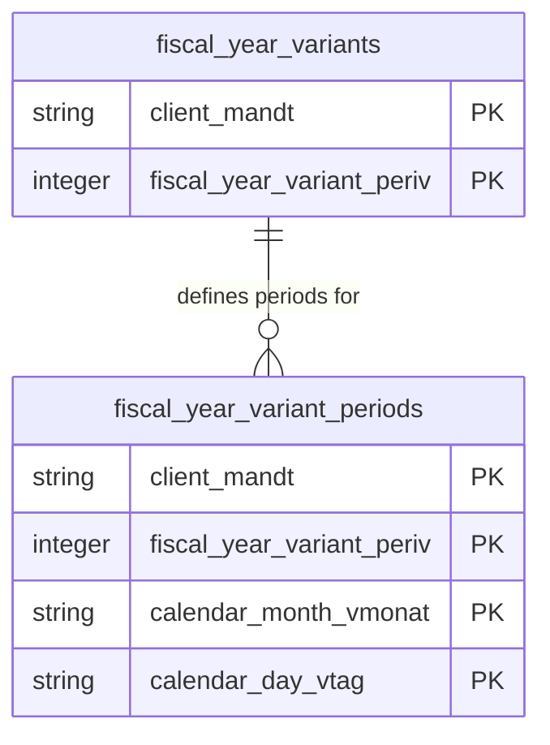

# Fiscal Year Variants Data Product

This data product includes information about SAP fiscal year variants from the Financial Accounting (FI) module in the Finance domain in SAP S/4HANA or SAP ECC. The Fiscal Year Variants data product provides clean financial calendar modeling assets for SAP Fiscal Year Variants (`T009`) and their associated period definitions (`T009B`) across ECC and S/4HANA systems.

## 1. Overview & Business Value

*   **Business Purpose:** Establishes fiscal calendar structures (posting periods, special periods, fiscal year start/end dates) by extracting variant configurations (`T009`) and period mappings (`T009B`). It enables accounting teams to align calendar dates with corporate fiscal reporting periods.
*   **Key Metrics & Use Cases:**
    *   **Fiscal Reporting & Close:** Aligning daily posting transactions with active fiscal periods and quarters.
    *   **Financial Calendar Dimming:** Serving as a base dimension for time-series financial analysis.

## 2. Data Assets Catalog

This data product exposes the following BigQuery data assets:

| Data Asset | Description | Source Systems |
| :--- | :--- | :--- |
| `fiscal_year_variants` | This view is based on SAP S/4HANA or SAP ECC Financial Accounting (FI) module in the Finance domain and provides master definitions of SAP Fiscal Year Variants from T009, including calendar year markers, year-dependent indicators, and the number of posting and special periods. The data is captured at the granularity of Client (System) and Fiscal Year Variant, ensuring a unique audit trail for every record. | `SAP ECC` / `SAP S/4HANA` |
| `fiscal_year_variant_periods` | This view is based on SAP S/4HANA or SAP ECC Financial Accounting (FI) module in the Finance domain and provides period definitions from SAP T009B, mapping calendar months and days to corporate fiscal posting periods and periods shifts. The data is captured at the granularity of Client (System), Fiscal Year Variant, Calendar Month Vmonat, and Calendar Day, ensuring a unique audit trail for every record. | `SAP ECC` / `SAP S/4HANA` |### Entity Relationship Diagram (ERD)

## 3. Data Foundation & Source Tables

To build these assets, the following source tables must be available in the data foundation layer:

| Source Table | Name / Description | System Source | Used by Asset(s) |
| :--- | :--- | :--- | :--- |
| `t009` | Fiscal Year Variants | `Common` | `fiscal_year_variants`, `fiscal_year_variant_periods` |
| `t009b` | Fiscal Year Variant Periods | `Common` | `fiscal_year_variant_periods` |

## 4. Transformations & Design Decisions

This section details the critical engineering and design decisions behind the transformations.

### A. Granularity & Primary Keys

*   **`fiscal_year_variants`**: Granularity is one row per fiscal year variant. Primary keys are `client_mandt` and `fiscal_year_variant_periv`.
*   **`fiscal_year_variant_periods`**: Granularity is one row per calendar day mapping per variant. Primary keys are `client_mandt`, `fiscal_year_variant_periv`, `calendar_month_vmonat`, and `calendar_day_vtag`.

### B. Joins & Relationship Logic

*   **`fiscal_year_variants`**: Sourced directly from `t009`.
*   **`fiscal_year_variant_periods`**: Sourced from `t009b` with variant context.

### C. Incremental Load Strategy

*   **Supported Materialization Types:** `incremental`
*   **Incremental Logic:**
    *   Delta loading tracks updates using the `recordstamp` field on base tables.
    *   **Merge Policy:** `EXTEND` on schema change.

### D. ERP Source System Differences (ECC vs. S/4HANA)

*   Unified definition models supporting both ECC and S/4HANA seamlessly.

### E. Field Conversions & Calculations

*   **Period Shift Calculations:** Preserves period displacement indicators (`relat`) for year-end crossover calculations.

## 5. Change Log

| Date | Type of change | Change details |
| :--- | :--- | :--- |
| 24.06.2026 | Release | Release candidate validation completed. |
