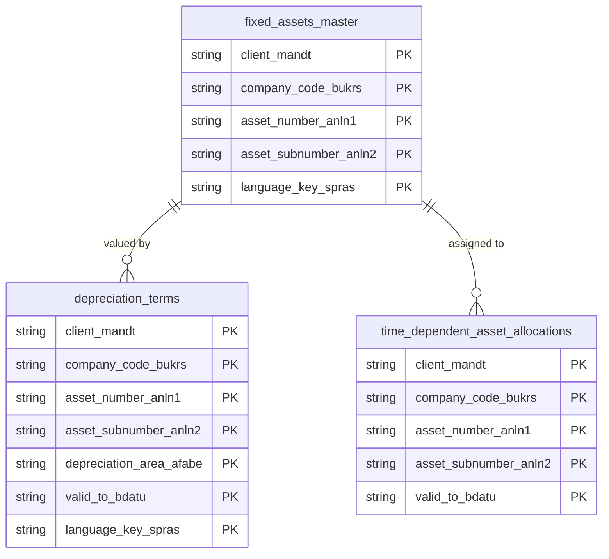

# Fixed Assets Data Product

This data product includes information about SAP fixed assets from the Financial Accounting (FI) module in the Finance domain in SAP S/4HANA or SAP ECC. It unifies asset master records, hierarchical assignments, and lifecycle details across the enterprise. It supports compliance auditing, CAPEX (Capital Expenditure) tracking, and strategic asset depreciation modeling.

## 1. Overview & Business Value

*   **Business Purpose:** Unifies asset master records, hierarchical assignments, and lifecycle details across the enterprise. It supports compliance auditing, CAPEX (Capital Expenditure) tracking, and strategic asset depreciation modeling.

*   **Key Metrics & Use Cases:**
    *   **Metric/Use Case 1:** Unified enterprise reporting and operational tracking.
    *   **Metric/Use Case 2:** High-fidelity analytics and AI-ready data ingestion.

## 2. Data Assets Catalog

This data product exposes the following BigQuery data assets:

| Data Asset | Description | Source Systems |
| :--- | :--- | :--- |
| `fixed_assets_master` | This view is based on SAP S/4HANA or SAP ECC Financial Accounting (FI) module in the Finance domain and provides SAP fixed asset master data from ANLA, ANLH, and ANKT, combining core asset details, main asset numbers, and class descriptions to enable lifecycle and ownership reporting. The data is captured at the granularity of Client (System), Company Code, Asset Number, Asset Subnumber, and Language Key, ensuring a unique audit trail for every record. | `SAP ECC` / `SAP S/4HANA` |
| `depreciation_terms` | This view is based on SAP S/4HANA or SAP ECC Financial Accounting (FI) module in the Finance domain and provides depreciation parameters and useful life settings from ANLB, T093B, and related SAP tables to model fixed asset valuation trends. The data is captured at the granularity of Client (System), Company Code, Asset Number, Asset Subnumber, Depreciation Area, Valid To, and Language Key, ensuring a unique audit trail for every record. | `SAP ECC` / `SAP S/4HANA` |
| `time_dependent_asset_allocations` | This view is based on SAP S/4HANA or SAP ECC Financial Accounting (FI) module in the Finance domain and provides cost center, profit center, plant, and other time-varying organizational allocations for fixed assets from SAP ANLZ. The data is captured at the granularity of Client (System), Company Code, Asset Number, Asset Subnumber, and Valid To, ensuring a unique audit trail for every record. | `SAP ECC` / `SAP S/4HANA` |### Entity Relationship Diagram (ERD)

## 3. Data Foundation & Source Tables

To build these assets, the following source tables must be available in the data foundation layer:

| Source Table | Name / Description | System Source | Used by Asset(s) |
| :--- | :--- | :--- | :--- |
| `anla` | Asset Master Record Segment | `Common` | `fixed_assets_master` |
| `anlh` | Asset Main Number Texts | `Common` | `fixed_assets_master` |
| `ankt` | Asset Class Descriptions | `Common` | `fixed_assets_master` |
| `anlb` | Depreciation Terms | `Common` | `depreciation_terms` |
| `anlz` | Asset Time-Dependent Allocations | `Common` | `time_dependent_asset_allocations` |
| `t090nat` | Depreciation Key Description | `Common` | `depreciation_terms` |
| `t093b` | Real Depreciation Areas | `Common` | `depreciation_terms` |
| `t093c` | Chart of Depreciation | `Common` | `depreciation_terms` |
| `t093t` | Depreciation Area Denominations | `Common` | `depreciation_terms` |
| `t095t` | Account Determination Texts | `Common` | `fixed_assets_master` |
| `t098t` | Reasons for Manual Valuation Text | `Common` | `fixed_assets_master` |

## 4. Transformations & Design Decisions

This section details the critical engineering and design decisions behind the transformations.

### A. Granularity & Primary Keys

* **fixed_assets_master:** Client (`client_mandt`), Company Code (`company_code_bukrs`), Asset Number (`asset_number_anln1`), Asset Subnumber (`asset_subnumber_anln2`), and Language (`language_key_spras`).
* **depreciation_terms:** Client (`client_mandt`), Company Code (`company_code_bukrs`), Asset Number (`asset_number_anln1`), Asset Subnumber (`asset_subnumber_anln2`), Depreciation Area (`depreciation_area_afabe`), Valid To Date (`valid_to_bdatu`), and Language (`language_key_spras`).
* **time_dependent_asset_allocations:** Client (`client_mandt`), Company Code (`company_code_bukrs`), Asset Number (`asset_number_anln1`), Asset Subnumber (`asset_subnumber_anln2`), and Valid To Date (`valid_to_bdatu`).

### B. Joins & Relationship Logic

* **fixed_assets_master:** Joins `anla` with `anlh` (Asset Main Number) and `ankt` (Asset Class Descriptions) to resolve descriptions, and LEFT JOINs `t095t` and `t098t` to bring in account determination and manual valuation texts.
* **depreciation_terms:** Joins `anlb` (Depreciation Terms) with `t093b` (Real Depreciation Areas) to fetch area attributes, `t093c` to determine the chart of depreciation, `t093t` for depreciation area descriptions, and `t090nat` for depreciation key texts.
* **time_dependent_asset_allocations:** Uses `anlz` directly without extra joins.

### C. Incremental Load Strategy

*   **Supported Materialization Types:** `incremental` | `table` | `view`
*   **Incremental Logic:**
  * **fixed_assets_master:** Incremental delta is determined using the greatest value of `recordstamp` from source tables `anla`, `anlh`, `ankt`, `t095t`, and `t098t` mapped to `source_last_updated_at`.
  * **depreciation_terms:** Incremental delta is determined using the greatest value of `recordstamp` from source tables `anlb`, `t093b`, `t093t`, `t090nat`, and `t093c` mapped to `source_last_updated_at`.
  * **time_dependent_asset_allocations:** Incremental delta is determined using the `recordstamp` from `anlz` mapped to `source_last_updated_at`.

### D. ERP Source System Differences (ECC vs. S/4HANA)

* **fixed_assets_master:** Omitted four S/4HANA-only fields (`LDT_DATE`, `LDT_SEQNO`, `SDM_STATUS`, `DUMMY_FAA_ASSET_INCL_EEW_PS`) from the main query to provide a single, unified view compatible with both ECC and S/4HANA environments.
* **Field Selections:**
  * **fixed_assets_master:** Includes standard ECC/S4 fields from `ANLA`, description fields from `ANKT` (with resolved unique aliases for `spras`, `xltxid`, `txt50`, `txa50` to avoid conflict with `ANLA`), and asset main text from `ANLH`. Fields are ordered exactly matching the original SAP table column hierarchies.

### E. Field Conversions & Calculations

*   **Currency & Conversions:** Standardized using built-in currency shift logic for currencies with non-standard decimal formats (e.g. JPY, IDR).
*   **Field Selections:** Enriched with operational data and standard language text mappings where applicable.

## 5. Change Log

| Date | Type of change | Change details |
| :--- | :--- | :--- |
| 24.06.2026 | Release | Release candidate validation completed. |
