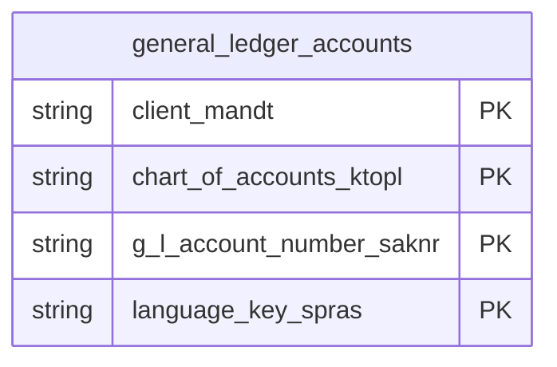

# General Ledger Accounts Data Product

This data product includes information about SAP general ledger accounts from the Financial Accounting (FI) module in the Finance domain in SAP S/4HANA or SAP ECC. It centralizes Chart of Accounts master records alongside multilingual operational definitions. Critical for financial consolidation, it ensures strict compliance auditing, trial balance reporting, and unified general ledger analytics.

## 1. Overview & Business Value

*   **Business Purpose:** Centralizes Chart of Accounts master records alongside multilingual operational definitions. Critical for financial consolidation, it ensures strict compliance auditing, trial balance reporting, and unified general ledger analytics.

*   **Key Metrics & Use Cases:**
    *   **Metric/Use Case 1:** Unified enterprise reporting and operational tracking.
    *   **Metric/Use Case 2:** High-fidelity analytics and AI-ready data ingestion.

## 2. Data Assets Catalog

This data product exposes the following BigQuery data assets:

| Data Asset | Description | Source Systems |
| :--- | :--- | :--- |
| `general_ledger_accounts` | This view is based on SAP S/4HANA or SAP ECC Financial Accounting (FI) module in the Finance domain and provides a comprehensive and unified view of General Ledger (G/L) accounts at the Chart of Accounts level. By joining general account details (such as account category, group, deletion/block indicators) with their corresponding multi-language descriptions, it supports financial reporting, GL reconciliation, compliance auditing, and general ledger consolidation. The data is captured at the granularity of Client (System), Chart Of Accounts, G L Account Number, and Language Key, ensuring a unique audit trail for every record. | `SAP ECC` / `SAP S/4HANA` |### Entity Relationship Diagram (ERD)

## 3. Data Foundation & Source Tables

To build these assets, the following source tables must be available in the data foundation layer:

| Source Table | Name / Description | System Source | Used by Asset(s) |
| :--- | :--- | :--- | :--- |
| `ska1` | Operational source table. | `Common` | `general_ledger_accounts` |
| `skat` | Operational source table. | `Common` | `general_ledger_accounts` |

## 4. Transformations & Design Decisions

This section details the critical engineering and design decisions behind the transformations.

### A. Granularity & Primary Keys

* **general_ledger_accounts (incremental):** Client (`client_mandt`), Chart of Accounts (`chart_of_accounts_ktopl`), G/L Account Number (`gl_account_number_saknr`), and Language Key (`language_key_spras`).
* **general_ledger_accounts (incremental):** `client_mandt`, `chart_of_accounts_ktopl`, `gl_account_number_saknr`, and `language_key_spras`.

### B. Joins & Relationship Logic

* **general_ledger_accounts (incremental):**
* `ska1` is LEFT JOINed with `skat` on client (`mandt`), Chart of Accounts (`ktopl`), and G/L Account (`saknr`).

### C. Incremental Load Strategy

*   **Supported Materialization Types:** `incremental` | `table` | `view`
*   **Incremental Logic:**
* **general_ledger_accounts (incremental):** Materialized as `incremental` table by default to allow efficient loading of G/L master records.
* **general_ledger_accounts (incremental):** Incremental filtering is applied using a `GREATEST` recordstamp comparison between `ska1.recordstamp` and `skat.recordstamp` (defaulting null values to `1900-01-01 00:00:00+00`).

### D. ERP Source System Differences (ECC vs. S/4HANA)

* **general_ledger_accounts (incremental):** None in the current model. Although S4 `ska1` and `skat` backend tables contain additional fields (e.g. `GLACCOUNT_TYPE`, `GLACCOUNT_SUBTYPE`, `LAST_CHANGED_TS`), only the common core fields defined in the shared data foundation annotations (`ska1.yaml` and `skat.yaml`) are selected.
* Field Selections:**
* **general_ledger_accounts (incremental):**
* All G/L account control properties selected from `ska1` (e.g. `xbilk` -> `balance_sheet_account_xbilk`, `xloev` -> `mark_for_deletion_xloev`).
* G/L Account descriptions and texts selected from `skat` (e.g. `txt20` -> `short_text_txt20`, `txt50` -> `gl_account_long_text_txt50`).
* Field `mcod1` exists in both source tables: `ska1.mcod1` is mapped as `search_term_mcod1` (Search Term) and `skat.mcod1` is mapped as `gl_long_text_mcod1` (G/L Long Text description).

### E. Field Conversions & Calculations

*   **Currency & Conversions:** Standardized using built-in currency shift logic for currencies with non-standard decimal formats (e.g. JPY, IDR).
*   **Field Selections:** Enriched with operational data and standard language text mappings where applicable.

## 5. Change Log

| Date | Type of change | Change details |
| :--- | :--- | :--- |
| 24.06.2026 | Release | Release candidate validation completed. |
