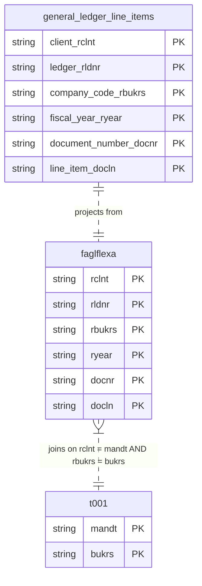

# General Ledger Items Data Product

This data product includes information about SAP general ledger items from the Financial Accounting (FI) module in the Finance domain in SAP ECC. The General Ledger Items data product provides a comprehensive, transaction-level view of actual general ledger line items from SAP ERP Central Component (ECC). It serves as a high-fidelity source of truth for financial reporting, auditing, and ledger-based analytics.

## 1. Overview & Business Value

*   **Business Purpose:** Solves the challenge of analyzing raw New General Ledger (New GL) actual line items by providing a clean, currency-adjusted, and date-enriched interface for transactional general ledger data.
*   **Key Metrics & Use Cases:**
    *   **Financial Auditing:** Trace line-item postings back to their reference documents and origin transactions.
    *   **Trial Balance & Financial Reporting:** Calculate account balances and period-end statements.
    *   **Ledger Comparison:** Analyze and compare postings across different general ledger ledgers.

## 2. Data Assets Catalog

This data product exposes the following BigQuery data assets:

| Data Asset | Description | Source Systems |
| :--- | :--- | :--- |
| `general_ledger_line_items` | This view is based on SAP ECC Financial Accounting (FI) module in the Finance domain and provides General Ledger Actual Line Items The data is captured at the granularity of Client (System), Ledger, Company Code, Fiscal Year, Document Number, and Line Item, ensuring a unique audit trail for every record. | `SAP ECC` |## 3. Data Foundation & Source Tables

To build these assets, the following source tables must be available in the data foundation layer:

| Source Table | Name / Description | System Source | Used by Asset(s) |
| :--- | :--- | :--- | :--- |
| `faglflexa` | General Ledger: Actual Line Items | `ECC-only` | `general_ledger_line_items` |
| `t001` | Company Codes | `Common` | `general_ledger_line_items` |
| `t000` | Clients | `Common` | `general_ledger_line_items` |
| `tcurx` | Decimal Places for Currency Codes | `Common` | `general_ledger_line_items` |

### Entity Relationship Diagram

## 4. Transformations & Design Decisions

This section details the critical engineering and design decisions behind the transformations.

### A. Granularity & Primary Keys

*   **`general_ledger_line_items`**: The grain of this asset is one row per client, ledger, company code, fiscal year, document number, and line item. Row uniqueness is strictly enforced on `client_rclnt`, `ledger_rldnr`, `company_code_rbukrs`, `fiscal_year_gjahr`, `document_number_belnr`, and `line_item_docln`.

### B. Joins & Relationship Logic

*   **`general_ledger_line_items`**:
    *   Joined `faglflexa` with `t001` on `rclnt = mandt` and `rbukrs = bukrs` to retrieve the company code's local currency key (`waers`).
    *   Joined `faglflexa` with `t000` on `rclnt = mandt` to retrieve the client's standard/group currency key (`mwaer`).
    *   *Rationale:* A LEFT JOIN is used for both tables to ensure no transaction records are dropped even if master data is missing.

### C. Incremental Load Strategy

*   **Supported Materialization Types:** `incremental`
*   **Incremental Logic:**
    *   **`general_ledger_line_items`**: Delta updates are performed using `faglflexa.recordstamp`.
    *   **Merge Policy:** `EXTEND` on schema change to allow seamless field additions.

### D. ERP Source System Differences (ECC vs. S/4HANA)

*   **`general_ledger_line_items`**:
    *   *Comparison:* This data product is specifically built for SAP ECC systems utilizing New GL (`faglflexa`). In S/4HANA, the equivalent transactional data is consolidated in `acdoca` (Universal Journal) which is modeled separately under the `universal_journal` data product.

### E. Field Conversions & Calculations

*   **Decimal Shifts (Currency):** Uses the helper `currencyDecimalShift` joined to `tcurx` to adjust decimal representations of currency fields:
    *   `amount_in_transaction_currency_tsl` shifted using `rtcur`.
    *   `amount_in_local_currency_hsl` shifted using `t001.waers` (local currency key).
    *   `amount_in_group_currency_ksl` shifted using `t000.mwaer` (group currency key).
    *   `amount_in_original_transaction_currency_wsl` shifted using `rwcur`.

## 5. Change Log

| Date | Type of change | Change details |
| :--- | :--- | :--- |
| 30.06.2026 | Feature | Initial onboarding of the `general_ledger_items` data product for SAP ECC. |
