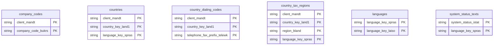

# Global Settings Data Product

This data product includes information about SAP global settings from the Financial Accounting (FI), Sales and Distribution (SD), Materials Management (MM), Controlling (CO), Production Planning (PP), Project System (PS) module in the Cross-Functional domain in SAP S/4HANA or SAP ECC. It establishes enterprise-wide foundational standards, incorporating countries, currencies, and languages. It provides the essential cross-domain reference layers needed for accurate localized operations, global tax calculation, and transaction mapping.

## 1. Overview & Business Value

*   **Business Purpose:** Establishes enterprise-wide foundational standards, incorporating countries, currencies, and languages. It provides the essential cross-domain reference layers needed for accurate localized operations, global tax calculation, and transaction mapping.

*   **Key Metrics & Use Cases:**
    *   **Metric/Use Case 1:** Unified enterprise reporting and operational tracking.
    *   **Metric/Use Case 2:** High-fidelity analytics and AI-ready data ingestion.

## 2. Data Assets Catalog

This data product exposes the following BigQuery data assets:

| Data Asset | Description | Source Systems |
| :--- | :--- | :--- |
| `company_codes` | This view is based on SAP S/4HANA or SAP ECC Financial Accounting (FI), Sales and Distribution (SD), Materials Management (MM), Controlling (CO), Production Planning (PP), Project System (PS) module in the Cross-Functional domain and provides the core enterprise structures by providing company definitions from SAP T001, detailing organizational locations, base currency identifiers, charts of accounts, and active fiscal year variants. The data is captured at the granularity of Client (System) and Company Code, ensuring a unique audit trail for every record. | `SAP ECC` / `SAP S/4HANA` |
| `languages` | This view is based on SAP S/4HANA or SAP ECC Financial Accounting (FI), Sales and Distribution (SD), Materials Management (MM), Controlling (CO), Production Planning (PP), Project System (PS) module in the Cross-Functional domain and provides a system-wide language dictionary from SAP T002 and T002T mapping language keys to standardized names to support multilingual localized reporting settings. The data is captured at the granularity of Language Key and Language Key, ensuring a unique audit trail for every record. | `SAP ECC` / `SAP S/4HANA` |
| `countries` | This view is based on SAP S/4HANA or SAP ECC Financial Accounting (FI), Sales and Distribution (SD), Materials Management (MM), Controlling (CO), Production Planning (PP), Project System (PS) module in the Cross-Functional domain and provides country-specific master records from SAP T005 and T005T containing localized names, formatting standards, regional settings, and international code mappings to enable international trading analytics. The data is captured at the granularity of Client (System), Country Key, and Language Key, ensuring a unique audit trail for every record. | `SAP ECC` / `SAP S/4HANA` |
| `country_dialing_codes` | This view is based on SAP S/4HANA or SAP ECC Financial Accounting (FI), Sales and Distribution (SD), Materials Management (MM), Controlling (CO), Production Planning (PP), Project System (PS) module in the Cross-Functional domain and provides international and country-specific telephone and fax dialing codes from SAP T005K to enable telecommunication metadata lookup. The data is captured at the granularity of Client (System), Country Key, and Telephone Fax Prefix Telewk, ensuring a unique audit trail for every record. | `SAP ECC` / `SAP S/4HANA` |
| `country_tax_regions` | This view is based on SAP S/4HANA or SAP ECC Financial Accounting (FI), Sales and Distribution (SD), Materials Management (MM), Controlling (CO), Production Planning (PP), Project System (PS) module in the Cross-Functional domain and provides Stores state, provincial, and regional master details from SAP T005S and T005U alongside language-specific descriptions to enable regional tax key lookups. The data is captured at the granularity of Client (System), Country Key, Region, and Language Key, ensuring a unique audit trail for every record. | `SAP ECC` / `SAP S/4HANA` |
| `system_status_texts` | This view is based on SAP S/4HANA or SAP ECC Financial Accounting (FI), Sales and Distribution (SD), Materials Management (MM), Controlling (CO), Production Planning (PP), Project System (PS) module in the Cross-Functional domain and provides language-dependent status texts for system statuses from SAP TJ02T to enable localized status mappings. The data is captured at the granularity of System Status and Language Key, ensuring a unique audit trail for every record. | `SAP ECC` / `SAP S/4HANA` |### Entity Relationship Diagram (ERD)

## 3. Data Foundation & Source Tables

To build these assets, the following source tables must be available in the data foundation layer:

| Source Table | Name / Description | System Source | Used by Asset(s) |
| :--- | :--- | :--- | :--- |
| `t001` | Operational source table. | `Common` | `company_codes` |
| `t002` | Operational source table. | `Common` | `languages` |
| `t002t` | Operational source table. | `Common` | `languages` |
| `t005` | Operational source table. | `Common` | `countries` |
| `t005t` | Operational source table. | `Common` | `countries` |
| `t005k` | Operational source table. | `Common` | `country_dialing_codes` |
| `t005s` | Operational source table. | `Common` | `country_tax_regions` |
| `t005u` | Operational source table. | `Common` | `country_tax_regions` |
| `tj02t` | Operational source table. | `Common` | `system_status_texts` |

## 4. Transformations & Design Decisions

This section details the critical engineering and design decisions behind the transformations.

### A. Granularity & Primary Keys

* **company_codes:** Client (`client_mandt`) and Company Code (`company_code_bukrs`).
* **languages:** Client (`client_mandt`) and Language Key (`language_key_spras`).
* **countries:** Client (`client_mandt`), Country Key (`country_key_land1`), and Language (`language_spras`).
* **country_dialing_codes:** Client (`client_mandt`) and Country Key (`country_key_land1`).
* **country_tax_regions:** Client (`client_mandt`), Country Key (`country_key_land1`), Region (`region_bland`), and Language Key (`language_key_spras`).
* **system_status_texts:** System Status Key (`status_key_istat`) and Language Key (`language_key_spras`).
* **company_codes:** `client_mandt` and `company_code_bukrs`.
* **languages:** `client_mandt` and `language_key_spras`.
* **countries:** `client_mandt`, `country_key_land1`, and `language_spras`.
* **country_dialing_codes:** `client_mandt` and `country_key_land1`.
* **country_tax_regions:** `client_mandt`, `country_key_land1`, `region_bland`, and `language_key_spras`.
* **system_status_texts:** `status_key_istat` and `language_key_spras`.

### B. Joins & Relationship Logic

* **company_codes:** No joins are required, as the company metadata and text descriptions are fully self-contained within the `t001` source table.
* **languages:** `t002` is LEFT JOINed with `t002t` on `mandt` (client) and `spras` (language) to enrich language codes with their localized textual labels.
* **countries:** `t005` is LEFT JOINed with `t005t` on `mandt` (client) and `land1` (country key) to attach localized country names.
* **country_dialing_codes:** No joins are required, as all country dialling attributes are fully self-contained within the `t005k` source table.
* **country_tax_regions:** `t005s` is LEFT JOINed with `t005u` on `mandt` (client), `land1` (country key), and `bland` (region key) to associate tax region codes with their language-specific textual names.
* **system_status_texts:** No joins are required, as all status metadata attributes are fully self-contained within the `tj02t` source table.
* *Note on text joins:* Joining with `t005t` can multiply rows per country if multiple languages are defined in the master data, or fail to display texts if records are not maintained for a specific language key.

### C. Incremental Load Strategy

*   **Supported Materialization Types:** `incremental` | `table` | `view`
*   **Incremental Logic:**
* **company_codes:** Driven by the `recordstamp` changes on the `t001` table.
* **languages:** Uses the `GREATEST` recordstamp derived from the union/join of both the `t002` and `t002t` tables.
* **countries:** Uses the `GREATEST` recordstamp derived from both the `t005` and `t005t` source tables.
* **country_dialing_codes:** Driven by the `recordstamp` changes on the `t005k` table.
* **country_tax_regions:** Uses the `GREATEST` recordstamp derived from the join of `t005s` and `t005u` source tables.
* **system_status_texts:** Driven by the `recordstamp` changes on the `tj02t` table.

### D. ERP Source System Differences (ECC vs. S/4HANA)

* **company_codes:** No schema differences. The `t001` table remains identical across both versions.
* **languages:** No schema differences. `t002` and `t002t` tables are structure-compatible between ECC and S4.
* **countries:** ECC and S4 possess distinct structural schema variations in the `t005` table (e.g., ECC features the `LANDGRP_VP` field). Consequently, completely separate definition files (`.js`) and annotations (`.yaml`) are maintained in `ecc` and `s4` subfolders to handle these discrepancies.
* **country_dialing_codes:** No schema differences. The `t005k` table remains identical across both versions.
* **country_tax_regions:** No schema differences. The `t005s` and `t005u` tables are schema-compatible across ECC and S4.
* **system_status_texts:** No schema differences. The `tj02t` table remains identical across both versions.
* Field Selections:**
* **company_codes:** Field selection is constrained to align directly with the fields defined in the Cortex 6 reference definition (`CompaniesMD.sql`) for consistent schema compatibility.
* **languages:** Leverages a refined, expanded field list compared to legacy Cortex 6 `Languages_T002` to capture additional attributes like Country ISO code, language name, and language translations.
* **countries:** Adheres strictly to the field selection pattern found in the Cortex 6 reference implementation (`CountriesMD.sql`) to maintain standardized field mappings.
* **country_dialing_codes:** Fields are selected to match the fields defined in the Cortex 6 reference (`TelephoneCodes_T005K.sql`) for consistent schema compatibility.
* **country_tax_regions:** Extends the legacy Cortex 6 `Regions_T005S.sql` field layout (which missed language text mapping) by incorporating the `region_name_bezei` from the `t005u` text table.
* **system_status_texts:** Selected fields map to technical keys and descriptions to match the standard SAP system status configuration layouts.

### E. Field Conversions & Calculations

*   **Currency & Conversions:** Standardized using built-in currency shift logic for currencies with non-standard decimal formats (e.g. JPY, IDR).
*   **Field Selections:** Enriched with operational data and standard language text mappings where applicable.

## 5. Change Log

| Date | Type of change | Change details |
| :--- | :--- | :--- |
| 24.06.2026 | Release | Release candidate validation completed. |
