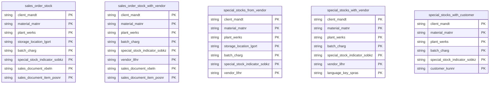

# Inventory & Special Stocks Data Product

This data product includes information about SAP inventory and special stocks from the Materials Management (MM), Sales and Distribution (SD) module in the Supply Chain, Sales domain in SAP ECC. The Inventory & Special Stocks data product provides detailed insights into specialized stock types and customer/vendor allocations within the supply chain. It consolidates sales order stock, customer-consigned/special stocks, and vendor-managed special stocks.

## 1. Overview & Business Value

*   **Business Purpose:** Solves the visibility challenge of non-standard and special stocks across storage locations, plants, and vendor/customer locations.
*   **Key Metrics & Use Cases:**
    *   **Sales Order Stock Visibility:** Tracks material inventory dedicated to specific sales orders.
    *   **Consignment Tracking:** Monitors vendor-consigned inventory (`special_stocks_from_vendor` and `special_stocks_with_vendor`) and customer-consigned inventory (`special_stocks_with_customer`).

## 2. Data Assets Catalog

This data product exposes the following BigQuery data assets:

| Data Asset | Description | Source Systems |
| :--- | :--- | :--- |
| `sales_order_stock` | This view is based on SAP ECC Materials Management (MM), Sales and Distribution (SD) module in the Supply Chain, Sales domain and provides Material stock allocated to specific sales orders. The data is captured at the granularity of Client (System), Material, Plant, Storage Location, Batch, Special Stock Indicator, Sales Document, and Sales Document Item, ensuring a unique audit trail for every record. | `SAP ECC` |
| `sales_order_stock_with_vendor` | This view is based on SAP ECC Materials Management (MM), Sales and Distribution (SD) module in the Supply Chain, Sales domain and provides Sales order stock specifically allocated with vendor information. The data is captured at the granularity of Client (System), Material, Plant, Batch, Special Stock Indicator, Vendor, Sales Document, and Sales Document Item, ensuring a unique audit trail for every record. | `SAP ECC` |
| `special_stocks_from_vendor` | This view is based on SAP ECC Materials Management (MM), Sales and Distribution (SD) module in the Supply Chain, Sales domain and provides Special stock owned/consigned by vendors. The data is captured at the granularity of Client (System), Material, Plant, Storage Location, Batch, Special Stock Indicator, and Vendor, ensuring a unique audit trail for every record. | `SAP ECC` |
| `special_stocks_with_vendor` | This view is based on SAP ECC Materials Management (MM), Sales and Distribution (SD) module in the Supply Chain, Sales domain and provides Vendor special stocks with descriptive indicator labels. The data is captured at the granularity of Client (System), Material, Plant, Batch, Special Stock Indicator, Vendor, and Language Key, ensuring a unique audit trail for every record. | `SAP ECC` |
| `special_stocks_with_customer` | This view is based on SAP ECC Materials Management (MM), Sales and Distribution (SD) module in the Supply Chain, Sales domain and provides Special stock consigned or placed at customer sites. The data is captured at the granularity of Client (System), Material, Plant, Batch, Special Stock Indicator, and Customer, ensuring a unique audit trail for every record. | `SAP ECC` |## 3. Data Foundation & Source Tables

To build these assets, the following source tables must be available in the data foundation layer:

| Source Table | Name / Description | System Source | Used by Asset(s) |
| :--- | :--- | :--- | :--- |
| `mska` | Sales Order Stock | `ECC-only` | `sales_order_stock` |
| `msfd` | Sales Order Stock with Vendor | `ECC-only` | `sales_order_stock_with_vendor` |
| `mkol` | Special Stocks from Vendor | `ECC-only` | `special_stocks_from_vendor` |
| `mslb` | Special Stocks with Vendor | `ECC-only` | `special_stocks_with_vendor` |
| `t148t` | Special Stock Descriptions | `ECC-only` | `special_stocks_with_vendor` |
| `msku` | Special Stocks with Customer | `ECC-only` | `special_stocks_with_customer` |

### Entity-Relationship (ER) Diagram

<!-- ERD_START -->

<!-- ERD_END -->

## 4. Transformations & Design Decisions

### A. Granularity & Primary Keys

*   **`sales_order_stock`**: Grain is one row per Client, Material, Plant, Storage Location, Batch, Special Stock indicator, Sales Document, and Sales Document Item. Row uniqueness is enforced on `client_mandt`, `material_matnr`, `plant_werks`, `storage_location_lgort`, `batch_charg`, `special_stock_indicator_sobkz`, `sales_document_vbeln`, `sales_document_item_posnr`.
*   **`sales_order_stock_with_vendor`**: Grain is one row per Client, Material, Plant, Batch, Special Stock, Vendor, Sales Document, and Sales Document Item. Keys: `client_mandt`, `material_matnr`, `plant_werks`, `batch_charg`, `special_stock_indicator_sobkz`, `vendor_lifnr`, `sales_document_vbeln`, `sales_document_item_posnr`.
*   **`special_stocks_from_vendor`**: Grain is one row per Client, Material, Plant, Storage Location, Batch, Special Stock, and Vendor. Keys: `client_mandt`, `material_matnr`, `plant_werks`, `storage_location_lgort`, `batch_charg`, `special_stock_indicator_sobkz`, `vendor_lifnr`.
*   **`special_stocks_with_vendor`**: Grain is one row per Client, Material, Plant, Batch, Special Stock, Vendor, and Language Key. Keys: `client_mandt`, `material_matnr`, `plant_werks`, `batch_charg`, `special_stock_indicator_sobkz`, `vendor_lifnr`, `language_key_spras`.
*   **`special_stocks_with_customer`**: Grain is one row per Client, Material, Plant, Batch, Special Stock, and Customer. Keys: `client_mandt`, `material_matnr`, `plant_werks`, `batch_charg`, `special_stock_indicator_sobkz`, `customer_kunnr`.

### B. Joins & Relationship Logic

*   **`special_stocks_with_vendor`**:
    *   Joined `mslb` with `t148t` on `mandt` and `sobkz` using `LEFT JOIN`.
    *   *Rationale:* Retains all special stock records from `mslb` even if corresponding descriptions are not maintained in `t148t`.

### C. Incremental Load Strategy

*   **Supported Materialization Types:** `incremental`
*   **Incremental Logic:**
    *   Delta updates are performed using `recordstamp` columns. For joined views (e.g. `special_stocks_with_vendor`), a `GREATEST` comparison on `recordstamp` fields of all joined tables is used to ensure new updates are detected accurately.

### D. ERP Source System Differences (ECC vs. S/4HANA)

*   This data product is ECC-only. No S/4HANA definitions are provided.

## 5. Change Log

| Date | Type of change | Change details |
| :--- | :--- | :--- |
| 02.07.2026 | Feature | Initial release of Inventory & Special Stocks data product. |
