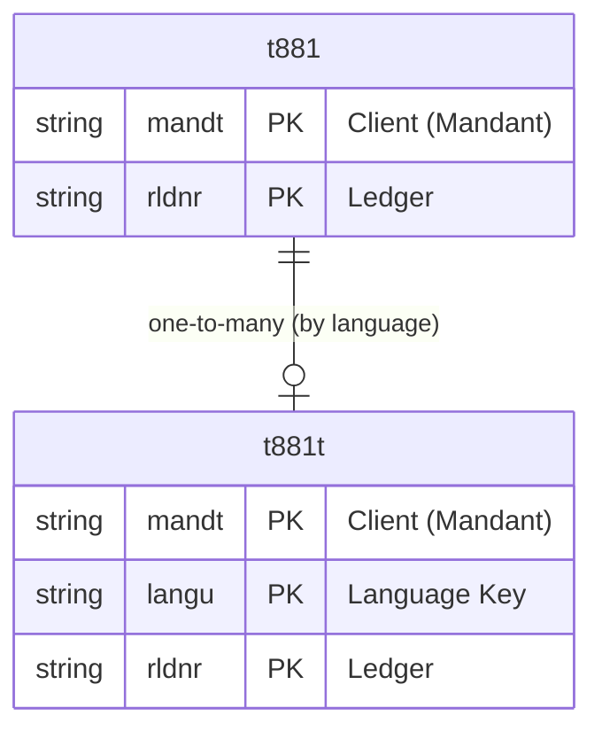

# Entity-Relationship Diagram: `ledger_master`

This diagram illustrates the primary key relationships between the ledger master table (`t881`) and the ledger text table (`t881t`).

```mermaid
erDiagram
    t881 {
        string mandt PK "Client (Mandant)"
        string rldnr PK "Ledger"
    }
    t881t {
        string mandt PK "Client (Mandant)"
        string langu PK "Language Key"
        string rldnr PK "Ledger"
    }
    t881 ||--o| t881t : "one-to-many (by language)"
```

