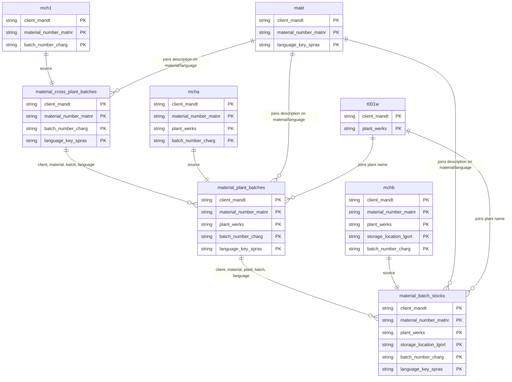

# Material Batches Data Product

This data product includes information about SAP material batches from the Materials Management (MM) module in the Supply Chain domain in SAP S/4HANA or SAP ECC. The `material_batches` data product serves as the consolidated repository for all SAP material batch management and inventory stock levels. It provides comprehensive visibility into batch master records at both the cross-plant (client) and plant levels, alongside real-time batch stock quantities at specific storage locations.

## 1. Overview & Business Value

The `material_batches` data product serves as the consolidated repository for all SAP material batch management and inventory stock levels. It provides comprehensive visibility into batch master records at both the cross-plant (client) and plant levels, alongside real-time batch stock quantities at specific storage locations.

## 2. Data Assets Catalog

This data product exposes the following BigQuery data assets:

| Data Asset | Description | Source Systems |
| :--- | :--- | :--- |
| `material_cross_plant_batches` | This view is based on SAP S/4HANA or SAP ECC Materials Management (MM) module in the Supply Chain domain and provides Central cross-plant registry for SAP material batches from MCH1, tracking universal batch details such as manufacturing and expiration dates, shelf life properties, supplier references, and batch status. The data is captured at the granularity of Client (System), Material Number, Batch Number, and Language Key, ensuring a unique audit trail for every record. | `SAP ECC` / `SAP S/4HANA` |
| `material_plant_batches` | This view is based on SAP S/4HANA or SAP ECC Materials Management (MM) module in the Supply Chain domain and provides plant-level batch definitions and valuation settings from SAP MCHA, tracking plant-specific batch assignments, status keys, and manufacturing parameters. The data is captured at the granularity of Client (System), Material Number, Plant, Batch Number, and Language Key, ensuring a unique audit trail for every record. | `SAP ECC` / `SAP S/4HANA` |
| `material_batch_stocks` | This view is based on SAP S/4HANA or SAP ECC Materials Management (MM) module in the Supply Chain domain and provides physical batch stock quantities per plant and storage location from SAP MCHB, including unrestricted, blocked, in-transit, restricted, and returns stock volumes. The data is captured at the granularity of Client (System), Material Number, Plant, Storage Location, Batch Number, and Language Key, ensuring a unique audit trail for every record. | `SAP ECC` / `SAP S/4HANA` |### Entity Relationship Diagram (ERD)

## 3. Data Foundation & Source Tables

To build these assets, the following source tables must be available in the data foundation layer:

| Source Table | Name / Description | System Source | Used by Asset(s) |
| :--- | :--- | :--- | :--- |
| `mch1` | Operational source table for cross-plant batches. | `Common` | `material_cross_plant_batches` |
| `mcha` | Operational source table for plant batches. | `Common` | `material_plant_batches` |
| `mchb` | Operational source table for batch stocks. | `Common` | `material_batch_stocks` |
| `makt` | Operational source table for material descriptions. | `Common` | `material_cross_plant_batches`, `material_plant_batches`, `material_batch_stocks` |
| `t001w` | Operational source table for plants. | `Common` | `material_plant_batches`, `material_batch_stocks` |

## 4. Transformations & Design Decisions

This section details the critical engineering and design decisions behind the transformations.

### A. Granularity & Primary Keys

* **material_cross_plant_batches:** Client (`client_mandt`), Material (`material_number_matnr`), Batch (`batch_number_charg`), and Language (`language_key_spras`).
* **material_plant_batches:** Client (`client_mandt`), Material (`material_number_matnr`), Plant (`plant_werks`), Batch (`batch_number_charg`), and Language (`language_key_spras`).
* **material_batch_stocks:** Client (`client_mandt`), Material (`material_number_matnr`), Plant (`plant_werks`), Storage Location (`storage_location_lgort`), Batch (`batch_number_charg`), and Language (`language_key_spras`).

### B. Joins & Relationship Logic

* **material_cross_plant_batches:** Joins left with `makt` on `mandt`, `matnr`, and `spras` to resolve material descriptions.
* **material_plant_batches:** Joins left with `makt` on `mandt`, `matnr`, and `spras` to resolve material descriptions, and left with `t001w` on `mandt` and `werks` to resolve plant name.
* **material_batch_stocks:** Joins left with `makt` on `mandt`, `matnr`, and `spras` to resolve material descriptions, and left with `t001w` on `mandt` and `werks` to resolve plant name.

### C. Incremental Load Strategy

*   **Supported Materialization Types:** `incremental`
*   **Incremental Logic:**
* **material_cross_plant_batches:** Incremental updates are tracked using `mch1.recordstamp`.
* **material_plant_batches:** Incremental updates are tracked using `mcha.recordstamp`.
* **material_batch_stocks:** Incremental updates are tracked using `mchb.recordstamp`.

### D. ERP Source System Differences (ECC vs. S/4HANA)

* **material_cross_plant_batches:** S/4HANA includes extended fields like global unique `batch_id` and single unit batch indicators. Separate definitions are maintained under `ecc` and `s4` folders.
* **material_plant_batches:** S/4HANA includes extended fields. Separate definitions are maintained under `ecc` and `s4` folders.
* **material_batch_stocks:** Unified model, no structural differences.

### E. Field Conversions & Calculations

*   **Currency & Conversions:** Standardized using built-in currency shift logic for currencies with non-standard decimal formats (e.g. JPY, IDR).
*   **Field Selections:** Enriched with operational data and standard language text mappings where applicable.

## 5. Change Log

| Date | Type of change | Change details |
| :--- | :--- | :--- |
| 24.06.2026 | Release | Release candidate validation completed. |
