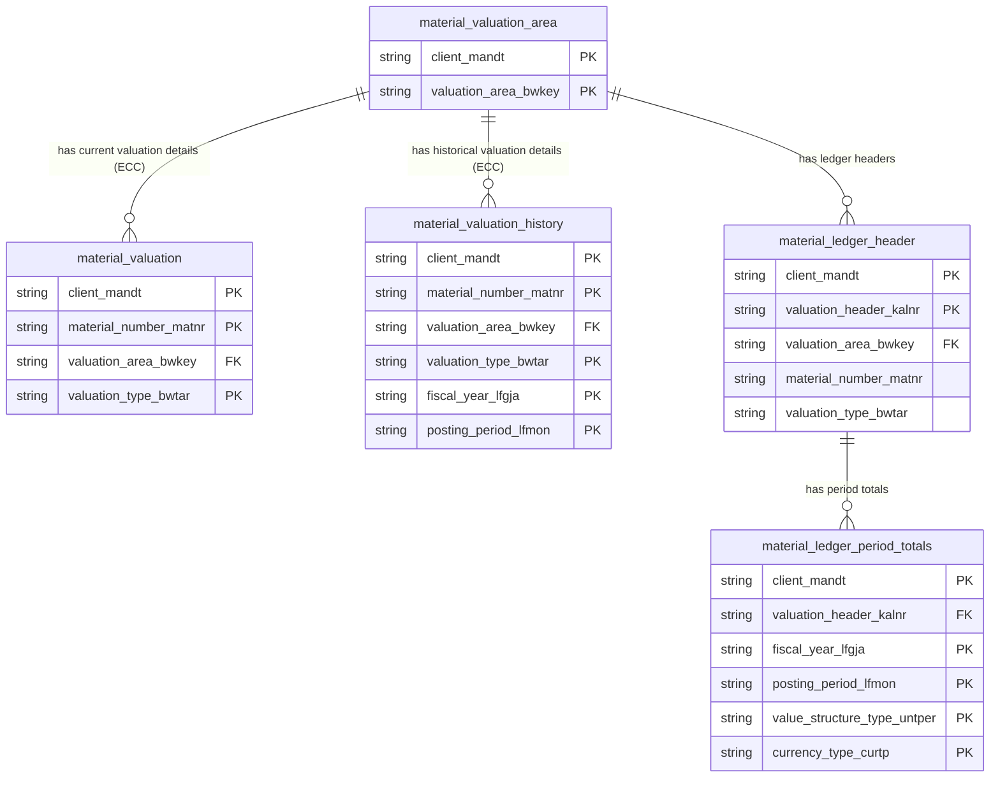

# Material Ledger Data Product

This data product includes information about SAP material ledger from the Materials Management (MM), Controlling (CO) module in the Supply Chain, Finance domain in SAP S/4HANA or SAP ECC. This data product provides a unified interface for material valuation and costing data from SAP systems (supporting both ECC and S/4HANA). It abstracts the complexities of SAP's material ledger architecture, allowing easy consumption of material cost details, valuation history, and period-end totals.

## Overview & Business Value

### Business Purpose
In SAP, the Material Ledger is the basis for actual costing. It enables the valuation of material inventories in multiple currencies and valuation views. This data product exposes valuation settings, standard costs, moving average prices, and period-end totals, facilitating inventory valuation auditing, cost variances analysis, and period-end financial closing checks.

### Key Metrics & Use Cases
*   **Inventory Valuation Audits**: Tracking stock values and unit costs across historical periods and plants.
*   **Standard vs. Moving Average Price Analysis**: Comparing valuation controls to identify cost discrepancies.
*   **Multi-Currency Inventory Reporting**: Viewing material ledger period-end totals in local, group, and hard currencies.

## Data Assets Catalog

| Asset Name | Granularity / Primary Keys | Description |
| :--- | :--- | :--- |
| **`material_valuation`** (ECC) | `client_mandt`, `material_number_matnr`, `valuation_area_bwkey`, `valuation_type_bwtar` | Exposes current standard and moving average valuation details for ECC from `MBEW`, including rich details like planned/future prices and costing variants. |
| **`material_valuation_history`** (ECC) | `client_mandt`, `material_number_matnr`, `valuation_area_bwkey`, `valuation_type_bwtar`, `fiscal_year_lfgja`, `posting_period_lfmon` | Exposes historical valuation details for ECC. Union of current (`MBEW`) and historical (`MBEWH`) valuation tables, limited to core valuation fields. |
| **`material_valuation_area`** (Common) | `client_mandt`, `valuation_area_bwkey` | Lists valuation area configurations (from `T001K`, `T001W`, `T001`), including the company code name, plant name, and indicating if Material Ledger is active. |
| **`material_ledger_header`** (S/4HANA, optional ECC) | `client_mandt`, `valuation_header_kalnr` | Contains master records (from `CKMLHD`) linking a material, plant, and valuation type to a unique valuation header number (`kalnr`). |
| **`material_ledger_period_totals`** (S/4HANA, optional ECC) | `client_mandt`, `valuation_header_kalnr`, `fiscal_year_lfgja`, `posting_period_lfmon`, `value_structure_type_untper`, `currency_type_curtp` | Exposes stock quantity, value, standard price, periodic unit price, and price/exchange rate differences (from `CKMLCR`) per header, period, value structure type, and currency type. |

### Material Ledger in ECC
Material ledger is optional in ECC and is not used by default. It can be optionally activated (via Transaction Codes `OMX1`, `OMX2`, `OMX3`).  If your ECC system has material ledger activated, you can enable the deployment of material ledger data assets (by setting `enabled: true` in `table_settings.yaml` under the ECC section of this data product) to deploy the material ledger data assets.  Otherwise, you can use the material valuation data assets to get the material valuation data.

### Material Ledger in S/4HANA
In S/4HANA, the Material Ledger is active by default. The S/4HANA version of this data product deploys the material ledger data assets (`material_ledger_header` and `material_ledger_period_totals`) to expose valuation and costing details.

### Entity Relationship Diagram

## Data Foundation & Source Tables

*   **SAP ECC**:
    *   `CKMLHD`: Material Ledger: Header Record (Optional)
    *   `CKMLCR`: Material Ledger: Period Totals (Values) (Optional)
    *   `MBEW`: Material Valuation (Current)
    *   `MBEWH`: Material Valuation (History)
    *   `T001K`: Valuation Area
    *   `T001W`: Plants
    *   `T001`: Company Codes
    *   `TCURX`: Decimal Places for Currencies
*   **SAP S/4HANA**:
    *   `CKMLHD`: Material Ledger: Header Record
    *   `CKMLCR`: Material Ledger: Period Totals (Values)
    *   `T001K`: Valuation Area
    *   `T001W`: Plants
    *   `T001`: Company Codes
    *   `TCURX`: Decimal Places for Currencies

## Transformations & Design Decisions

### Granularity & Primary Keys
*   **`material_valuation`**: Granular at the material, valuation area, and valuation type level (`client_mandt`, `material_number_matnr`, `valuation_area_bwkey`, `valuation_type_bwtar`).
*   **`material_valuation_history`**: Granular at the material, valuation area, valuation type, and fiscal period level (`client_mandt`, `material_number_matnr`, `valuation_area_bwkey`, `valuation_type_bwtar`, `fiscal_year_lfgja`, `posting_period_lfmon`).
*   **`material_valuation_area`**: Granular at the valuation area level (`client_mandt`, `valuation_area_bwkey`).
*   **`material_ledger_header`**: Granular at the unique valuation header number level (`client_mandt`, `valuation_header_kalnr`).
*   **`material_ledger_period_totals`**: Granular at the valuation header, fiscal period, value structure type, and currency type level (`client_mandt`, `valuation_header_kalnr`, `fiscal_year_lfgja`, `posting_period_lfmon`, `value_structure_type_untper`, `currency_type_curtp`).

### Joins & Relationship Logic
*   Both `material_valuation` and `material_valuation_history` join `MBEW`/`MBEWH` to `T001K` and `T001` to determine the base currency key (`waers`) of the company code associated with the valuation area.
*   **`material_valuation_history`**: Performs a `UNION ALL` between `MBEW` (current period) and `MBEWH` (historical periods). `MBEWH` is LEFT JOINed to live `MBEW` using an anti-join condition (`mbew_check.matnr IS NULL`) to exclude historical snapshot records when the live record for the current period already resides in `MBEW`, preventing `MERGE` collisions.
*   **`material_valuation_area`**: Joins `T001K` with `T001W` (Plants) and `T001` (Company Codes) to enrich the valuation area with company code details and plant names.
*   **`material_ledger_period_totals`**: Joins `CKMLCR` with `CKMLHD` to inherit the material number, valuation area, and valuation type associated with the valuation header (`kalnr`).

### Incremental Load Strategy
*   All assets use Dataform's incremental materialization. The incremental filter selects rows where the source system `recordstamp` is greater than the maximum `source_last_updated_at` currently in the target table.

### ERP Source System Differences (ECC vs S/4HANA)
*   **ECC**: 
    *   By default, the Material Ledger is optional. When disabled, valuation values are read from `MBEW` (current) and `MBEWH` (history), and the Material Ledger tables (`CKMLHD`/`CKMLCR`) are skipped.
    *   **Sparse History (Latch-on-Change):** SAP only writes to `MBEWH` when a movement occurs in a new period. `material_valuation_history` is therefore sparse. To perform historical monthly trend analysis, queries must implement a "Last Value Carried Forward" (gap-filling) logic using window functions to propagate the last known value across periods with no movements.
*   **S/4HANA**: Material Ledger is mandatory. Valuation values are read from `CKMLHD`/`CKMLCR`, and `MBEW`/`MBEWH` are skipped.
*   These differences are managed declaratively using `table_settings.yaml` to enable/disable corresponding targets based on the SAP version configured.

### Field Conversions & Calculations
*   **Currency Decimals**: Prices (`stprs`, `verpr`, `salk3`, `salkv`, `vksal`) are stored in SAP as raw integers. They are shifted to standard decimal representation using the `TCURX` config map.

## Change Log

| Date | Type of change | Change details |
| :--- | :--- | :--- |
| 26.06.2026 | Release | Initial release of Material Ledger Data Product, including `material_valuation` (current only) and `material_valuation_history` (historical values). |
| 29.07.2026 | Bug Fix | Added anti-join filter (mbew_check.matnr IS NULL) between MBEWH and live MBEW in material_valuation_history to eliminate period record duplication. |

