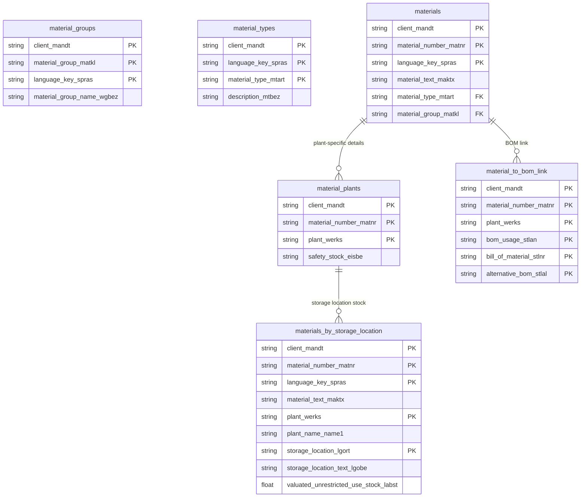

# Materials Data Product

This data product includes information about SAP materials from the Materials Management (MM) module in the Supply Chain domain in SAP S/4HANA or SAP ECC. It exposes the definitive product and material master catalog, capturing core dimensions, weight attributes, and categorization data. It powers demand forecasting, master data governance, and inventory optimization analytics.

## 1. Overview & Business Value

*   **Business Purpose:** Exposes the definitive product and material master catalog, capturing core dimensions, weight attributes, and categorization data. It powers demand forecasting, master data governance, and inventory optimization analytics.

*   **Key Metrics & Use Cases:**
    *   **Metric/Use Case 1:** Unified enterprise reporting and operational tracking.
    *   **Metric/Use Case 2:** High-fidelity analytics and AI-ready data ingestion.

## 2. Data Assets Catalog

This data product exposes the following BigQuery data assets:

| Data Asset | Description | Source Systems |
| :--- | :--- | :--- |
| `materials` | This view is based on SAP S/4HANA or SAP ECC Materials Management (MM) module in the Supply Chain domain and provides SAP general material master data from MARA combined with multilingual text entries from MAKT, documenting product codes, descriptions, and physical and dimensional specifications. The data is captured at the granularity of Client (System), Material Number, and Language Key, ensuring a unique audit trail for every record. | `SAP ECC` / `SAP S/4HANA` |
| `material_groups` | This view is based on SAP S/4HANA or SAP ECC Materials Management (MM) module in the Supply Chain domain and provides a catalog of material group classifications from SAP T023 and T023T, grouping materials for inventory valuation, purchasing controls, and structured sales analysis. The data is captured at the granularity of Client (System), Material Group, and Language Key, ensuring a unique audit trail for every record. | `SAP ECC` / `SAP S/4HANA` |
| `material_types` | This view is based on SAP S/4HANA or SAP ECC Materials Management (MM) module in the Supply Chain domain and provides Maps material type codes to localized descriptions from SAP T134 and T134T, defining control parameters such as price controls and procurement types. The data is captured at the granularity of Client (System), Language Key, and Material Type, ensuring a unique audit trail for every record. | `SAP ECC` / `SAP S/4HANA` |
| `material_plants` | This view is based on SAP S/4HANA or SAP ECC Materials Management (MM) module in the Supply Chain domain and provides plant-specific material data from SAP MARC, tracking deletion flags, batch management indicators, plant-specific statuses, and safety stock levels. The data is captured at the granularity of Client (System), Material Number, and Plant, ensuring a unique audit trail for every record. | `SAP ECC` / `SAP S/4HANA` |
| `materials_by_storage_location` | This view is based on SAP S/4HANA or SAP ECC Materials Management (MM) module in the Supply Chain domain and provides material inventory levels, multilingual material descriptions, plant names, and storage location names at the storage location level from SAP MARD, MAKT, T001W, and T001L. The data is captured at the granularity of Client (System), Material Number, Language Key, Plant, and Storage Location, ensuring a unique audit trail for every record. | `SAP ECC` / `SAP S/4HANA` |
| `material_to_bom_link` | This view is based on SAP S/4HANA or SAP ECC Materials Management (MM) module in the Supply Chain domain and provides Links materials to their Bill of Material (BOM) numbers and alternatives at the plant and BOM usage level, using SAP MAST. The data is captured at the granularity of Client (System), Material Number, Plant, Bom Usage, Bill Of Material, and Alternative Bom, ensuring a unique audit trail for every record. | `SAP ECC` / `SAP S/4HANA` |### Entity Relationship Diagram (ERD)

## 3. Data Foundation & Source Tables

To build these assets, the following source tables must be available in the data foundation layer:

| Source Table | Name / Description | System Source | Used by Asset(s) |
| :--- | :--- | :--- | :--- |
| `mara` | Operational source table. | `Common` | `materials` |
| `makt` | Operational source table. | `Common` | `materials` |
| `t023` | Operational source table. | `Common` | `material_groups` |
| `t023t` | Operational source table. | `Common` | `material_groups` |
| `t134` | Operational source table. | `Common` | `material_types` |
| `t134t` | Operational source table. | `Common` | `material_types` |
| `marc` | Operational source table. | `Common` | `material_plants` |
| `mard` | Operational source table. | `Common` | `materials_by_storage_location` |
| `t001l` | Operational source table. | `Common` | `materials_by_storage_location` |
| `t001w` | Operational source table. | `Common` | `materials_by_storage_location` |
| `mast` | Operational source table. | `Common` | `material_to_bom_link` |

## 4. Transformations & Design Decisions

This section details the critical engineering and design decisions behind the transformations.

### A. Granularity & Primary Keys

* **materials:** Client (`client_mandt`), Material Number (`material_number_matnr`), and Language Key (`language_key_spras`).
* **material_groups:** Client (`client_mandt`), Material Group Code (`material_group_matkl`), and Language Key (`language_key_spras`).
* **material_types:** Client (`client_mandt`), Material Type (`material_type_mtart`), and Language Key (`language_key_spras`).
* **material_plants:** Client (`client_mandt`), Material Number (`material_number_matnr`), and Plant (`plant_werks`).
* **materials_by_storage_location:** Client (`client_mandt`), Material Number (`material_number_matnr`), Language Key (`language_key_spras`), Plant (`plant_werks`), and Storage Location (`storage_location_lgort`).
* **material_to_bom_link:** Client (`client_mandt`), Material Number (`material_number_matnr`), Plant (`plant_werks`), BOM Usage (`bom_usage_stlan`), Bill of Material (`bill_of_material_stlnr`), and Alternative BOM (`alternative_bom_stlal`).

### B. Joins & Relationship Logic

* **materials:** `mara` is INNER JOINed to `makt` on `mandt` and `matnr` to bind material codes with their multilingual descriptions.
* **material_groups:** `t023` is INNER JOINed to `t023t` on `mandt` and `matkl` to map group codes to texts.
* **material_types:** `t134` is INNER JOINed to `t134t` on `mandt` and `mtart` to pair type keys with their textual definitions.
* **material_plants:** Direct projection from the foundational `marc` table without joins.
* **materials_by_storage_location:** `mard` is INNER JOINed to `makt` on `mandt` and `matnr` to bind multilingual material descriptions, LEFT JOINed to `t001w` on `mandt` and `werks` to bind plant names, and LEFT JOINed to `t001l` on `mandt`, `werks`, and `lgort` to enrich with storage location descriptions.
* **material_to_bom_link:** Direct projection from the foundational `mast` table without joins.
* *Note on text joins:* Joins to text tables may multiply entries if multiple language keys are configured, or omit items if translation lines are not fully populated.

### C. Incremental Load Strategy

*   **Supported Materialization Types:** `incremental` | `table` | `view`
*   **Incremental Logic:**
* **materials:** Uses the `GREATEST` recordstamp of `mara` and `makt` to capture updates in either the material attributes or descriptions.
* **material_groups:** Calculated from the `GREATEST` recordstamp values of `t023` and `t023t`.
* **material_types:** Determined by the `GREATEST` recordstamp of `t134` and `t134t`.
* **material_plants:** Determined by the `recordstamp` of `marc`.
* **materials_by_storage_location:** Calculated from the `GREATEST` recordstamp of `mard`, `makt`, `t001l`, and `t001w`.
* **material_to_bom_link:** Determined by the `recordstamp` of `mast`.

### D. ERP Source System Differences (ECC vs. S/4HANA)

* **materials:** No differences. Unified script is used across both ERP versions.
* **material_groups:** No differences. The table structures of `t023` and `t023t` are identical.
* **material_types:** No differences. `t134` and `t134t` structures are structure-compatible.
* **material_plants:** No differences. Unified script is used across both ERP versions.
* **materials_by_storage_location:** Catch Weight Management (CWM) columns are available in S/4HANA but omitted here to maintain a unified, standard schema across both ECC and S/4HANA versions.
* **material_to_bom_link:** No differences. Unified script is used across both ERP versions.
* Field Selections:**
* **materials:** Restricts columns to fields aligned with the legacy Cortex 6 `MaterialsMD.sql` reference views to assure structural continuity.
* **material_groups:** Aligns column selection with the fields extracted in the Cortex 6 reference view `MaterialGroupsMD.sql`.
* **material_types:** Selects the exact columns present in the Cortex 6 reference view `MaterialTypesMD.sql` for backward schema compatibility.

### E. Field Conversions & Calculations

*   **Currency & Conversions:** Standardized using built-in currency shift logic for currencies with non-standard decimal formats (e.g. JPY, IDR).
*   **Field Selections:** Enriched with operational data and standard language text mappings where applicable.

## 5. Change Log

| Date | Type of change | Change details |
| :--- | :--- | :--- |
| 24.06.2026 | Release | Release candidate validation completed. |
| 26.06.2026 | Addition | Added new data asset `material_to_bom_link` based on SAP `MAST` table. |
