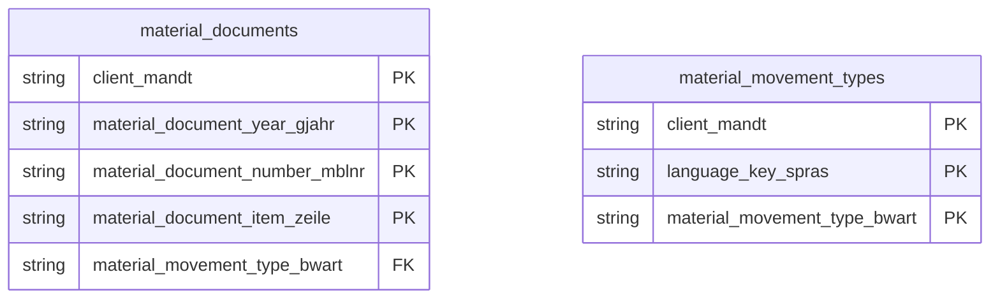

# Materials Movement Data Product

This data product includes information about SAP materials movement from the Materials Management (MM) module in the Supply Chain domain in SAP S/4HANA or SAP ECC. It logs historical material document headers and items representing all physical and logical inventory transfers. It facilitates real-time inventory velocity analyses, shrinkage auditing, and warehouse flow optimization.

## 1. Overview & Business Value

*   **Business Purpose:** Logs historical material document headers and items representing all physical and logical inventory transfers. It facilitates real-time inventory velocity analyses, shrinkage auditing, and warehouse flow optimization.

*   **Key Metrics & Use Cases:**
    *   **Metric/Use Case 1:** Unified enterprise reporting and operational tracking.
    *   **Metric/Use Case 2:** High-fidelity analytics and AI-ready data ingestion.

## 2. Data Assets Catalog

This data product exposes the following BigQuery data assets:

| Data Asset | Description | Source Systems |
| :--- | :--- | :--- |
| `material_documents` | This view is based on SAP S/4HANA or SAP ECC Materials Management (MM) module in the Supply Chain domain and provides SAP operational goods movements, tracking receipts, issues, plant-to-plant transfers, and inventory adjustments from transactional logs MSEG and MATDOC. The data is captured at the granularity of Client (System), Material Document Year, Material Document Number, and Material Document Item, ensuring a unique audit trail for every record. | `SAP ECC` / `SAP S/4HANA` |
| `material_movement_types` | This view is based on SAP S/4HANA or SAP ECC Materials Management (MM) module in the Supply Chain domain and provides a system-wide dictionary of SAP material movement type keys from T156 enriched with multilingual description texts from T156T. The data is captured at the granularity of Client (System), Language Key, and Material Movement Type, ensuring a unique audit trail for every record. | `SAP ECC` / `SAP S/4HANA` |### Entity Relationship Diagram (ERD)

## 3. Data Foundation & Source Tables

To build these assets, the following source tables must be available in the data foundation layer:

| Source Table | Name / Description | System Source | Used by Asset(s) |
| :--- | :--- | :--- | :--- |
| `mseg` | Operational source table. | `Common` | `material_documents` |
| `matdoc` | Operational source table. | `Common` | `material_documents` |
| `t156` | Operational source table. | `Common` | `material_movement_types` |
| `t156t` | Operational source table. | `Common` | `material_movement_types` |

## 4. Transformations & Design Decisions

This section details the critical engineering and design decisions behind the transformations.

### A. Granularity & Primary Keys

* **material_documents:** Client (`client_mandt`), Material Document Year (`material_document_year_gjahr`), Material Document Number (`material_document_number_mblnr`), and Document Item Number (`material_document_item_zeile`).
* **material_movement_types:** Client (`client_mandt`), Movement Type (`material_movement_type_bwart`), and Language Key (`language_key_spras`).

### B. Joins & Relationship Logic

* **material_documents:** No joins required for core records.
* **material_movement_types:** `t156` is INNER JOINed to `t156t` on `mandt` and `bwart` to resolve localized movement descriptions.
* *Note on text joins:* Joining with text tables can multiply rows if multiple languages are active, or result in blank fields if texts are missing for certain language keys.

### C. Incremental Load Strategy

*   **Supported Materialization Types:** `incremental` | `table` | `view`
*   **Incremental Logic:**
* **material_documents:** Direct delta load based on record-level timestamps of `mseg` (ECC) or `matdoc` (S4).
* **material_movement_types:** Uses the `GREATEST` recordstamp of `t156` and `t156t` source tables.

### D. ERP Source System Differences (ECC vs. S/4HANA)

* **material_documents:** Major architectural differences exist. ECC retrieves data from the legacy `mseg` table, whereas S/4HANA uses the unified `matdoc` table. Totally separate script files are maintained under `ecc` and `s4` definition folders to manage these diverging schemas.
* **material_movement_types:** No schema differences. Both versions share structure-compatible definitions of `t156` and `t156t`.
* Field Selections:**
* **material_documents:** Limits field selection to business columns defined in Cortex 6 `MaterialsMovementDP.sql` views to preserve backward compatibility.
* **material_movement_types:** Follows the exact column selection pattern present in the Cortex 6 reference view `MaterialMovementTypesDP.sql` to standardize code lookups.

### E. Field Conversions & Calculations

*   **Currency & Conversions:** Standardized using built-in currency shift logic for currencies with non-standard decimal formats (e.g. JPY, IDR).
*   **Field Selections:** Enriched with operational data and standard language text mappings where applicable.

## 5. Change Log

| Date | Type of change | Change details |
| :--- | :--- | :--- |
| 24.06.2026 | Release | Release candidate validation completed. |
