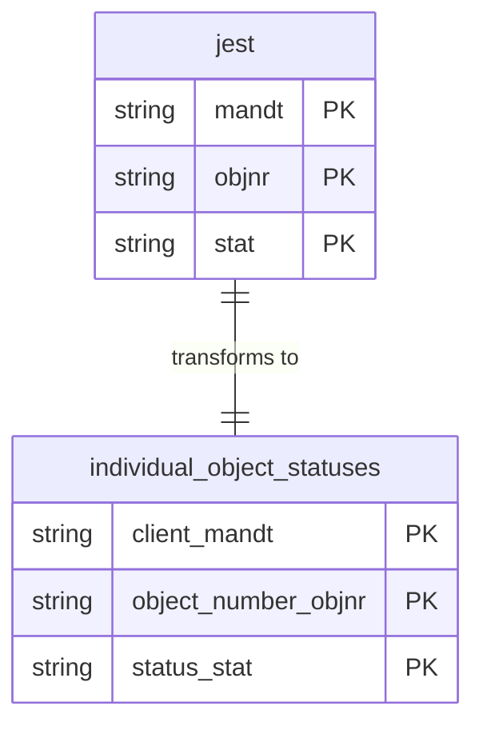

# Object Statuses Data Product

This data product includes information about SAP object statuses from the Production Planning (PP), Controlling (CO), Project System (PS) module in the Manufacturing, Finance, Supply Chain domain in SAP S/4HANA or SAP ECC. Individual Object Statuses data asset provides a consolidated view of status information for various SAP objects (such as orders, projects, WBS elements, etc.). It allows tracking the historical and current status of these objects, which is critical for manufacturing, controlling, and project system analytics.

## 1. Overview & Business Value

*   **Business Purpose:** Tracks the status of internal orders, production orders, WBS elements, and other SAP objects over time. Enables cross-functional analytics in manufacturing, project management, and finance.
*   **Key Metrics & Use Cases:**
    *   **Order Tracking:** Monitor whether a production or internal order is created, released, technically completed, or closed.
    *   **Project Status Auditing:** Verify status transitions of WBS elements and projects to ensure correct cost allocation.

## 2. Data Assets Catalog

This data product exposes the following BigQuery data assets:

| Data Asset | Description | Source Systems |
| :--- | :--- | :--- |
| `individual_object_statuses` | This view is based on SAP S/4HANA or SAP ECC Production Planning (PP), Controlling (CO), Project System (PS) module in the Manufacturing, Finance, Supply Chain domain and provides Individual status details for SAP objects. The data is captured at the granularity of Client (System), Object Number, and Status, ensuring a unique audit trail for every record. | `SAP ECC` / `SAP S/4HANA` |## 3. Data Foundation & Source Tables

To build these assets, the following source tables must be available in the data foundation layer:

| Source Table | Name / Description | System Source | Used by Asset(s) |
| :--- | :--- | :--- | :--- |
| `jest` | Individual Object Status | `Common` | `individual_object_statuses` |

### Entity Relationship Diagram

<!-- ERD_START -->

<!-- ERD_END -->

## 4. Transformations & Design Decisions

This section details the critical engineering and design decisions behind the transformations.

### A. Granularity & Primary Keys

*   **`individual_object_statuses`**: The grain of this asset is one row per object number (`objnr`) and status (`stat`). Row uniqueness is strictly enforced on `client_mandt`, `object_number_objnr`, and `status_stat`.

### B. Joins & Relationship Logic

*   **`individual_object_statuses`**:
    *   Direct projection from the `jest` table in the data foundation layer. No additional joins are required.

### C. Incremental Load Strategy

*   **Supported Materialization Types:** `incremental`
*   **Incremental Logic:**
    *   **`individual_object_statuses`**: Delta updates are performed using `jest.recordstamp`.
    *   **Merge Policy:** `EXTEND` on schema change to allow seamless field additions.

### D. ERP Source System Differences (ECC vs. S/4HANA)

*   **`individual_object_statuses`**:
    *   *Comparison:* No schema differences between ECC and S/4HANA for the `jest` table.

### E. Field Conversions & Calculations

*   No complex calculations or decimal shifts are applied.

## 5. Change Log

| Date | Type of change | Change details |
| :--- | :--- | :--- |
| 30.06.2026 | Feature | Initial release of the `object_statuses` data product. |
