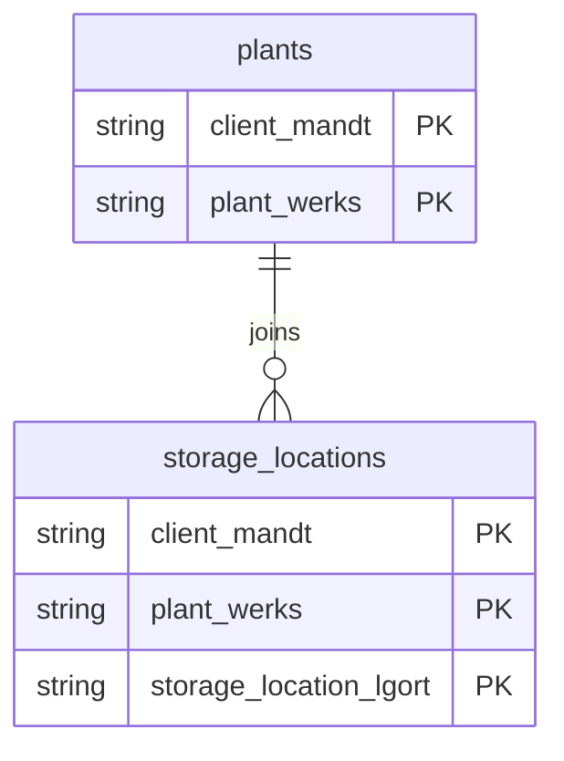

# Plants And Storage Data Product

This data product includes information about SAP plants and storage from the Materials Management (MM) module in the Supply Chain domain in SAP S/4HANA or SAP ECC. Defines the hierarchical structural mapping of enterprise plants, storage locations, and storage bins. It underpins granular warehouse layout analysis, stock placement logic, and logistical capacity planning.

## 1. Overview & Business Value

*   **Business Purpose:** Defines the hierarchical structural mapping of enterprise plants, storage locations, and storage bins. It underpins granular warehouse layout analysis, stock placement logic, and logistical capacity planning.

*   **Key Metrics & Use Cases:**
    *   **Metric/Use Case 1:** Unified enterprise reporting and operational tracking.
    *   **Metric/Use Case 2:** High-fidelity analytics and AI-ready data ingestion.

## 2. Data Assets Catalog

This data product exposes the following BigQuery data assets:

| Data Asset | Description | Source Systems |
| :--- | :--- | :--- |
| `plants` | This view is based on SAP S/4HANA or SAP ECC Materials Management (MM) module in the Supply Chain domain and provides plant master data from SAP T001W mapping individual plant units to addresses, organizational assignments, and operational parameters. The data is captured at the granularity of Client (System) and Plant, ensuring a unique audit trail for every record. | `SAP ECC` / `SAP S/4HANA` |
| `storage_locations` | This view is based on SAP S/4HANA or SAP ECC Materials Management (MM) module in the Supply Chain domain and provides warehouse/storage location master data from SAP T001L, mapping locations to their corresponding plants and divisions. The data is captured at the granularity of Client (System), Plant, and Storage Location, ensuring a unique audit trail for every record. | `SAP ECC` / `SAP S/4HANA` |### Entity Relationship Diagram (ERD)

## 3. Data Foundation & Source Tables

To build these assets, the following source tables must be available in the data foundation layer:

| Source Table | Name / Description | System Source | Used by Asset(s) |
| :--- | :--- | :--- | :--- |
| `t001w` | Operational source table. | `Common` | `plants` |
| `t001l` | Operational source table. | `Common` | `storage_locations` |

## 4. Transformations & Design Decisions

This section details the critical engineering and design decisions behind the transformations.

### A. Granularity & Primary Keys

* **plants:** Client (`client_mandt`) and Plant (`plant_werks`).
* **storage_locations:** Client (`client_mandt`), Plant (`plant_werks`), and Storage Location (`storage_location_lgort`).
* **plants:** `client_mandt` and `plant_werks`.
* **storage_locations:** `client_mandt`, `plant_werks`, and `storage_location_lgort`.

### B. Joins & Relationship Logic

* **plants:** No joins. Self-contained within `t001w`.
* **storage_locations:** No joins. Self-contained within `t001l`.

### C. Incremental Load Strategy

*   **Supported Materialization Types:** `incremental` | `table` | `view`
*   **Incremental Logic:**
* **plants:** Filters updates using the `recordstamp` timestamp on the `t001w` source table.
* **storage_locations:** Filters updates using the `recordstamp` timestamp on the `t001l` source table.

### D. ERP Source System Differences (ECC vs. S/4HANA)

* **plants:** Minor schema differences exist in raw tables: ECC contains `sgt_stat` (Segment Status MRP), while S4 contains `no_default_batch_management`, `fsh_group_pr`, and `arun_fix_batch`. All mapped fields are identical and present in both systems, resulting in a single unified schema.
* **storage_locations:** S4 raw tables contain additional fields `mesbs`, `messt`, `oih_licno`, `oig_itrfl`, and `oib_tnkassign`. Mapped fields (`mandt`, `werks`, `lgort`, `lgobe`) are identical and present in both systems, resulting in a single unified schema.
* Field Selections:**
* **plants:** Mapped and structured columns from `t001w` aligned to standard snake_case naming conventions, matching the legacy Cortex 6 mappings.
* **storage_locations:** Mapped columns from `t001l` including client, plant, storage location code, and its description.

### E. Field Conversions & Calculations

*   **Currency & Conversions:** Standardized using built-in currency shift logic for currencies with non-standard decimal formats (e.g. JPY, IDR).
*   **Field Selections:** Enriched with operational data and standard language text mappings where applicable.

## 5. Change Log

| Date | Type of change | Change details |
| :--- | :--- | :--- |
| 24.06.2026 | Release | Release candidate validation completed. |
