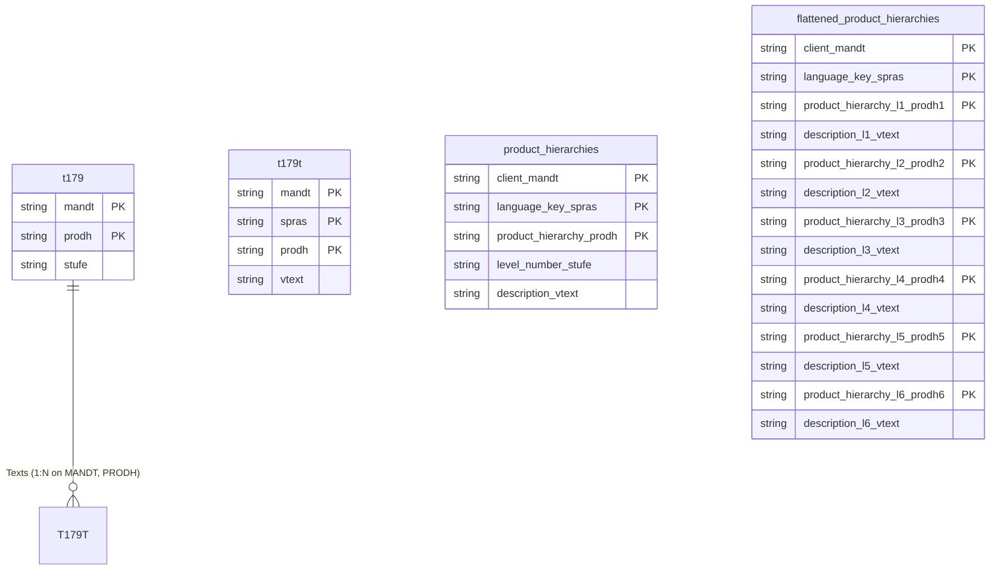

# Product Hierarchies Data Product

This data product includes information about SAP product hierarchies from the Sales and Distribution (SD), Materials Management (MM) module in the Sales, Supply Chain domain in SAP S/4HANA or SAP ECC. This data product provides master data and a flattened view of the product hierarchies configured in SAP.

---

## 1. Overview & Business Value

*   **Business Purpose:** Product hierarchies in SAP are used to classify materials into a hierarchical structure for sales, marketing, and analysis. This data product makes it easy to:
    1.  Retrieve hierarchy nodes with their text descriptions in multiple languages.
    2.  Slice and dice transactional data (e.g., Sales, Deliveries, Billing) using a flattened 6-level hierarchy view.
*   **Key Metrics & Use Cases:**
    *   **Master Data Auditing:** Verification of product hierarchy structures and descriptions.
    *   **Sales and Margin Analysis:** Slicing and dicing sales revenue, volumes, and margins by different levels of the product hierarchy.
    *   **Inventory Reporting:** Analyzing stock levels and movements grouped by product hierarchy levels.

---

## 2. Data Assets Catalog

This data product exposes the following BigQuery data assets:

| Data Asset | Description | Source Systems |
| :--- | :--- | :--- |
| `product_hierarchies` | This view is based on SAP S/4HANA or SAP ECC Sales and Distribution (SD), Materials Management (MM) module in the Sales, Supply Chain domain and provides Master data for product hierarchies, including node codes, levels, and descriptions. The data is captured at the granularity of Client (System), Language Key, and Product Hierarchy, ensuring a unique audit trail for every record. | `SAP ECC` / `SAP S/4HANA` |
| `flattened_product_hierarchies` | This view is based on SAP S/4HANA or SAP ECC Sales and Distribution (SD), Materials Management (MM) module in the Sales, Supply Chain domain and provides Flattened representation of the product hierarchy up to 6 levels, showing codes and descriptions for each level. The data is captured at the granularity of Client (System), Language Key, Product Hierarchy L1 Prodh1, Product Hierarchy L2 Prodh2, Product Hierarchy L3 Prodh3, Product Hierarchy L4 Prodh4, Product Hierarchy L5 Prodh5, and Product Hierarchy L6 Prodh6, ensuring a unique audit trail for every record. | `SAP ECC` / `SAP S/4HANA` |### Entity-Relationship Diagram

---

## 3. Data Foundation & Source Tables

To build these assets, the following source tables must be available in the data foundation layer:

| Source Table | Name / Description | System Source | Used by Asset(s) |
| :--- | :--- | :--- | :--- |
| `t179` | Materials: Product Hierarchies | `Common` | `product_hierarchies`, `flattened_product_hierarchies` |
| `t179t` | Materials: Product Hierarchies: Texts | `Common` | `product_hierarchies`, `flattened_product_hierarchies` |

---

## 4. Transformations & Design Decisions

This section details the critical engineering and design decisions behind the transformations.

### A. Granularity & Primary Keys

*   **`product_hierarchies`**: The grain of this asset is one row per Client, Language, and Product Hierarchy Node. Row uniqueness is strictly enforced on `client_mandt`, `language_key_spras`, and `product_hierarchy_prodh`.
*   **`flattened_product_hierarchies`**: The grain of this asset is one row per Client, Language, and complete hierarchy path (levels 1-6). Row uniqueness is strictly enforced on `client_mandt`, `language_key_spras`, and all level code fields (`product_hierarchy_l1_prodh1` through `product_hierarchy_l6_prodh6`).

### B. Joins & Relationship Logic

*   **`product_hierarchies`**:
    *   Joined `t179` with `t179t` on `mandt` and `prodh` using an `INNER JOIN`.
    *   *Rationale:* A node must have a text description to be meaningful in this master data view.
*   **`flattened_product_hierarchies`**:
    *   **Why 6 Levels?** Standard SAP product hierarchies typically use a 3-level structure (5/5/8 character split). However, SAP allows customizing the structure (defined via the `PRODHS` DDIC structure) to support up to 9 levels (totaling 18 characters). Typical SAP systems have **6 levels**.
    *   **What happens when there are fewer levels?** The flattener uses progressive `LEFT JOIN`s starting from Level 1 (`stufe = '1'`) and joining subsequent levels (`stufe = '2'` to `stufe = '6'`) using `STARTS_WITH(child.prodh, parent.prodh)`.
        If a system only uses fewer levels (e.g., the standard 3 levels), the CTEs for levels 4, 5, and 6 will return no rows. Because we use `LEFT JOIN`, the columns for these higher levels (`product_hierarchy_l4_prodh4`, `description_l4_vtext`, etc.) will naturally evaluate to `NULL` without causing the query to fail or filter out valid 3-level hierarchy paths.
    *   **Text Joins:** Each level CTE (`h1` through `h6`) performs an `INNER JOIN` between `t179` and `t179t` to resolve the description for that node. The level CTEs are then joined to each other on `client_mandt` and `language_key_spras` to ensure that all descriptions in a single row are in the same language.

### C. Incremental Load Strategy

*   **Supported Materialization Types:** `incremental`
*   **Incremental Logic:**
    *   **`product_hierarchies`**: Delta updates are performed using `GREATEST` of the `recordstamp` from both `t179` and `t179t`.
    *   **`flattened_product_hierarchies`**: Each level CTE calculates a local `recordstamp` using the `GREATEST` of `t179` and `t179t` for that level. The main query then applies the incremental filter using the `GREATEST` of all level CTE `recordstamp`s: `incremental.getFilter(ctx, ["h1", "h2", "h3", "h4", "h5", "h6"])`.
*   **Merge Policy:** `EXTEND` on schema change to allow seamless field additions.

### D. ERP Source System Differences (ECC vs. S/4HANA)

*   **`product_hierarchies` and `flattened_product_hierarchies`**:
    *   *Comparison:* There are no schema or logic differences for these tables between ECC and S/4HANA. The data product is version-agnostic and resolves the source dataset dynamically.

### E. Field Conversions & Calculations

*   No decimal shifts or complex field conversions are required. Fields are mapped directly from `t179` and `t179t`.

---

## 5. Change Log

| Date | Type of change | Change details |
| :--- | :--- | :--- |
| 26.06.2026 | Feature | Initial creation of the `product_hierarchies` and `flattened_product_hierarchies` assets with support for up to 6 levels and multilingual descriptions. |
