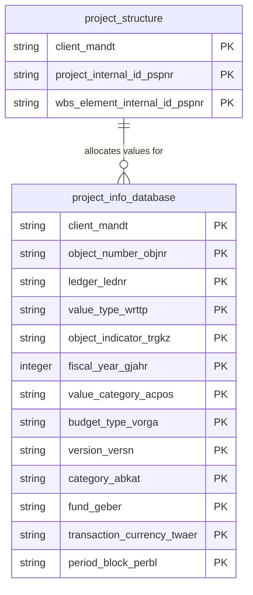

# Project Structure Data Product

This data product includes information about SAP project structure from the Project System (PS), Controlling (CO) module in the Finance, Supply Chain domain in SAP S/4HANA or SAP ECC. The Project Structure data product combines project definitions, WBS (Work Breakdown Structure) elements, hierarchical structures, and scheduling data from SAP systems. It provides a comprehensive, unified view of project lifecycles, enabling tracking of project organization, status, schedules, and financial database values. This foundation supports long-term project planning, controlling, budget management, and operational milestone analytics.

## 1. Overview & Business Value

*   **Business Purpose:** Provides a structured and unified representation of enterprise projects and WBS hierarchies, mapping how they are organized, scheduled, and related structurally. It serves as the analytical foundation for long-term project controlling, portfolio budget tracking, and real-time operational project progress reporting.
*   **Key Metrics & Use Cases:**
    *   **Project Schedule & Milestone Tracking:** Analyze scheduled vs. forecast vs. actual start and finish dates and durations for WBS elements to monitor project execution.
    *   **Work Breakdown Structure (WBS) Controlling:** Analyze the project hierarchy (superior, subordinate, and sibling relationships) for cost allocation, planning, and account assignment checks.
    *   **Project Value & Budget Analytics:** Track annual and period-based project values (actuals, budget, commitments, plan) mapped to specific WBS objects and ledgers.

## 2. Data Assets Catalog

This data product exposes the following BigQuery data assets:

| Data Asset | Description | Source Systems |
| :--- | :--- | :--- |
| `project_structure` | This view is based on SAP S/4HANA or SAP ECC Project System (PS), Controlling (CO) module in the Finance, Supply Chain domain and provides Combines SAP Project Definitions, WBS Elements, and Scheduling Data from PROJ, PRPS, PRTE, and PRHI to provide a view of project structures, hierarchies, and timelines. The data is captured at the granularity of Client (System), Project Internal Id, and Wbs Element Internal Id, ensuring a unique audit trail for every record. | `SAP ECC` / `SAP S/4HANA` |
| `project_info_database` | This view is based on SAP S/4HANA or SAP ECC Project System (PS), Controlling (CO) module in the Finance, Supply Chain domain and provides actual, budget, commitment, and planning values by period and fiscal year for SAP projects and WBS elements from the Project Info Database (RPSCO). The data is captured at the granularity of Client (System), Object Number, Ledger, Value Type, Object Indicator, Fiscal Year, Value Category, Budget Type, Version, Category, Fund, Transaction Currency, and Period Block, ensuring a unique audit trail for every record. | `SAP ECC` / `SAP S/4HANA` |### Entity Relationship Diagram (ERD)

## 3. Data Foundation & Source Tables

To build these assets, the following source tables must be available in the data foundation layer:

| Source Table | Name / Description | System Source | Used by Asset(s) |
| :--- | :--- | :--- | :--- |
| `proj` | Project Definition | `Common` | `project_structure` |
| `prps` | WBS (Work Breakdown Structure) Element Master Data | `Common` | `project_structure` |
| `prte` | Scheduling Data for WBS Element | `Common` | `project_structure` |
| `prhi` | WBS Element Hierarchy | `Common` | `project_structure` |
| `rpsco` | Project Info Database: Costs, Revenues, Fin. Budgets | `Common` | `project_info_database` |

## 4. Transformations & Design Decisions

This section details the critical engineering and design decisions behind the transformations.

### A. Granularity & Primary Keys

* **project_structure:** Client (`client_mandt`), Project Internal ID (`project_internal_id_pspnr`), and WBS Element Internal ID (`wbs_element_internal_id_pspnr`).
* **project_info_database:** Client (`client_mandt`), Object Number (`object_number_objnr`), Ledger (`ledger_lednr`), Value Type (`value_type_wrttp`), Object Indicator (`object_indicator_trgkz`), Fiscal Year (`gjahr`), Value Category (`acpos`), Budget Type (`vorga`), Version (`versn`), Category (`abkat`), Fund (`geber`), Transaction Currency (`twaer`), and Period Block (`perbl`).

### B. Joins & Relationship Logic

* **project_structure:** LEFT JOINed `proj` to `prps` to attach WBS element details to project definitions, LEFT JOINed `prps` to `prte` to attach scheduling dates and durations, and LEFT JOINed `prps` to `prhi` to resolve hierarchical parent, child, and sibling pointers.
* **project_info_database:** No joins; retrieves data directly from the `rpsco` base table.

### C. Incremental Load Strategy

*   **Supported Materialization Types:** `incremental` | `table` | `view`
*   **Incremental Logic:**
    *   **`project_structure`**: Materialized as `incremental` table by default. Delta filter is applied using the `GREATEST` recordstamp comparison across `proj`, `prps`, `prte`, and `prhi`.
    *   **`project_info_database`**: Materialized as `incremental` table by default. Delta filter is applied using the `recordstamp` column on `rpsco`.

### D. ERP Source System Differences (ECC vs. S/4HANA)

*   **`project_structure`**:
    *   *Comparison:* Unified target schema and unified model. No structural differences between ECC and S/4HANA versions of the source tables (`proj`, `prps`, `prte`, `prhi`).
    *   *Field Selections:* Captures project definitions, organizational mappings (company code, business area, controlling area, profit center, plant), scheduling dates (scheduled, forecast, actual start/finish dates and durations), and WBS hierarchy element identifiers.
*   **`project_info_database`**:
    *   *Comparison:* Unified target schema and unified model. No structural differences in the source `rpsco` table.
    *   *Field Selections:* Captures ledger, value type, object indicator, fiscal year, value category, budget type, version, category, fund, transaction currency, and annual/period-based value fields.

### E. Field Conversions & Calculations

*   **Currency & Conversions:** Standardized using transaction currency fields (`twaer` in `project_info_database`, `pwhie` project currency in `project_structure`). Value fields in `project_info_database` are left as-is, subject to standard downstream currency conversions.
*   **Date Fields & Formats:** Null dates or empty date parameters from SAP are handled gracefully, and raw stamps are resolved using standard BigQuery `TIMESTAMP` conversions.

## 5. Change Log

| Date | Type of change | Change details |
| :--- | :--- | :--- |
| 24.06.2026 | Release | Release candidate validation completed. |
