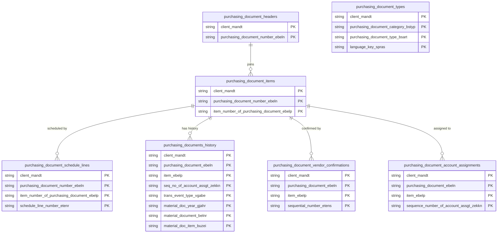

# Purchasing Documents Data Product

This data product includes information about SAP purchasing documents from the Materials Management (MM) module in the Supply Chain domain in SAP S/4HANA or SAP ECC. It tracks enterprise procurement activity spanning purchase orders, scheduling agreements, and contract frameworks. It yields critical insights into supplier lead-time compliance, spending analytics, and automated procurement workflow efficiency.

## 1. Overview & Business Value

*   **Business Purpose:** Tracks enterprise procurement activity spanning purchase orders, scheduling agreements, and contract frameworks. It yields critical insights into supplier lead-time compliance, spending analytics, and automated procurement workflow efficiency.

*   **Key Metrics & Use Cases:**
    *   **Metric/Use Case 1:** Unified enterprise reporting and operational tracking.
    *   **Metric/Use Case 2:** High-fidelity analytics and AI-ready data ingestion.

## 2. Data Assets Catalog

This data product exposes the following BigQuery data assets:

| Data Asset | Description | Source Systems |
| :--- | :--- | :--- |
| `purchasing_document_headers` | This view is based on SAP S/4HANA or SAP ECC Materials Management (MM) module in the Supply Chain domain and provides administrative and commercial terms of SAP purchase orders, scheduling agreements, and contracts from EKKO, maintaining transaction dates, vendors, currencies, and payment terms. The data is captured at the granularity of Client (System) and Purchasing Document Number, ensuring a unique audit trail for every record. | `SAP ECC` / `SAP S/4HANA` |
| `purchasing_document_items` | This view is based on SAP S/4HANA or SAP ECC Materials Management (MM) module in the Supply Chain domain and provides Manages detailed transactional item lines from SAP EKPO, representing ordered materials, quantities, pricing components, plants, and account assignment references. The data is captured at the granularity of Client (System), Purchasing Document Number, and Item Number Of Purchasing Document, ensuring a unique audit trail for every record. | `SAP ECC` / `SAP S/4HANA` |
| `purchasing_document_schedule_lines` | This view is based on SAP S/4HANA or SAP ECC Materials Management (MM) module in the Supply Chain domain and provides logistical delivery schedules from SAP EKET, specifying delivery dates, scheduled quantities, and received/issued quantities for each item line. The data is captured at the granularity of Client (System), Purchasing Document Number, Item Number Of Purchasing Document, and Schedule Line Number, ensuring a unique audit trail for every record. | `SAP ECC` / `SAP S/4HANA` |
| `purchasing_documents_history` | This view is based on SAP S/4HANA or SAP ECC Materials Management (MM) module in the Supply Chain domain and provides the historical transactions and updates for purchasing documents from EKBE. The data is captured at the granularity of Client (System), Purchasing Document, Item, Seq No Of Account Assgt, Trans Event Type, Material Doc Year, Material Document, and Material Doc Item, ensuring a unique audit trail for every record. | `SAP ECC` / `SAP S/4HANA` |
| `purchasing_document_vendor_confirmations` | This view is based on SAP S/4HANA or SAP ECC Materials Management (MM) module in the Supply Chain domain and provides Manages vendor confirmation details from EKES. The data is captured at the granularity of Client (System), Purchasing Document, Item, and Sequential Number, ensuring a unique audit trail for every record. | `SAP ECC` / `SAP S/4HANA` |
| `purchasing_document_account_assignments` | This view is based on SAP S/4HANA or SAP ECC Materials Management (MM) module in the Supply Chain domain and provides the account assignments for purchasing document items from EKKN. The data is captured at the granularity of Client (System), Purchasing Document, Item, and Sequence Number Of Account Assgt, ensuring a unique audit trail for every record. | `SAP ECC` / `SAP S/4HANA` |
| `purchasing_document_types` | This view is based on SAP S/4HANA or SAP ECC Materials Management (MM) module in the Supply Chain domain and provides the configuration of purchasing document types and their descriptions from T161 and T161T. The data is captured at the granularity of Client (System), Purchasing Document Category, Purchasing Document Type, and Language Key, ensuring a unique audit trail for every record. | `SAP ECC` / `SAP S/4HANA` |## 3. Data Foundation & Source Tables

To build these assets, the following source tables must be available in the data foundation layer:

| Source Table | Name / Description | System Source | Used by Asset(s) |
| :--- | :--- | :--- | :--- |
| `ekko` | Purchasing Document Header | `Common` | `purchasing_document_headers`, `purchasing_document_items`, `purchasing_document_account_assignments` |
| `ekpo` | Purchasing Document Item | `Common` | `purchasing_document_items` |
| `eket` | Scheduling Agreement Schedule Lines | `Common` | `purchasing_document_schedule_lines` |
| `ekbe` | History per Purchasing Document | `Common` | `purchasing_documents_history` |
| `ekes` | Vendor Confirmations | `Common` | `purchasing_document_vendor_confirmations` |
| `ekkn` | Account Assignment in Purchasing Document | `Common` | `purchasing_document_account_assignments` |
| `t161` | Purchasing Document Types | `Common` | `purchasing_document_types` |
| `t161t` | Texts for Purchasing Document Types | `Common` | `purchasing_document_types` |

<!-- ERD_START -->
### Entity Relationship Diagram (ERD)

<!-- ERD_END -->

## 4. Transformations & Design Decisions

This section details the critical engineering and design decisions behind the transformations.

### A. Granularity & Primary Keys

* **purchasing_document_headers:** Client (`client_mandt`) and Purchasing Document Number (`purchasing_document_number_ebeln`).
* **purchasing_document_items:** Client (`client_mandt`), Purchasing Document Number (`purchasing_document_number_ebeln`), and Item Number (`item_number_of_purchasing_document_ebelp`).
* **purchasing_document_schedule_lines:** Client (`client_mandt`), Purchasing Document Number (`purchasing_document_number_ebeln`), Item Number (`item_number_of_purchasing_document_ebelp`), and Schedule Line Delivery Serial Number (`schedule_line_number_etenr`).
* **purchasing_documents_history:** Client (`client_mandt`), Purchasing Document (`purchasing_document_ebeln`), Item (`item_ebelp`), Account Assignment Sequence (`seq_no_of_account_assgt_zekkn`), Transaction Type (`trans_event_type_vgabe`), Year (`material_doc_year_gjahr`), Material Document (`material_document_belnr`), and Material Doc Item (`material_doc_item_buzei`).
* **purchasing_document_vendor_confirmations:** Client (`client_mandt`), Purchasing Document (`purchasing_document_ebeln`), Item (`item_ebelp`), and Sequential Number (`sequential_number_etens`).
* **purchasing_document_account_assignments:** Client (`client_mandt`), Purchasing Document (`purchasing_document_ebeln`), Item (`item_ebelp`), and Account Assignment Sequence (`sequence_number_of_account_assgt_zekkn`).
* **purchasing_document_types:** Client (`client_mandt`), Document Category (`purchasing_document_category_bstyp`), Document Type (`purchasing_document_type_bsart`), and Language (`language_key_spras`).

### B. Joins & Relationship Logic

* **purchasing_document_headers:**
    * `ekko` is LEFT JOINed to the `date_dimension` table on `aedat` (change date) and `bedat` (purchasing document date) to resolve detailed calendar metrics.
* **purchasing_document_items:**
    * `ekpo` is INNER JOINed to `ekko` on `mandt` and `ebeln` to retrieve the active currency key (`waers`) and document categories.
    * `ekko` document currency keys are matched against the `currency_decimal` CTE (sourced from `tcurx`) to apply proper decimal shifting.
* **purchasing_document_account_assignments:**
    * `ekkn` is LEFT JOINed to `ekko` on `mandt` and `ebeln` to retrieve the currency key (`waers`) for decimal shifting.
* **purchasing_document_types:**
    * `t161` is LEFT JOINed to `t161t` on `mandt`, `bstyp`, and `bsart` to retrieve the localized document type descriptions (`batxt`).

### C. Incremental Load Strategy

*   **Supported Materialization Types:** `incremental` | `table` | `view`
*   **Incremental Logic:**
    * **purchasing_document_headers:** Driven by `ekko.recordstamp`.
    * **purchasing_document_items:** Driven by `GREATEST(ekpo.recordstamp, ekko.recordstamp)`.
    * **purchasing_document_schedule_lines:** Driven by `eket.recordstamp`.
    * **purchasing_documents_history:** Driven by `ekbe.recordstamp`.
    * **purchasing_document_vendor_confirmations:** Driven by `ekes.recordstamp`.
    * **purchasing_document_account_assignments:** Driven by `GREATEST(ekkn.recordstamp, ekko.recordstamp)`.
    * **purchasing_document_types:** Driven by `GREATEST(t161.recordstamp, t161t.recordstamp)`.

### D. ERP Source System Differences (ECC vs. S/4HANA)

* No structural differences for the newly added assets. Shared unified code structure.

### E. Field Conversions & Calculations

*   **Currency & Conversions:** Standardized using built-in currency shift logic for currencies with non-standard decimal formats (e.g. JPY, IDR) via `tcurx`.

## 5. Change Log

| Date | Type of change | Change details |
| :--- | :--- | :--- |
| 24.06.2026 | Release | Release candidate validation completed. |
| 03.07.2026 | Enhancement | Added `purchasing_documents_history`, `purchasing_document_vendor_confirmations`, `purchasing_document_account_assignments`, and `purchasing_document_types` assets. |
