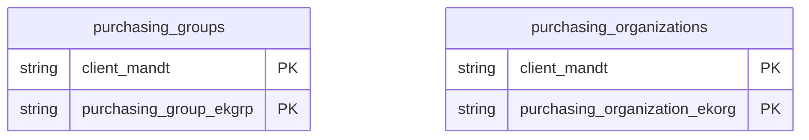

# Purchasing Organizational Structure Data Product

This data product includes information about SAP purchasing organizational structure from the Materials Management (MM) module in the Supply Chain domain in SAP S/4HANA or SAP ECC. Outlines the structural assignments of purchasing organizations and buying groups across enterprise facilities. It enables centralized procurement compliance tracking, strategic vendor negotiation analyses, and spending governance.

## 1. Overview & Business Value

*   **Business Purpose:** Outlines the structural assignments of purchasing organizations and buying groups across enterprise facilities. It enables centralized procurement compliance tracking, strategic vendor negotiation analyses, and spending governance.

*   **Key Metrics & Use Cases:**
    *   **Metric/Use Case 1:** Unified enterprise reporting and operational tracking.
    *   **Metric/Use Case 2:** High-fidelity analytics and AI-ready data ingestion.

## 2. Data Assets Catalog

This data product exposes the following BigQuery data assets:

| Data Asset | Description | Source Systems |
| :--- | :--- | :--- |
| `purchasing_organizations` | This view is based on SAP S/4HANA or SAP ECC Materials Management (MM) module in the Supply Chain domain and provides purchasing hierarchy master data from SAP T024E, mapping individual purchasing organization units to descriptions and assigned company codes (BUKRS). The data is captured at the granularity of Client (System) and Purchasing Organization, ensuring a unique audit trail for every record. | `SAP ECC` / `SAP S/4HANA` |
| `purchasing_groups` | This view is based on SAP S/4HANA or SAP ECC Materials Management (MM) module in the Supply Chain domain and provides Defines purchasing groups master data from SAP T024, mapping individual purchasing groups to their names, phone numbers, and emails. The data is captured at the granularity of Client (System) and Purchasing Group, ensuring a unique audit trail for every record. | `SAP ECC` / `SAP S/4HANA` |### Entity Relationship Diagram (ERD)

## 3. Data Foundation & Source Tables

To build these assets, the following source tables must be available in the data foundation layer:

| Source Table | Name / Description | System Source | Used by Asset(s) |
| :--- | :--- | :--- | :--- |
| `t024e` | Operational source table. | `Common` | `purchasing_organizations` |
| `t024` | Operational source table. | `Common` | `purchasing_groups` |

## 4. Transformations & Design Decisions

This section details the critical engineering and design decisions behind the transformations.

### A. Granularity & Primary Keys

* **purchasing_organizations:** Client (`client_mandt`) and Purchasing Organization (`purchasing_organization_ekorg`).
* **purchasing_groups:** Client (`client_mandt`) and Purchasing Group (`purchasing_group_ekgrp`).
* **purchasing_organizations:** `client_mandt` and `purchasing_organization_ekorg`.
* **purchasing_groups:** `client_mandt` and `purchasing_group_ekgrp`.

### B. Joins & Relationship Logic

* **purchasing_organizations:** No joins. Completely self-contained within the `t024e` table.
* **purchasing_groups:** No joins. Completely self-contained within the `t024` table.

### C. Incremental Load Strategy

*   **Supported Materialization Types:** `incremental` | `table` | `view`
*   **Incremental Logic:**
* **purchasing_organizations:** Materialized as `incremental` table by default.
* **purchasing_groups:** Materialized as `incremental` table by default.
* **purchasing_organizations:** Filters updates using the `recordstamp` timestamp on the `t024e` source table.
* **purchasing_groups:** Filters updates using the `recordstamp` timestamp on the `t024` source table.

### D. ERP Source System Differences (ECC vs. S/4HANA)

* **purchasing_organizations:** No differences. Shared unified schema structure across both ERP systems.
* **purchasing_groups:** No differences. Shared unified schema structure across both ERP systems.
* Field Selections:**
* **purchasing_organizations:** Selects client (`mandt`), organization code (`ekorg`), descriptive text (`ekotx`), and assigned company code (`bukrs`).
* **purchasing_groups:** Selects client (`mandt`), purchasing group code (`ekgrp`), name (`eknam`), telephone (`ektel`), and email (`smtp_addr`).

### E. Field Conversions & Calculations

*   **Currency & Conversions:** Standardized using built-in currency shift logic for currencies with non-standard decimal formats (e.g. JPY, IDR).
*   **Field Selections:** Enriched with operational data and standard language text mappings where applicable.

## 5. Change Log

| Date | Type of change | Change details |
| :--- | :--- | :--- |
| 24.06.2026 | Release | Release candidate validation completed. |
