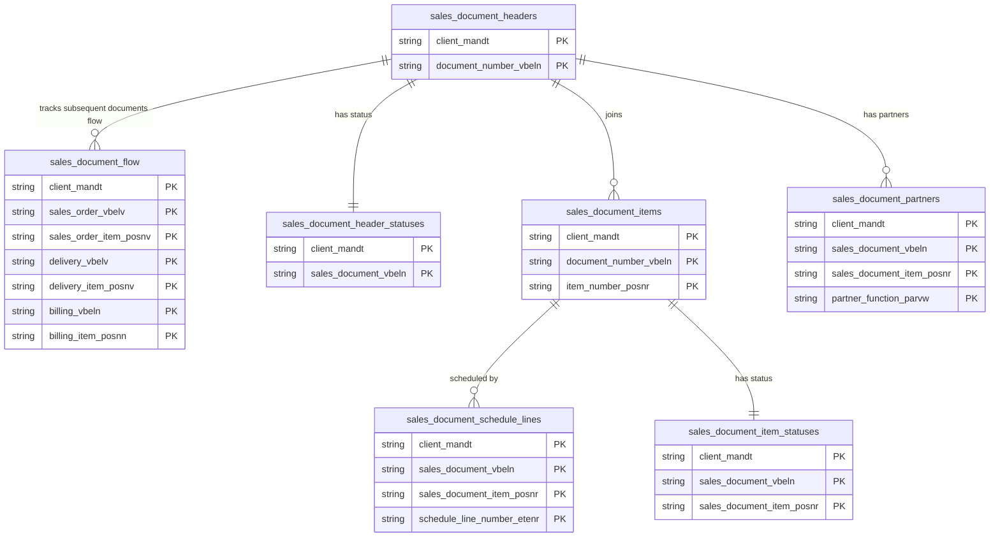

# Sales Documents Data Product

This data product includes information about SAP sales documents from the Sales and Distribution (SD) module in the Sales domain in SAP S/4HANA or SAP ECC. It integrates end-to-end sales transactions, aggregating orders, schedule lines, statuses, and subsequent document flows. Serves as the bedrock for sales velocity forecasting, demand planning, and customer fulfillment analytics.

## 1. Overview & Business Value

*   **Business Purpose:** Integrates end-to-end sales transactions, aggregating orders, schedule lines, statuses, and subsequent document flows. Serves as the bedrock for sales velocity forecasting, demand planning, and customer fulfillment analytics.

*   **Key Metrics & Use Cases:**
    *   **Metric/Use Case 1:** Unified enterprise reporting and operational tracking.
    *   **Metric/Use Case 2:** High-fidelity analytics and AI-ready data ingestion.

## 2. Data Assets Catalog

This data product exposes the following BigQuery data assets:

| Data Asset | Description | Source Systems |
| :--- | :--- | :--- |
| `sales_document_headers` | This view is based on SAP S/4HANA or SAP ECC Sales and Distribution (SD) module in the Sales domain and provides sales document header-level details from SAP VBAK, tracking customer accounts, net value, document categories, and dates. The data is captured at the granularity of Client (System) and Document Number, ensuring a unique audit trail for every record. | `SAP ECC` / `SAP S/4HANA` |
| `sales_document_items` | This view is based on SAP S/4HANA or SAP ECC Sales and Distribution (SD) module in the Sales domain and provides sales document item-level transaction details from SAP VBAP, documenting materials, quantities ordered, net prices, and plant locations. The data is captured at the granularity of Client (System), Document Number, and Item Number, ensuring a unique audit trail for every record. | `SAP ECC` / `SAP S/4HANA` |
| `sales_document_partners` | This view is based on SAP S/4HANA or SAP ECC Sales and Distribution (SD) module in the Sales domain and provides partner details for sales documents at both header and item levels from SAP VBPA, mapping roles like Sold-to Party and Ship-to Party. The data is captured at the granularity of Client (System), Sales Document, Sales Document Item, and Partner Function, ensuring a unique audit trail for every record. | `SAP ECC` / `SAP S/4HANA` |
| `sales_document_schedule_lines` | This view is based on SAP S/4HANA or SAP ECC Sales and Distribution (SD) module in the Sales domain and provides schedule line data for sales items from SAP VBEP, detailing confirmed, ordered, and delivered quantities. The data is captured at the granularity of Client (System), Sales Document, Sales Document Item, and Schedule Line Number, ensuring a unique audit trail for every record. | `SAP ECC` / `SAP S/4HANA` |
| `sales_document_header_statuses` | This view is based on SAP S/4HANA or SAP ECC Sales and Distribution (SD) module in the Sales domain and provides processing, delivery, and billing statuses of sales document headers from SAP VBUK (ECC) or VBAK (S4). The data is captured at the granularity of Client (System) and Sales Document, ensuring a unique audit trail for every record. | `SAP ECC` / `SAP S/4HANA` |
| `sales_document_item_statuses` | This view is based on SAP S/4HANA or SAP ECC Sales and Distribution (SD) module in the Sales domain and provides picking, delivery, and billing statuses of individual sales document items from SAP VBUP (ECC) or VBAP/LIPS (S4). The data is captured at the granularity of Client (System), Sales Document, and Sales Document Item, ensuring a unique audit trail for every record. | `SAP ECC` / `SAP S/4HANA` |
| `sales_document_flow` | This view is based on SAP S/4HANA or SAP ECC Sales and Distribution (SD) module in the Sales domain and provides Information about sales document flows from SAP VBFA, mapping preceding Sales Orders to subsequent Deliveries and Invoices. The data is captured at the granularity of Client (System), Sales Order, Sales Order Item, Delivery, Delivery Item, Billing, and Billing Item, ensuring a unique audit trail for every record. | `SAP ECC` / `SAP S/4HANA` |### Entity Relationship Diagram (ERD)

## 3. Data Foundation & Source Tables

To build these assets, the following source tables must be available in the data foundation layer:

| Source Table | Name / Description | System Source | Used by Asset(s) |
| :--- | :--- | :--- | :--- |
| `vbak` | Operational source table. | `Common` | `sales_document_headers`, `sales_document_header_statuses` |
| `vbap` | Operational source table. | `Common` | `sales_document_items`, `sales_document_item_statuses` |
| `vbpa` | Operational source table. | `Common` | `sales_document_partners` |
| `vbep` | Operational source table. | `Common` | `sales_document_schedule_lines` |
| `vbuk` | Operational source table. | `Common` | `sales_document_header_statuses` |
| `vbup` | Operational source table. | `Common` | `sales_document_item_statuses` |
| `vbfa` | Operational source table. | `Common` | `sales_document_flow` |

## 4. Transformations & Design Decisions

This section details the critical engineering and design decisions behind the transformations.

### A. Granularity & Primary Keys

* **sales_document_headers:** Client (`client_mandt`) and Sales Document (`document_number_vbeln`).
* **sales_document_items:** Client (`client_mandt`), Sales Document (`document_number_vbeln`), and Sales Document Item (`item_number_posnr`).
* **sales_document_partners:** Client (`client_mandt`), Sales Document (`sales_document_vbeln`), Sales Document Item (`sales_document_item_posnr`), and Partner Function (`partner_function_parvw`).
* **sales_document_schedule_lines:** Client (`client_mandt`), Sales Document (`sales_document_vbeln`), Sales Document Item (`sales_document_item_posnr`), and Schedule Line Number (`schedule_line_number_etenr`).
* **sales_document_header_statuses:** Client (`client_mandt`) and Sales Document (`sales_document_vbeln`).
* **sales_document_item_statuses:** Client (`client_mandt`), Sales Document (`sales_document_vbeln`), and Sales Document Item (`sales_document_item_posnr`).
* **sales_document_flow:** Client (`client_mandt`), Preceding Sales Order (`sales_order_vbelv`), Preceding Item (`sales_order_item_posnv`), Delivery (`delivery_vbelv`), Delivery Item (`delivery_item_posnv`), Billing Document (`billing_vbeln`), and Billing Item (`billing_item_posnn`).

### B. Joins & Relationship Logic

* **sales_document_headers:** LEFT JOINed to `tcurx` (via `currencyDecimalShift` helper) to shift currency values, and LEFT JOINed to `date_dimension` (three times: `erdat`, `audat`, `vdatu`) to resolve calendar dimensions.
* **sales_document_items:** LEFT JOINed to `tcurx` to shift currency values, and LEFT JOINed to `date_dimension` (`erdat`) to resolve calendar dimensions.
* **sales_document_partners:** No joins.
* **sales_document_schedule_lines:** LEFT JOINed to `tcurx` (S4 only) to shift currency values, and LEFT JOINed to `date_dimension` (two times: `edatu`, `bddat`) to resolve calendar dimensions.
* **sales_document_header_statuses:** No joins for ECC; S4 version is self-contained.
* **sales_document_item_statuses:** No joins for ECC; S4 version is self-contained querying `vbap` directly at the Sales Order Item grain. Delivery-level statuses are maintained separately in `delivery_document_items`.
* **sales_document_flow:** Sourced from `vbfa` joined twice (Order -> Delivery -> Invoice) to track preceding and subsequent documents.
* *Note on text joins:* No text table joins are performed in these models.

### C. Incremental Load Strategy

*   **Supported Materialization Types:** `incremental`
*   **Incremental Logic:**
* **sales_document_headers:** Delta filter applied using `recordstamp` column on `vbak`.
* **sales_document_items:** Delta filter applied using `recordstamp` column on `vbap`.
* **sales_document_partners:** Delta filter applied using `recordstamp` column on `vbpa`.
* **sales_document_schedule_lines:** Delta filter applied using `recordstamp` column on `vbep`.
* **sales_document_header_statuses:** Delta filter applied using `recordstamp` column on `vbuk` (ECC) or `vbak` (S4).
* **sales_document_item_statuses:** Delta filter applied using `recordstamp` column on `vbup` (ECC) or `vbap` (S4).
* **sales_document_flow:** Delta filter applied using `recordstamp` column on `vbfa`.

### D. ERP Source System Differences (ECC vs. S/4HANA)

* **sales_document_headers:** Unified model, no structural differences.
* **sales_document_items:** Unified model, no structural differences.
* **sales_document_partners:** Unified model, no structural differences.
* **sales_document_schedule_lines:** S4 includes extended fields (e.g., `dlvqty_bu`, `dlvqty_su`, `ocdqty_bu`, `ocdqty_su`, `ordqty_bu`, `ordqty_su`, `crea_dlvdate`, `req_dlvdate`, `bedar`, `odn_amount`, `handle`, `lccst`, `rrqqty_bu`, `crqqty_bu`), and shifts currency values for `odn_amount` via `tcurx`. Separate definition files are maintained under `ecc/` and `s4/` folders to handle these schema differences.
* **sales_document_header_statuses:** Unified target schema. ECC queries status columns directly from `vbuk`. S/4HANA queries status columns from `vbak`. Fields that are only present in ECC `vbuk` are cast to `NULL` in the S/4HANA definition. S/4HANA specific fields (e.g. `cmps_cm`, `cmps_te`) are cast to `NULL` in ECC.
* **sales_document_item_statuses:** Unified target schema. ECC queries status columns directly from `vbup`. S/4HANA queries status columns directly from `vbap`. S/4HANA specific fields (such as `ifrs15_relevance`) are cast to `NULL` in ECC. Delivery-level statuses reside separately in `delivery_document_items`.
* **sales_document_flow:** Unified target schema. Relies on the standard `vbfa` table joined twice. The document types are parameterized in `table_settings.yaml` under the `filters` block to allow custom customer-specific transaction types.
* **Field Selections:**
* **sales_document_headers:** Comprehensive set of header metrics, status indicator codes, organization structures, and time-dimension expansions.
* **sales_document_items:** Details pricing, quantities, bom levels, plant, and storage locations with currency shifting.
* **sales_document_partners:** Captures customer, vendor, personnel, contact person, address numbers, country, unloading point, and hierarchy details.
* **sales_document_schedule_lines:** Details scheduled quantities, confirmation statuses, delivery dates, and relevant shipping/transport planning timestamps.
* **sales_document_header_statuses:** Comprehensive list of header processing, credit check, transportation, packing, and incompleteness status fields.
* **sales_document_item_statuses:** Comprehensive list of item-level picking, delivery, and billing status fields.
* **sales_document_flow:** Maps preceding orders, delivery documents, and subsequent invoices, including quantities and values with their corresponding units/currencies.

### E. Field Conversions & Calculations

*   **Currency & Conversions:** Standardized using built-in currency shift logic for currencies with non-standard decimal formats (e.g. JPY, IDR).
*   **Field Selections:** Enriched with operational data and standard language text mappings where applicable.

## 5. Change Log

| Date | Type of change | Change details |
| :--- | :--- | :--- |
| 24.06.2026 | Release | Release candidate validation completed. |
