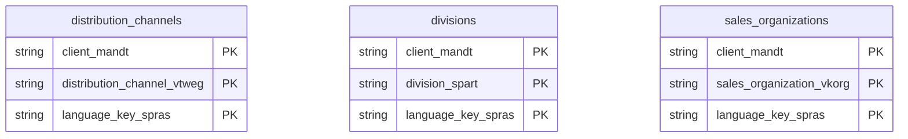

# Sales Organizational Structure Data Product

This data product includes information about SAP sales organizational structure from the Sales and Distribution (SD) module in the Sales domain in SAP S/4HANA or SAP ECC. It structures sales organizations, distribution channels, and divisions alongside their corresponding facility assignments. Supports sales territory performance analyses, multi-channel revenue distribution tracking, and sales operations planning.

## 1. Overview & Business Value

*   **Business Purpose:** Structures sales organizations, distribution channels, and divisions alongside their corresponding facility assignments. Supports sales territory performance analyses, multi-channel revenue distribution tracking, and sales operations planning.

*   **Key Metrics & Use Cases:**
    *   **Metric/Use Case 1:** Unified enterprise reporting and operational tracking.
    *   **Metric/Use Case 2:** High-fidelity analytics and AI-ready data ingestion.

## 2. Data Assets Catalog

This data product exposes the following BigQuery data assets:

| Data Asset | Description | Source Systems |
| :--- | :--- | :--- |
| `sales_organizations` | This view is based on SAP S/4HANA or SAP ECC Sales and Distribution (SD) module in the Sales domain and provides sales organization details and configurations from SAP TVKO, enriched with multi-lingual description texts from TVKOT to support sales territory structure analysis. The data is captured at the granularity of Client (System), Sales Organization, and Language Key, ensuring a unique audit trail for every record. | `SAP ECC` / `SAP S/4HANA` |
| `distribution_channels` | This view is based on SAP S/4HANA or SAP ECC Sales and Distribution (SD) module in the Sales domain and provides a master dictionary of distribution channels from SAP TVTW, enriched with multi-lingual names from TVTWT. The data is captured at the granularity of Client (System), Distribution Channel, and Language Key, ensuring a unique audit trail for every record. | `SAP ECC` / `SAP S/4HANA` |
| `divisions` | This view is based on SAP S/4HANA or SAP ECC Sales and Distribution (SD) module in the Sales domain and provides division master data from SAP TSPA, enriched with localized multi-lingual text descriptions from TSPAT. The data is captured at the granularity of Client (System), Division, and Language Key, ensuring a unique audit trail for every record. | `SAP ECC` / `SAP S/4HANA` |### Entity Relationship Diagram (ERD)

## 3. Data Foundation & Source Tables

To build these assets, the following source tables must be available in the data foundation layer:

| Source Table | Name / Description | System Source | Used by Asset(s) |
| :--- | :--- | :--- | :--- |
| `tvko` | Operational source table. | `Common` | `sales_organizations` |
| `tvkot` | Operational source table. | `Common` | `sales_organizations` |
| `tvtw` | Operational source table. | `Common` | `distribution_channels` |
| `tvtwt` | Operational source table. | `Common` | `distribution_channels` |
| `tspa` | Operational source table. | `Common` | `divisions` |
| `tspat` | Operational source table. | `Common` | `divisions` |

## 4. Transformations & Design Decisions

This section details the critical engineering and design decisions behind the transformations.

### A. Granularity & Primary Keys

* **sales_organizations:** Client (`client_mandt`), Sales Organization (`sales_organization_vkorg`), and Language Key (`language_key_spras`).
* **distribution_channels:** Client (`client_mandt`), Distribution Channel (`distribution_channel_vtweg`), and Language Key (`language_key_spras`).
* **divisions:** Client (`client_mandt`), Division (`division_spart`), and Language Key (`language_key_spras`).

### B. Joins & Relationship Logic

* **sales_organizations:** `tvko` is LEFT JOINed to `tvkot` on Client (`mandt`) and Sales Organization (`vkorg`) to resolve localized names.
* **distribution_channels:** `tvtw` is LEFT JOINed to `tvtwt` on Client (`mandt`) and Distribution Channel (`vtweg`) to resolve localized names.
* **divisions:** `tspa` is LEFT JOINed to `tspat` on Client (`mandt`) and Division (`spart`) to resolve localized names.
* *Note on text joins:* Joining with text tables can multiply rows per language key if multiple languages are active in the system.

### C. Incremental Load Strategy

*   **Supported Materialization Types:** `incremental` | `table` | `view`
*   **Incremental Logic:**
* **sales_organizations:** Uses the `GREATEST` recordstamp of `tvko` and `tvkot` source tables.
* **distribution_channels:** Uses the `GREATEST` recordstamp of `tvtw` and `tvtwt` source tables.
* **divisions:** Uses the `GREATEST` recordstamp of `tspa` and `tspat` source tables.

### D. ERP Source System Differences (ECC vs. S/4HANA)

* **sales_organizations:** Unified model with no schema differences between ECC and S/4HANA.
* **distribution_channels:** Unified model with no schema differences between ECC and S/4HANA.
* **divisions:** Unified model with no schema differences between ECC and S/4HANA.

* **Field Selections:**
  * **sales_organizations:** Extracted fields cover statistics currency, company code, address number, text keys, and SD config flags.
  * **distribution_channels:** Retrieves core channel keys and their description texts.
  * **divisions:** Retrieves core division keys and their description texts.

### E. Field Conversions & Calculations

*   **Currency & Conversions:** Standardized using built-in currency shift logic for currencies with non-standard decimal formats (e.g. JPY, IDR).
*   **Field Selections:** Enriched with operational data and standard language text mappings where applicable.

## 5. Change Log

| Date | Type of change | Change details |
| :--- | :--- | :--- |
| 24.06.2026 | Release | Release candidate validation completed. |
