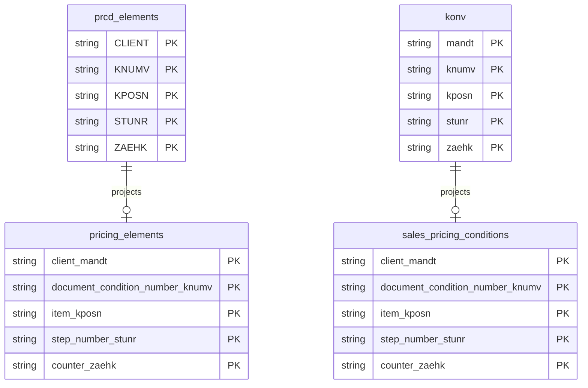

# Sales Pricing Conditions Data Product

This data product includes information about SAP sales pricing conditions from the Sales and Distribution (SD) module in the Sales domain in SAP S/4HANA or SAP ECC. It provides a single, comprehensive, and consistent view of sales pricing conditions across SAP ECC and S/4HANA. It exposes pricing calculation details, rates, currencies, and condition values for sales documents.

## 1. Overview & Business Value

*   **Business Purpose:** Enables auditing and analysis of pricing conditions applied to sales transactions. Allows users to track condition values, rounding differences, scales, and G/L accounts determined for billing and pricing.
*   **Key Metrics & Use Cases:**
    *   **Pricing Audit:** Detailed analysis of condition types, rates, and values applied to sales orders.
    *   **Margin Analysis:** Evaluating discounts, surcharges, and tax conditions.
    *   **Financial Reconciliation:** Verifying G/L account determinations for accruals and pricing.

## 2. Data Assets Catalog

This data product exposes the following BigQuery data assets:

| Data Asset | Description | Source Systems |
| :--- | :--- | :--- |
| `pricing_elements` | This view is based on SAP S/4HANA Sales and Distribution (SD) module in the Sales domain and provides Pricing elements (transactional data) containing conditions, rates, and values for S/4HANA. The data is captured at the granularity of Client (System), Document Condition Number, Item, Step Number, and Counter, ensuring a unique audit trail for every record. | `SAP S/4HANA` |
| `sales_pricing_conditions` | This view is based on SAP ECC Sales and Distribution (SD) module in the Sales domain and provides Sales pricing conditions containing conditions, rates, and values for ECC. The data is captured at the granularity of Client (System), Document Condition Number, Item, Step Number, and Counter, ensuring a unique audit trail for every record. | `SAP ECC` |## 3. Data Foundation & Source Tables

To build these assets, the following source tables must be available in the data foundation layer:

| Source Table | Name / Description | System Source | Used by Asset(s) |
| :--- | :--- | :--- | :--- |
| `prcd_elements` | Pricing Elements (S/4HANA replacement for konv) | `S4-only` | `pricing_elements` |
| `konv` | Conditions (Transaction Data for ECC) | `ECC-only` | `sales_pricing_conditions` |
| `tcurx` | Decimal Places for Currencies | `Common` | Both |

### Entity Relationship Diagram (ERD)

<!-- ERD_START -->

<!-- ERD_END -->

## 4. Transformations & Design Decisions

This section details the critical engineering and design decisions behind the transformations.

### A. Granularity & Primary Keys

*   **`pricing_elements` / `sales_pricing_conditions`**: The grain of this asset is one row per pricing condition item. Row uniqueness is strictly enforced on `client_mandt`, `doc_condition_no_knumv`, `item_kposn`, `step_number_stunr`, and `counter_zaehk`.

### B. Joins & Relationship Logic

*   **`pricing_elements` (S4)**:
    *   Joined `prcd_elements` with `date_dimension` on `SAFE.PARSE_DATE('%Y%m%d', SUBSTR(prcd_elements.KDATU, 1, 8)) = dimensional_date_kdatu.date`.
    *   *Rationale:* `KDATU` is a `CHAR 14` timestamp in S/4HANA; we extract the first 8 characters and parse it as a `DATE` to join with the date dimension.
*   **`sales_pricing_conditions` (ECC)**:
    *   Joined `konv` with `date_dimension` on `konv.kdatu = dimensional_date_kdatu.date`.
    *   *Rationale:* `kdatu` is a `DATS` field in ECC and can be joined directly.

### C. Incremental Load Strategy

*   **Supported Materialization Types:** `incremental`
*   **Incremental Logic:**
    *   Delta updates are performed using the `recordstamp` column of the respective source table.
    *   Merge Policy: `EXTEND` on schema change to allow seamless field additions.

### D. ERP Source System Differences (ECC vs. S/4HANA)

*   **S/4HANA vs ECC**:
    *   *Comparison:* S/4HANA replaces the legacy `konv` table with `prcd_elements`, which features slightly different fields (e.g. `waerk` instead of `waers` for document currency, and larger field sizes for rates and values). Separate JS definitions are maintained in `ecc/` and `s4/` folders to handle this.

### E. Field Conversions & Calculations

*   **Decimal Shifts (Currency):** Uses helper `currencyDecimalShift` joined to `tcurx` to adjust decimal representations of currency fields (`kwert`, `kdiff`, `kwert_k`) based on the document currency (`waerk`/`waers`).
*   **Rates and Bases:** Keep `kbetr` and `kawrt` as-is to avoid corruption of quantity-based rates.

## 5. Change Log

| Date | Type of change | Change details |
| :--- | :--- | :--- |
| 29.06.2026 | Feature | Initial onboarding of `sales_pricing_conditions` data product. |
