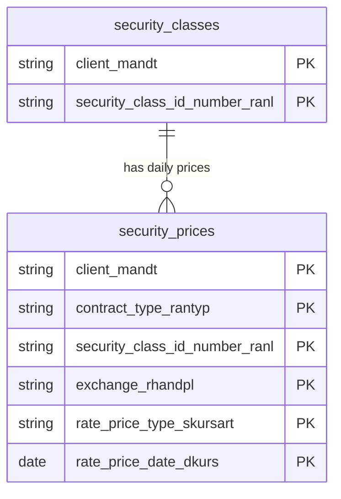

# Treasury Market Data Data Product

This data product includes information about SAP treasury market data from the Treasury and Risk Management (TRM) module in the Treasury domain in SAP S/4HANA or SAP ECC. It integrates treasury market data from SAP, providing a comprehensive view of security classes (master data) and their corresponding daily market prices. Serves as the foundation for treasury management, portfolio valuation, risk analysis, and financial reporting.

## 1. Overview & Business Value

*   **Business Purpose:** Consolidates security master data and daily market prices to enable automated valuation of securities portfolios, tracking of financial assets, and compliance with treasury accounting standards.
*   **Key Metrics & Use Cases:**
    *   **Portfolio Valuation:** Calculates the current market value of security holdings using daily closing prices.
    *   **Treasury Risk Management:** Evaluates exposure to market price fluctuations and interest rate risks.
    *   **Master Data Auditing:** Provides a consistent catalog of security classes, issuers, and classifications.

## 2. Data Assets Catalog

This data product exposes the following BigQuery data assets:

| Data Asset | Description | Source Systems |
| :--- | :--- | :--- |
| `security_classes` | This view is based on SAP S/4HANA or SAP ECC Treasury and Risk Management (TRM) module in the Treasury domain and provides Represents security master data, including names, product types, issuers, and classification details. The data is captured at the granularity of Client (System) and Security Class Id Number, ensuring a unique audit trail for every record. | `SAP ECC` / `SAP S/4HANA` |
| `security_prices` | This view is based on SAP S/4HANA or SAP ECC Treasury and Risk Management (TRM) module in the Treasury domain and provides daily market prices (closing, opening, high, low) for securities across different exchanges. The data is captured at the granularity of Client (System), Contract Type Rantyp, Security Class Id Number, Exchange Rhandpl, Rate Price Type Skursart, and Rate Price Date, ensuring a unique audit trail for every record. | `SAP ECC` / `SAP S/4HANA` |### Entity Relationship Diagram (ERD)

<!-- ERD_START -->

<!-- ERD_END -->

## 3. Data Foundation & Source Tables

To build these assets, the following source tables must be available in the data foundation layer:

| Source Table | Name / Description | System Source | Used by Asset(s) |
| :--- | :--- | :--- | :--- |
| `vwpanla` | Asset master for securities. | `Common` | `security_classes` |
| `atras` | Treasury security prices. | `Common` | `security_prices` |

## 4. Transformations & Design Decisions

This section details the critical engineering and design decisions behind the transformations.

### A. Granularity & Primary Keys

*   **security_classes:** Client (`client_mandt`) and Security Class ID Number (`security_class_id_number_ranl`).
*   **security_prices:** Client (`client_mandt`), Contract Type (`contract_type_rantyp`), Security Class ID Number (`security_class_id_number_ranl`), Exchange (`exchange_rhandpl`), Rate/Price Type (`rate_price_type_skursart`), and Rate/Price Date (`rate_price_date_dkurs`).

### B. Joins & Relationship Logic

*   **security_classes:** Sourced directly from `vwpanla` with no additional table joins.
*   **security_prices:** Sourced from `atras` and joined to `vwpanla` to validate security existence and inherit currency attributes.
    *   *Gotchas & Filters:* Prices are filtered by valid dates and active security classes to prevent orphaned price records.

### C. Incremental Load Strategy

*   **Supported Materialization Types:** `incremental`
*   **Incremental Logic:**
    *   **security_classes:** Delta updates are performed using `recordstamp` column on `vwpanla`.
    *   **security_prices:** Delta updates are performed using `recordstamp` column on `atras`.
    *   **Merge Policy:** `EXTEND` on schema change to allow seamless field additions.

### D. ERP Source System Differences (ECC vs. S/4HANA)

*   **security_classes:** Unified model, no structural differences between ECC and S/4HANA.
*   **security_prices:** Unified model, no structural differences between ECC and S/4HANA.

### E. Field Conversions & Calculations

*   **Decimal Shifts (Currency):** Price fields (e.g., `pktkur` for absolute price) do not undergo standard currency decimal shifts as they represent market rates or index values rather than transactional amounts. Transactional value fields (like `pkur` when representing percentage-based bond prices) are handled according to their specific quotation types.

## 5. Change Log

| Date | Type of change | Change details |
| :--- | :--- | :--- |
| 02.07.2026 | Release | Initial release of Treasury Market Data data product. |
