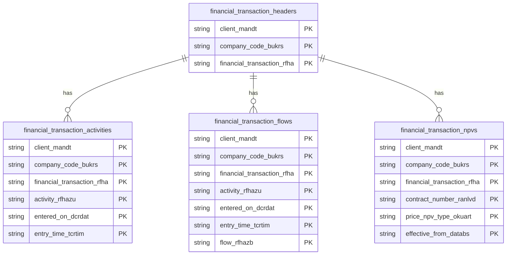

# Treasury Positions Data Product

This data product includes information about SAP treasury positions from the Treasury and Risk Management (TRM) module in the Treasury domain in SAP S/4HANA or SAP ECC. The Treasury Positions data product provides clean, analytics-ready models for treasury transactions, flows, activities, and net present values (NPV) from SAP Treasury and Risk Management (TRM).

## 1. Overview & Business Value

*   **Business Purpose:** Captures financial transactions (header details, payment flows, business activities, and market valuations) across SAP ECC and S/4HANA systems. It dynamically shifts currency decimals for transaction and valuation amounts, providing a consistent basis for treasury position reporting, risk analysis, and audit compliance.
*   **Key Metrics & Use Cases:**
    *   **Treasury Position Reporting:** Analysis of active financial transactions, maturities, and counterparty risks.
    *   **Cash Flow Forecasting:** Tracking cash inflows and outflows from principal and interest payments.
    *   **Valuation & Risk Management:** Net Present Value (NPV) tracking for OTC derivatives and securities.
    *   **Audit & Compliance:** Tracing transaction lifecycles from contract to settlement.

## 2. Data Assets Catalog

This data product exposes the following BigQuery data assets:

| Data Asset | Description | Source Systems |
| :--- | :--- | :--- |
| `financial_transaction_headers` | This view is based on SAP S/4HANA or SAP ECC Treasury and Risk Management (TRM) module in the Treasury domain and provides Treasury Financial Transaction Headers The data is captured at the granularity of Client (System), Company Code, and Financial Transaction, ensuring a unique audit trail for every record. | `SAP ECC` / `SAP S/4HANA` |
| `financial_transaction_flows` | This view is based on SAP S/4HANA or SAP ECC Treasury and Risk Management (TRM) module in the Treasury domain and provides Treasury Financial Transaction Flows The data is captured at the granularity of Client (System), Company Code, Financial Transaction, Activity Rfhazu, Entered On Dcrdat, Entry Time Tcrtim, and Flow Rfhazb, ensuring a unique audit trail for every record. | `SAP ECC` / `SAP S/4HANA` |
| `financial_transaction_activities` | This view is based on SAP S/4HANA or SAP ECC Treasury and Risk Management (TRM) module in the Treasury domain and provides Treasury Financial Transaction Activities The data is captured at the granularity of Client (System), Company Code, Financial Transaction, Activity Rfhazu, Entered On Dcrdat, and Entry Time Tcrtim, ensuring a unique audit trail for every record. | `SAP ECC` / `SAP S/4HANA` |
| `financial_transaction_npvs` | This view is based on SAP S/4HANA or SAP ECC Treasury and Risk Management (TRM) module in the Treasury domain and provides Treasury Financial Transaction Net Present Values (NPV) The data is captured at the granularity of Client (System), Company Code, Financial Transaction, Contract Number Ranlvd, Price Npv Type Okuart, and Effective From Databs, ensuring a unique audit trail for every record. | `SAP ECC` / `SAP S/4HANA` |### Entity Relationship Diagram (ERD)

<!-- ERD_START -->

<!-- ERD_END -->

## 3. Data Foundation & Source Tables

To build these assets, the following source tables must be available in the data foundation layer:

| Source Table | Name / Description | System Source | Used by Asset(s) |
| :--- | :--- | :--- | :--- |
| `vtbfha` | Financial Transaction | `Common` | `financial_transaction_headers`, `financial_transaction_flows`, `financial_transaction_activities`, `financial_transaction_npvs` |
| `vtbfhapo` | Transaction Flow | `Common` | `financial_transaction_flows` |
| `vtbfhazu` | Transaction Activity | `Common` | `financial_transaction_activities` |
| `vtvbar` | NPVs of OTC Transactions | `Common` | `financial_transaction_npvs` |
| `t001` | Company Codes | `Common` | `financial_transaction_flows` |
| `tcurx` | Decimal Places for Currency Codes | `Common` | `financial_transaction_flows`, `financial_transaction_npvs`, `financial_transaction_activities` |

## 4. Transformations & Design Decisions

### A. Granularity & Primary Keys

*   **`financial_transaction_headers`**: One row per financial transaction. Primary keys are `client_mandt`, `company_code_bukrs`, and `financial_transaction_rfha`.
*   **`financial_transaction_flows`**: One row per transaction payment flow. Primary keys are `client_mandt`, `company_code_bukrs`, `financial_transaction_rfha`, `activity_rfhazu`, `entered_on_dcrdat`, `entry_time_tcrtim`, and `flow_rfhazb`.
*   **`financial_transaction_activities`**: One row per transaction activity (e.g. Contract, Settlement). Primary keys are `client_mandt`, `company_code_bukrs`, `financial_transaction_rfha`, `activity_rfhazu`, `entered_on_dcrdat`, and `entry_time_tcrtim`.
*   **`financial_transaction_npvs`**: One row per valuation date and type. Primary keys are `client_mandt`, `company_code_bukrs`, `financial_transaction_rfha`, `contract_number_ranlvd`, `price_npv_type_okuart`, and `effective_from_databs`.

### B. Joins & Relationship Logic

*   **`financial_transaction_flows`**: Joined to `tcurx` to perform currency decimal shifts on payment amount (`bzbetr`) using the payment currency (`wzbetr`). It is also joined to `t001` to resolve the local currency (`waers`) for local currency amounts (`bhwbetr`).
*   **`financial_transaction_activities`**: Joined to `vtbfha` to resolve the payment currency (`wgschft`) for limit amounts, which is then used with `tcurx` for decimal shifts.
*   **`financial_transaction_npvs`**: Joined to `tcurx` to perform currency decimal shifts on Net Present Value (`barwert`) using the valuation currency (`wbarwert`).

### C. Incremental Load Strategy

*   **Supported Materialization Types:** `incremental`
*   **Incremental Logic:** Delta updates are performed using the `recordstamp` column of the respective source tables.

### D. ERP Source System Differences (ECC vs. S/4HANA)

*   Separate Dataform `.js` definitions are maintained under `ecc/` and `s4/` subdirectories for `financial_transaction_headers` and `financial_transaction_flows` to handle schema differences (e.g. `bupla` in S/4HANA version of `VTBFHA`).

---

## 5. Change Log

| Date | Type of change | Change details |
| :--- | :--- | :--- |
| 03.07.2026 | Release | Initial onboarding of treasury_positions data product. |
