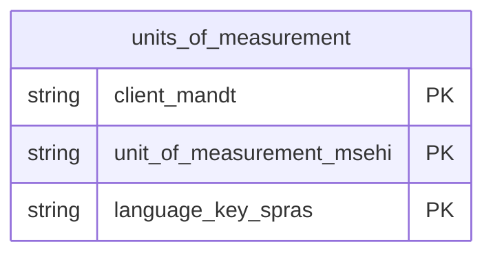

# Units Of Measurement Data Product

This data product includes information about SAP units of measurement from the Materials Management (MM), Sales and Distribution (SD) module in the Cross-Functional domain in SAP S/4HANA or SAP ECC. It establishes global consistency for transactional dimensions, weights, volumes, and temperatures. Vital for inventory balancing, it ensures mathematically accurate conversions and standardizations across diverse international supply chains.

## 1. Overview & Business Value

*   **Business Purpose:** Establishes global consistency for transactional dimensions, weights, volumes, and temperatures. Vital for inventory balancing, it ensures mathematically accurate conversions and standardizations across diverse international supply chains.

*   **Key Metrics & Use Cases:**
    *   **Metric/Use Case 1:** Unified enterprise reporting and operational tracking.
    *   **Metric/Use Case 2:** High-fidelity analytics and AI-ready data ingestion.

## 2. Data Assets Catalog

This data product exposes the following BigQuery data assets:

| Data Asset | Description | Source Systems |
| :--- | :--- | :--- |
| `units_of_measurement` | This view is based on SAP S/4HANA or SAP ECC Materials Management (MM), Sales and Distribution (SD) module in the Cross-Functional domain and provides a standardized, globally consistent view of SAP units of measurement (weights, volumes, dimensions, temperatures) from T006, T006A, and T006T, mapped to ISO codes. The data is captured at the granularity of Client (System), Unit Of Measurement, and Language Key, ensuring a unique audit trail for every record. | `SAP ECC` / `SAP S/4HANA` |### Entity Relationship Diagram (ERD)

## 3. Data Foundation & Source Tables

To build these assets, the following source tables must be available in the data foundation layer:

| Source Table | Name / Description | System Source | Used by Asset(s) |
| :--- | :--- | :--- | :--- |
| `t006` | Operational source table. | `Common` | `units_of_measurement` |
| `t006a` | Operational source table. | `Common` | `units_of_measurement` |
| `t006t` | Operational source table. | `Common` | `units_of_measurement` |

## 4. Transformations & Design Decisions

This section details the critical engineering and design decisions behind the transformations.

### A. Granularity & Primary Keys

* **units_of_measurement:** Client (`client_mandt`), Internal Unit of Measurement (`unit_of_measurement_msehi`), and Language Key (`language_key_spras`).

### B. Joins & Relationship Logic

* **units_of_measurement:**
* `t006` is LEFT JOINed with `t006t` on `mandt` and `dimid`.
* `t006` is LEFT JOINed with `t006a` on `mandt` and `msehi`.
* To maintain linguistic consistency, `t006a.spras` is joined against `t006t.spras`.

### C. Incremental Load Strategy

*   **Supported Materialization Types:** `incremental` | `table` | `view`
*   **Incremental Logic:**
* **units_of_measurement:** Incremental updates are tracked dynamically using a `GREATEST` recordstamp comparison between `t006.recordstamp`, `t006a.recordstamp`, and `t006t.recordstamp` (defaulting null values to `1900-01-01 00:00:00+00`).

### D. ERP Source System Differences (ECC vs. S/4HANA)

* **units_of_measurement:** None. The structures of tables `t006`, `t006a`, and `t006t` are identical across both ECC and S4.
* Field Selections:**
* **units_of_measurement:**
* Keys and identifiers (e.g., `client_mandt`, `unit_of_measurement_msehi`, `language_key_spras`).
* External representations and ISO mappings (e.g., `three_char_indicator_for_external_unit_of_measurement_kzex3`, `iso_code_isocode`, `commercial_measurement_unit_kzkeh`).
* Conversion scale attributes (e.g., `decimal_rounding_andec`, `exponent_exp10`, `numerator_zaehl`, `denominator_nennr`, `additive_constant_addko`).
* Physical family and dimension parameters (e.g., `dimension_dimid`, `unit_of_measurement_family_famunit`, `temperature_temp_value`, `pressure_value_press_val`).
* Translations (e.g., `measuremt_unit_text_mseht`, `unit_text_msehl`, `dimension_text_txdim`).

### E. Field Conversions & Calculations

*   **Currency & Conversions:** Standardized using built-in currency shift logic for currencies with non-standard decimal formats (e.g. JPY, IDR).
*   **Field Selections:** Enriched with operational data and standard language text mappings where applicable.

## 5. Change Log

| Date | Type of change | Change details |
| :--- | :--- | :--- |
| 24.06.2026 | Release | Release candidate validation completed. |
