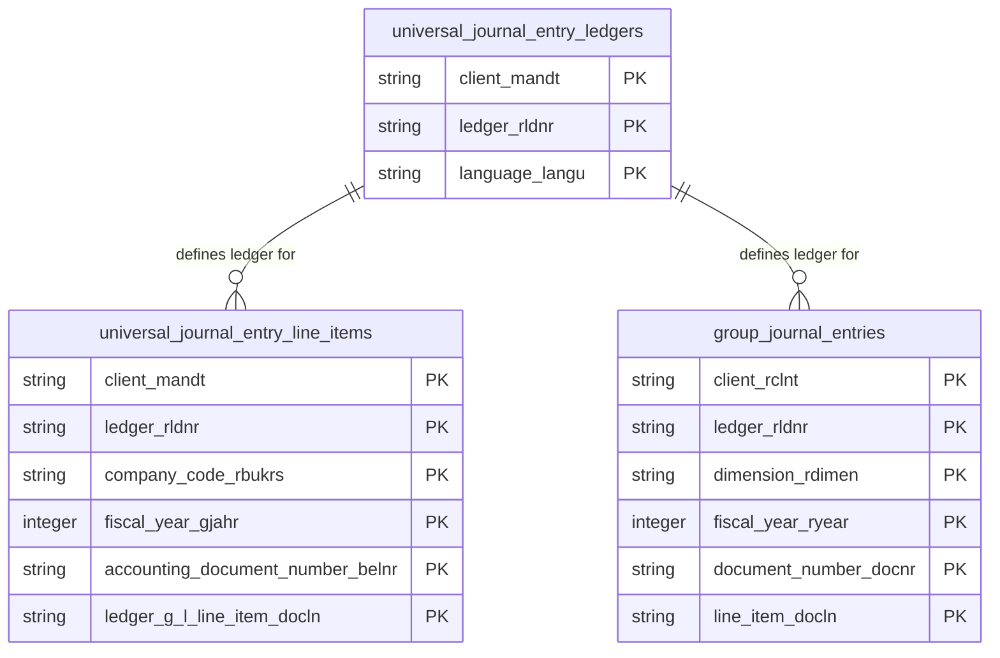

# Universal Journal Data Product

This data product includes information about SAP universal journal from the Financial Accounting (FI), Controlling (CO) module in the Finance domain in SAP S/4HANA. It exposes the unified, high-fidelity financial ledger for balance sheet and P&L reporting. It constitutes the definitive source of truth for corporate fiscal consolidation, cost center controlling, and AI-driven variance analyses.

## 1. Overview & Business Value

*   **Business Purpose:** Exposes the unified, high-fidelity financial ledger for balance sheet and P&L reporting. It constitutes the definitive source of truth for corporate fiscal consolidation, cost center controlling, and AI-driven variance analyses.

*   **Key Metrics & Use Cases:**
    *   **Metric/Use Case 1:** Unified enterprise reporting and operational tracking.
    *   **Metric/Use Case 2:** High-fidelity analytics and AI-ready data ingestion.

## 2. Data Assets Catalog

This data product exposes the following BigQuery data assets:

| Data Asset | Description | Source Systems |
| :--- | :--- | :--- |
| `universal_journal_entry_line_items` | This view is based on SAP S/4HANA Financial Accounting (FI), Controlling (CO) module in the Finance domain and provides complete journal entry details from S/4HANA's unified finance ledger (ACDOCA), supporting balance sheet, P&L, and variance analysis reporting. The data is captured at the granularity of Client (System), Ledger, Company Code, Fiscal Year, Accounting Document Number, and Ledger G L Line Item, ensuring a unique audit trail for every record. | `SAP S/4HANA` |
| `universal_journal_entry_ledgers` | This view is based on SAP S/4HANA Financial Accounting (FI), Controlling (CO) module in the Finance domain and provides a master list of ledgers defined in S/4HANA from FINSC_LEDGER, enriched with multi-lingual text descriptions from FINSC_LEDGER_T. The data is captured at the granularity of Client (System), Ledger, and Language, ensuring a unique audit trail for every record. | `SAP S/4HANA` |
| `group_journal_entries` | This view is based on SAP S/4HANA Financial Accounting (FI), Controlling (CO) module in the Finance domain and provides group-level consolidation journal entries from S/4HANA's ACDOCU table, supporting corporate financial consolidation reporting. The data is captured at the granularity of Client (System), Ledger, Dimension Rdimen, Fiscal Year, Document Number, and Line Item, ensuring a unique audit trail for every record. | `SAP S/4HANA` |### Entity Relationship Diagram (ERD)

## 3. Data Foundation & Source Tables

To build these assets, the following source tables must be available in the data foundation layer:

| Source Table | Name / Description | System Source | Used by Asset(s) |
| :--- | :--- | :--- | :--- |
| `acdoca` | Universal Journal Entry Line Items | `S4-only` | `universal_journal_entry_line_items` |
| `finsc_ledger` | Real Ledgers | `S4-only` | `universal_journal_entry_ledgers` |
| `finsc_ledger_t` | Ledger Descriptions | `S4-only` | `universal_journal_entry_ledgers` |
| `acdocu` | Universal Journal Group Consolidation | `S4-only` | `group_journal_entries` |
| `tf200` | Consolidation Version | `S4-only` | `group_journal_entries` |
| `tf201` | Consolidation Version Text | `S4-only` | `group_journal_entries` |
| `fincs_ref_vers_r` | Reference Versions for Consolidation | `S4-only` | `group_journal_entries` |
| `tcurx` | Decimal Places for Currencies | `Common` | `universal_journal_entry_line_items`, `group_journal_entries` |

## 4. Transformations & Design Decisions

This section details the critical engineering and design decisions behind the transformations.

### A. Granularity & Primary Keys

* **universal_journal_entry_line_items:** Client (`client_mandt`), Ledger (`ledger_rldnr`), Company Code (`company_code_rbukrs`), Fiscal Year (`fiscal_year_gjahr`), Document Number (`accounting_document_number_belnr`), and Line Item (`ledger_g_l_line_item_docln`).
* **universal_journal_entry_ledgers:** Client (`client_mandt`), Ledger (`ledger_rldnr`), and Language (`language_langu`).
* **group_journal_entries:** Client (`client_rclnt`), Ledger (`ledger_rldnr`), Dimension (`dimension_rdimen`), Fiscal Year (`fiscal_year_ryear`), Document Number (`document_number_docnr`), and Line Item (`line_item_docln`).

### B. Joins & Relationship Logic

* **universal_journal_entry_line_items:** LEFT JOINed to `tcurx` to shift currency values for multiple transaction/local/group currency fields, and LEFT JOINed to `date_dimension` (`budat`) to resolve posting dates.
* **universal_journal_entry_ledgers:** `finsc_ledger` is LEFT JOINed to `finsc_ledger_t` on Client (`mandt`) and Ledger (`rldnr`) to resolve localized descriptions.
* **group_journal_entries:** LEFT JOINed to `tcurx` three times (matching `rtcur`, `rhcur`, and `rkcur` currencies) to shift respective transaction, local, and group amount fields, and LEFT JOINed to `date_dimension` (`budat`) to resolve posting dates.
* *Note on text joins:* Joining `finsc_ledger` with `finsc_ledger_t` can multiply rows per language key if multiple languages are active.

### C. Incremental Load Strategy

*   **Supported Materialization Types:** `incremental` | `table` | `view`
*   **Incremental Logic:**
* **universal_journal_entry_line_items:** Delta filter applied using `recordstamp` column on `acdoca`.
* **universal_journal_entry_ledgers:** Full load, no incremental filters applied.
* **group_journal_entries:** Delta filter applied using `recordstamp` column on `acdocu`.

### D. ERP Source System Differences (ECC vs. S/4HANA)

* **universal_journal_entry_line_items:** Table `acdoca` is specific to S/4HANA (Universal Journal architecture). ECC does not support this data product (ECC relies on split GL tables like `bseg`/`faglflexa`).
* **universal_journal_entry_ledgers:** Table `finsc_ledger` is specific to S/4HANA ledger architecture.
* **group_journal_entries:** Table `acdocu` is specific to S/4HANA group reporting consolidation.
* Field Selections:**
* **universal_journal_entry_line_items:** Includes nearly all attributes from `acdoca` (with BigQuery-compatible naming like replacing `_dataaging` with `dataaging`), excluding freely defined currencies.
* **universal_journal_entry_ledgers:** Selected fields cover ledger type classifications, extension properties, application owner references, and accounting principles.
* **group_journal_entries:** Retrieves consolidation keys (consolidation unit, group, version, chart of accounts) and financial figures with appropriate currency shifts.

### E. Field Conversions & Calculations

*   **Currency & Conversions:** Standardized using built-in currency shift logic for currencies with non-standard decimal formats (e.g. JPY, IDR).
*   **Field Selections:** Enriched with operational data and standard language text mappings where applicable.

## 5. Change Log

| Date | Type of change | Change details |
| :--- | :--- | :--- |
| 24.06.2026 | Release | Release candidate validation completed. |
