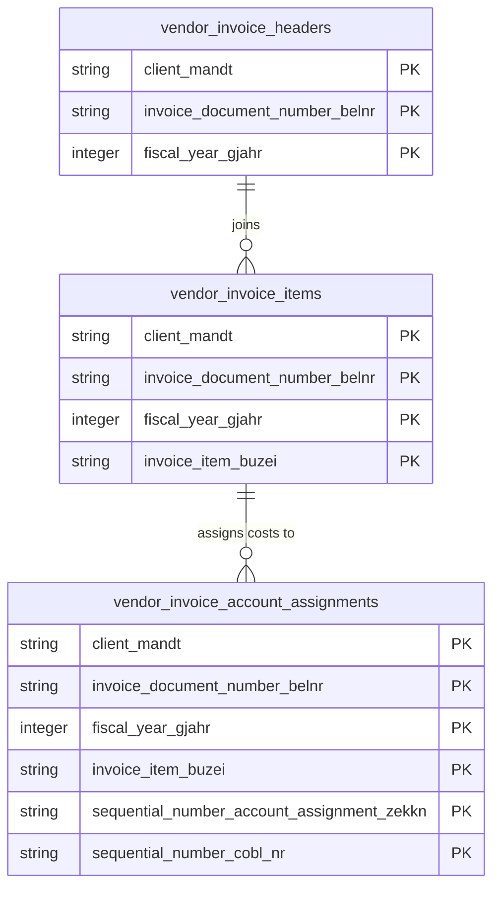

# Vendor Invoices Data Product

This data product includes information about SAP vendor invoices from the Materials Management (MM), Financial Accounting (FI) module in the Finance, Supply Chain domain in SAP S/4HANA or SAP ECC. Aggregates accounts payable invoice lifecycle logs, capturing document headers, logistical matching criteria, and processing statuses. Facilitates AP automation auditing, cash discount realization tracking, and payment run efficiency modeling.

## 1. Overview & Business Value

*   **Business Purpose:** Aggregates accounts payable invoice lifecycle logs, capturing document headers, logistical matching criteria, and processing statuses. Facilitates AP automation auditing, cash discount realization tracking, and payment run efficiency modeling.

*   **Key Metrics & Use Cases:**
    *   **Metric/Use Case 1:** Unified enterprise reporting and operational tracking.
    *   **Metric/Use Case 2:** High-fidelity analytics and AI-ready data ingestion.

## 2. Data Assets Catalog

This data product exposes the following BigQuery data assets:

| Data Asset | Description | Source Systems |
| :--- | :--- | :--- |
| `vendor_invoice_headers` | This view is based on SAP S/4HANA or SAP ECC Materials Management (MM), Financial Accounting (FI) module in the Finance, Supply Chain domain and provides a unified header-level transaction view of supplier incoming invoices from SAP RBKP, enabling auditing of gross amounts, tax details, and cash discounts. The data is captured at the granularity of Client (System), Invoice Document Number, and Fiscal Year, ensuring a unique audit trail for every record. | `SAP ECC` / `SAP S/4HANA` |
| `vendor_invoice_items` | This view is based on SAP S/4HANA or SAP ECC Materials Management (MM), Financial Accounting (FI) module in the Finance, Supply Chain domain and provides line-item details of supplier incoming invoices from SAP RSEG, tracking invoiced quantities, materials, and purchase order references. The data is captured at the granularity of Client (System), Invoice Document Number, Fiscal Year, and Invoice Item, ensuring a unique audit trail for every record. | `SAP ECC` / `SAP S/4HANA` |
| `vendor_invoice_account_assignments` | This view is based on SAP S/4HANA or SAP ECC Materials Management (MM), Financial Accounting (FI) module in the Finance, Supply Chain domain and provides financial account assignments for invoice line items from SAP RBCO, mapping transactions directly to cost centers, profit centers, G/L accounts, and WBS elements. The data is captured at the granularity of Client (System), Invoice Document Number, Fiscal Year, Invoice Item, Sequential Number Account Assignment, and Sequential Number Cobl, ensuring a unique audit trail for every record. | `SAP ECC` / `SAP S/4HANA` |### Entity Relationship Diagram (ERD)

## 3. Data Foundation & Source Tables

To build these assets, the following source tables must be available in the data foundation layer:

| Source Table | Name / Description | System Source | Used by Asset(s) |
| :--- | :--- | :--- | :--- |
| `rbkp` | Operational source table. | `Common` | `vendor_invoice_headers`, `vendor_invoice_items`, `vendor_invoice_account_assignments` |
| `rseg` | Operational source table. | `Common` | `vendor_invoice_items` |
| `rbco` | Operational source table. | `Common` | `vendor_invoice_account_assignments` |

## 4. Transformations & Design Decisions

This section details the critical engineering and design decisions behind the transformations.

### A. Granularity & Primary Keys

* **vendor_invoice_headers:** Client (`client_mandt`), Invoice Document Number (`invoice_document_number_belnr`), and Fiscal Year (`fiscal_year_gjahr`).
* **vendor_invoice_items:** Client (`client_mandt`), Invoice Document Number (`invoice_document_number_belnr`), Fiscal Year (`fiscal_year_gjahr`), and Invoice Item Number (`invoice_item_buzei`).
* **vendor_invoice_account_assignments:** Client (`client_mandt`), Invoice Document Number (`invoice_document_number_belnr`), Fiscal Year (`fiscal_year_gjahr`), Invoice Item Number (`invoice_item_buzei`), Sequence Number of Account Assignment (`sequential_number_account_assignment_zekkn`), and Sequential Number (`sequential_number_cobl_nr`).

### B. Joins & Relationship Logic

* `vendor_invoice_headers`: Joins left with `currency_decimal` (constructed from `tcurx` via helper include) on currency code `waers` to perform currency decimal shifting. Joins left with `date_dimension` on posting date `budat` and document date `bldat`.
* `vendor_invoice_items`: Joins left with `rbkp` on `mandt`, `belnr`, `gjahr` to obtain currency code `waers` for currency decimal shifting. Joins left with `currency_decimal` and `date_dimension` on `retduedt`.
* `vendor_invoice_account_assignments`: Joins left with `rbkp` on `mandt`, `belnr`, `gjahr` to obtain currency code `waers`. Joins left with `currency_decimal` and `date_dimension` on `bzdat` and `ledat`.

### C. Incremental Load Strategy

*   **Supported Materialization Types:** `incremental` | `table` | `view`
*   **Incremental Logic:**
* `vendor_invoice_headers`: Filtered incrementally using `rbkp.recordstamp`.
* `vendor_invoice_items`: Filtered incrementally using `rseg.recordstamp`.
* `vendor_invoice_account_assignments`: Filtered incrementally using `rbco.recordstamp`.

### D. ERP Source System Differences (ECC vs. S/4HANA)

* `vendor_invoice_headers`: None.
* `vendor_invoice_items`: None.
* `vendor_invoice_account_assignments`: None.
* **Field Selections:**
* `vendor_invoice_headers`: Exposes gross amount `rmwwr`, unplanned delivery costs `beznk`, value-added tax `wmwst1`, and discount amount `wskto` shifted to correct decimals. Selects key fields and all business-relevant fields aliased to standard V7 `snake_case`.
* `vendor_invoice_items`: Exposes line amount `wrbtr` and delivery costs `bnkan` shifted to correct decimals.
* `vendor_invoice_account_assignments`: Exposes transaction amount `wrbtr` and distribution amount `bnkan_fw` shifted to correct decimals. Selects WBS element, cost centers, and G/L accounts.

### E. Field Conversions & Calculations

*   **Currency & Conversions:** Standardized using built-in currency shift logic for currencies with non-standard decimal formats (e.g. JPY, IDR).
*   **Field Selections:** Enriched with operational data and standard language text mappings where applicable.

## 5. Change Log

| Date | Type of change | Change details |
| :--- | :--- | :--- |
| 24.06.2026 | Release | Release candidate validation completed. |
