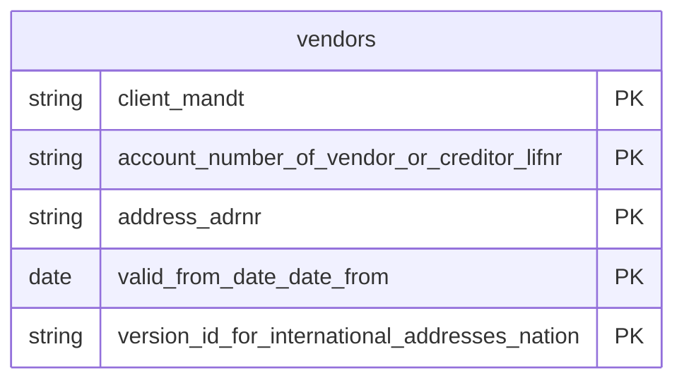

# Vendors Data Product

This data product includes information about SAP vendors from the Materials Management (MM), Financial Accounting (FI) module in the Supply Chain, Finance domain in SAP S/4HANA or SAP ECC. It profiles the centralized vendor master catalog, integrating operational identifiers, organizational extensions, and bank accounting frameworks. Essential for SRM (Supplier Relationship Management), vendor risk modeling, and strategic sourcing.

## 1. Overview & Business Value

*   **Business Purpose:** Profiles the centralized vendor master catalog, integrating operational identifiers, organizational extensions, and bank accounting frameworks. Essential for SRM (Supplier Relationship Management), vendor risk modeling, and strategic sourcing.

*   **Key Metrics & Use Cases:**
    *   **Metric/Use Case 1:** Unified enterprise reporting and operational tracking.
    *   **Metric/Use Case 2:** High-fidelity analytics and AI-ready data ingestion.

## 2. Data Assets Catalog

This data product exposes the following BigQuery data assets:

| Data Asset | Description | Source Systems |
| :--- | :--- | :--- |
| `vendors` | This view is based on SAP S/4HANA or SAP ECC Materials Management (MM), Financial Accounting (FI) module in the Supply Chain, Finance domain and provides a comprehensive view of vendor master records by merging base supplier information (LFA1) with detailed physical address details (ADRC). The data is captured at the granularity of Client (System), Account Number Of Vendor Or Creditor, Address, Valid From Date Date, and Version Id For International Addresses Nation, ensuring a unique audit trail for every record. | `SAP ECC` / `SAP S/4HANA` |### Entity Relationship Diagram (ERD)

## 3. Data Foundation & Source Tables

To build these assets, the following source tables must be available in the data foundation layer:

| Source Table | Name / Description | System Source | Used by Asset(s) |
| :--- | :--- | :--- | :--- |
| `lfa1` | Operational source table. | `Common` | `vendors` |
| `adrc` | Operational source table. | `Common` | `vendors` |

## 4. Transformations & Design Decisions

This section details the critical engineering and design decisions behind the transformations.

### A. Granularity & Primary Keys

* **vendors:** Client (`client_mandt`), Supplier Account Number (`account_number_of_vendor_or_creditor_lifnr`), Address Number (`address_adrnr`), Valid From Date (`valid_from_date_date_from`), and Version ID for International Addresses (`version_id_for_international_addresses_nation`).

### B. Joins & Relationship Logic

* **vendors:** `lfa1` is LEFT JOINed to `adrc` on Client (`mandt` = `client`) and Address Number (`adrnr` = `addrnumber`).
* *Note on filtering:* To ensure only the current default address version is joined, it filters on the address validity limit (`date_to = '9999-12-31'`) and defaults to the standard international version (where `nation` is empty/null).
* *Note on text joins:* No text tables are joined in this model.

### C. Incremental Load Strategy

*   **Supported Materialization Types:** `incremental` | `table` | `view`
*   **Incremental Logic:**
* **vendors:** Evaluates changes on both `lfa1` and `adrc` using the `GREATEST` of their respective `recordstamp` columns.

### D. ERP Source System Differences (ECC vs. S/4HANA)

* **vendors:** Shared unified design, no structural differences exist between ECC and S/4HANA implementations.
* Field Selections:**
* **vendors:** Merges administrative creation details, tax IDs, blockage flags, bank parameters from `lfa1` with descriptive city, street, building, country, and contact coordinates from `adrc`.

### E. Field Conversions & Calculations

*   **Currency & Conversions:** Standardized using built-in currency shift logic for currencies with non-standard decimal formats (e.g. JPY, IDR).
*   **Field Selections:** Enriched with operational data and standard language text mappings where applicable.

## 5. Change Log

| Date | Type of change | Change details |
| :--- | :--- | :--- |
| 24.06.2026 | Release | Release candidate validation completed. |
