# Sales Performance Data Product

This data product includes information about sales performance from the Sales and Distribution (SD) module in SAP S/4HANA or SAP ECC. This data product provides a comprehensive view of sales performance across the organization. It integrates data from various foundational SAP data products to enable strategic sales insights and performance analysis.

## 1. Overview & Business Value

*   **Business Purpose:** Consolidates sales document headers, items, statuses, customer details, product records, sales organization details, and delivery information to provide a single, unified analytical model for sales performance analysis. This helps sales operations and executives monitor sales volumes, check delivery fulfillment, and track overdue deliveries.
*   **Key Metrics & Use Cases:**
    *   **Sales Revenue & Performance:** Monitor net sales values by division, sales organization, or customer over time to evaluate sales performance and identify growth trends.
    *   **Fulfillment Tracking:** Analyze overall delivery status and identify order blockages to streamline fulfillment processes.
    *   **Overdue Deliveries:** Identify and track sales orders where delivery is overdue to resolve logistics bottlenecks and improve customer satisfaction.

## 2. Data Assets Catalog

This data product exposes the following BigQuery data assets:

| Data Asset | Description | Source Systems |
| :--- | :--- | :--- |
| `sales_performance` | This view is based on the SAP S/4HANA or SAP ECC Sales and Distribution (SD) module and provides detailed performance metrics across sales organizations, divisions, customers, and materials. The data is captured at the granularity of Client, Sales Document Number, and Sales Document Item Number. | `SAP ECC` / `SAP S/4HANA` |

<!-- ERD_START -->
### Entity Relationship Diagram (ERD)

```mermaid
erDiagram
    "sales_document_headers [Foundation]" {
        STRING client_mandt PK
        STRING document_number_vbeln PK
    }
    "sales_document_items [Foundation]" {
        STRING client_mandt PK
        STRING document_number_vbeln PK
        STRING item_number_posnr PK
    }
    "sales_document_header_statuses [Foundation]" {
        STRING client_mandt PK
        STRING sales_document_vbeln PK
    }
    "sales_document_item_statuses [Foundation]" {
        STRING client_mandt PK
        STRING sales_document_vbeln PK
        STRING sales_document_item_posnr PK
    }
    "customers [Foundation]" {
        STRING client_mandt PK
        STRING customer_number_kunnr PK
        STRING language_key_spras PK
    }
    "materials [Foundation]" {
        STRING client_mandt PK
        STRING material_number_matnr PK
        STRING language_key_spras PK
    }
    "sales_organizations [Foundation]" {
        STRING client_mandt PK
        STRING sales_organization_vkorg PK
        STRING language_key_spras PK
    }
    "divisions [Foundation]" {
        STRING client_mandt PK
        STRING division_spart PK
        STRING language_key_spras PK
    }
    "delivery_document_items [Foundation]" {
        STRING client_mandt PK
        STRING delivery_document_vbeln PK
        STRING item_number_posnr PK
    }
    "sales_performance [Data Product]" {
        STRING client_mandt PK
        STRING sales_document_number_vbeln PK
        STRING sales_document_item_number_posnr PK
    }

    "sales_document_headers [Foundation]" ||--|| "sales_performance [Data Product]" : "joins via client_mandt and vbeln"
    "sales_document_items [Foundation]" ||--|| "sales_performance [Data Product]" : "projects and transforms"
    "sales_document_header_statuses [Foundation]" ||--o{ "sales_performance [Data Product]" : "joins via client_mandt and vbeln"
    "sales_document_item_statuses [Foundation]" ||--o{ "sales_performance [Data Product]" : "joins via client_mandt, vbeln, and posnr"
    "customers [Foundation]" ||--o{ "sales_performance [Data Product]" : "joins via client_mandt and kunnr"
    "materials [Foundation]" ||--o{ "sales_performance [Data Product]" : "joins via client_mandt and matnr"
    "sales_organizations [Foundation]" ||--o{ "sales_performance [Data Product]" : "joins via client_mandt and vkorg"
    "divisions [Foundation]" ||--o{ "sales_performance [Data Product]" : "joins via client_mandt and spart"
    "delivery_document_items [Foundation]" ||--o{ "sales_performance [Data Product]" : "joins via client_mandt and vgbel/vgpos"
```

<!-- ERD_END -->

## 3. Data Product Dependencies

To build these assets, data products with the following module types must be available and enabled:

| Required Module Type | Description | Namespace / Source | Used by Asset(s) |
| :--- | :--- | :--- | :--- |
| `cortex.sap.products.customers` | Customers master data catalog. | `cortex` | `sales_performance` |
| `cortex.sap.products.sales_documents` | Sales transactions (headers, items, and statuses) product. | `cortex` | `sales_performance` |
| `cortex.sap.products.delivery_documents` | Delivery details and items transactions. | `cortex` | `sales_performance` |
| `cortex.sap.products.sales_organizational_structure` | Sales organizations and divisions master data product. | `cortex` | `sales_performance` |
| `cortex.sap.products.materials` | General material master catalog. | `cortex` | `sales_performance` |

## 4. Transformations & Design Decisions

This section details the critical engineering and design decisions behind the transformations.

### A. Granularity & Primary Keys

*   **`sales_performance`**: Granularity is one row per sales document item line. Primary keys are `client_mandt`, `sales_document_number_vbeln`, and `sales_document_item_number_posnr`.

### B. Joins & Relationship Logic

*   **`sales_performance`**:
    *   Starts with `sales_document_headers` (`header`) joined with `sales_document_items` (`item`) to extract core transactional records.
    *   JOINed with `sales_document_header_statuses` (`header_status`) and `sales_document_item_statuses` (`item_status`) to get delivery and overall order statuses.
    *   LEFT JOINed to `customers` (`customer`) on `client_mandt` and `kunnr` (filtered by configurable language `filters.language`, default `'E'`, address version `filters.address_version_nation`, default `''`, and active address `valid_to_date_date_to = '9999-12-31'`) to resolve customer name.
    *   LEFT JOINed to `materials` (`product`) on `client_mandt` and `matnr` (filtered by configurable language `filters.language`, default `'E'`) to resolve product descriptions.
    *   LEFT JOINed to `sales_organizations` (`salesorg`) on `client_mandt` and `vkorg` (filtered by configurable language `filters.language`, default `'E'`) to resolve sales organization names.
    *   LEFT JOINed to `divisions` (`division`) on `client_mandt` and `spart` (filtered by configurable language `filters.language`, default `'E'`) to resolve division names.
    *   LEFT JOINed to `delivery_document_items` via `delivered_quantity` CTE (grouped by referenced sales document/item) to determine actual delivered quantity.

### C. Change Log

| Date | Type of change | Change details |
| :--- | :--- | :--- |
| 14.07.2026 | Release | Initial release candidate validation completed. |
| 29.07.2026 | Bug Fix | Updated primary key to (client_mandt, sales_document_number_vbeln, sales_document_item_number_posnr) and added configurable language & address version filters. |

