# Supplier Spend Analysis Data Product

This data product includes information about supplier spend analysis from the Materials Management (MM) module in the Supply Chain domain in SAP S/4HANA or SAP ECC. This data product provides a comprehensive view of supplier spend across the organization. It integrates data from various SAP modules to enable strategic procurement insights and supplier performance analysis.

## 1. Overview & Business Value

*   **Business Purpose:** Consolidates purchasing document items, headers, vendor records, materials, and organization details to provide a single, unified analytical model for spend analysis. This helps procurement teams identify cost-saving opportunities, evaluate vendor concentration risk, and track open and overdue commitments.
*   **Key Metrics & Use Cases:**
    *   **Spend Visibility & Sourcing:** Analyze purchasing patterns by vendor, material group, or geography to optimize procurement pricing and negotiate volume discounts.
    *   **Operational Commitment Tracking:** Track open PO amounts and overdue deliveries to prevent inventory stockouts and manage working capital.

## 2. Data Assets Catalog

This data product exposes the following BigQuery data assets:

| Data Asset | Description | Source Systems |
| :--- | :--- | :--- |
| `supplier_spend_analysis` | This view is based on SAP S/4HANA or SAP ECC Materials Management (MM) module in the Supply Chain domain and provides instant visibility into the supplier spend position across materials, vendors, and purchasing organizations to maximize procurement value. The data is captured at the granularity of Client (System), Purchasing Document Number, and Item Number Of Purchasing Document, ensuring a unique audit trail for every record. | `SAP ECC` / `SAP S/4HANA` |

<!-- ERD_START -->
### Entity Relationship Diagram (ERD)

```mermaid
erDiagram
    "purchasing_document_items [Foundation]" {
        STRING client_mandt PK
        STRING purchasing_document_number_ebeln PK
        STRING item_number_of_purchasing_document_ebelp PK
    }
    "purchasing_document_headers [Foundation]" {
        STRING client_mandt PK
        STRING purchasing_document_number_ebeln PK
    }
    "vendors [Foundation]" {
        STRING client_mandt PK
        STRING account_number_of_vendor_or_creditor_lifnr PK
        STRING address_adrnr PK
        DATE valid_from_date_date_from PK
        STRING version_id_for_international_addresses_nation PK
    }
    "materials [Foundation]" {
        STRING client_mandt PK
        STRING material_number_matnr PK
        STRING language_key_spras PK
    }
    "purchasing_organizations [Foundation]" {
        STRING client_mandt PK
        STRING purchasing_organization_ekorg PK
    }
    "purchasing_document_schedule_lines [Foundation]" {
        STRING client_mandt PK
        STRING purchasing_document_number_ebeln PK
        STRING item_number_of_purchasing_document_ebelp PK
        STRING schedule_line_number_etenr PK
    }
    "supplier_spend_analysis [Data Product]" {
        STRING client_mandt PK
        STRING purchasing_document_number_ebeln PK
        STRING item_number_of_purchasing_document_ebelp PK
    }

    "purchasing_document_items [Foundation]" ||--|| "supplier_spend_analysis [Data Product]" : "projects and transforms"
    "purchasing_document_headers [Foundation]" ||--o{ "supplier_spend_analysis [Data Product]" : "joins via ebeln"
    "vendors [Foundation]" ||--o{ "supplier_spend_analysis [Data Product]" : "joins via lifnr"
    "materials [Foundation]" ||--o{ "supplier_spend_analysis [Data Product]" : "joins via matnr"
    "purchasing_organizations [Foundation]" ||--o{ "supplier_spend_analysis [Data Product]" : "joins via ekorg"
    "purchasing_document_schedule_lines [Foundation]" ||--o{ "supplier_spend_analysis [Data Product]" : "joins via ebeln and ebelp"
```

<!-- ERD_END -->

## 3. Data Product Dependencies

To build these assets, data products with the following module types must be available and enabled:

| Required Module Type | Description | Namespace / Source | Used by Asset(s) |
| :--- | :--- | :--- | :--- |
| `cortex.materials` | General material master data product. | `cortex` | `supplier_spend_analysis` |
| `cortex.purchasing_documents` | Procurement transactions (headers, items, schedule lines) product. | `cortex` | `supplier_spend_analysis` |
| `cortex.purchasing_organizational_structure` | Purchasing groups and organizations master data product. | `cortex` | `supplier_spend_analysis` |
| `cortex.vendors` | Centralized vendor master catalog product. | `cortex` | `supplier_spend_analysis` |

## 4. Transformations & Design Decisions

This section details the critical engineering and design decisions behind the transformations.

### A. Granularity & Primary Keys

*   **`supplier_spend_analysis`**: Granularity is one row per purchasing document item line. Primary keys are `client_mandt`, `purchasing_document_number_ebeln`, and `item_number_of_purchasing_document_ebelp`.

### B. Joins & Relationship Logic

*   **`supplier_spend_analysis`**:
    *   Starts with `purchasing_document_items` (`i`).
    *   LEFT JOINed to `purchasing_document_headers` (`h`) on `client_mandt` and `ebeln` to get purchasing document date and vendor details.
    *   LEFT JOINed to `vendors` (`v`) on `client_mandt` and `lifnr` to resolve vendor names, deletion flags, and locations. Filtered on `valid_to_date_date_to = '9999-12-31'` and address version `nation` (configurable via `filters.address_version_nation`, default `''`) to ensure 1 active address per vendor.
    *   LEFT JOINed to `materials` (`m`) on `client_mandt` and `matnr` to enrich material description and categorization. Filtered on language key (configurable via `filters.language`, default `'E'`) to ensure 1 material description per item.
    *   LEFT JOINed to `purchasing_organizations` (`o`) on `client_mandt` and `ekorg` to resolve purchasing organization text.
    *   LEFT JOINed to `purchasing_document_schedule_lines` (`oq`) grouped by item to calculate open net amounts for purchase order quantities.

### C. Change Log

| Date | Type of change | Change details |
| :--- | :--- | :--- |
| 13.07.2026 | Release | Initial release candidate validation completed. |
| 28.07.2026 | Bug Fix | Added configurable language and address version filters to material and vendor joins to prevent row duplication. |

