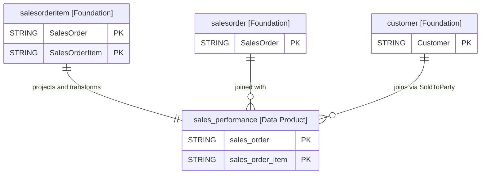

# Sales Performance Data Product

This data product provides a comprehensive reporting view of sales performance from the Sales and Distribution (SD) module in SAP Business Data Connectivity (BDC). It integrates sales order header and item data with customer details and calendar date dimensions to evaluate sales revenues, delivery fulfillment, and overdue tracking. By unifying operational sales metrics and time dimensions into a single view, this product accelerates enterprise analytics, executive dashboards, and AI-driven sales forecasting.

## 1. Overview & Business Value

*   **Business Purpose:** Delivers a consolidated, reporting-ready data asset to track sales order execution, analyze order net values, monitor fulfillment timelines, and identify delivery delays across sales organizations.
*   **Key Metrics & Use Cases:**
    *   **Sales Performance & Revenue Analysis:** Evaluate sales order volume (`order_quantity`), total order values (`total_net_amount`), and item-level net amounts (`net_amount`) segmented by sales organization, division, and distribution channel.
    *   **Fulfillment & Overdue Tracking:** Monitor item and header delivery statuses (`delivery_status`, `total_delivery_status`, `overall_total_delivery_status`) and identify overdue deliveries (`is_delivery_overdue`) when current dates exceed requested delivery dates.
    *   **Time-Based Reporting:** Analyze sales performance trends across document and delivery years, quarters, and months (`year_of_sales_document`, `month_of_requested_delivery`, etc.).

## 2. Data Assets Catalog

This data product exposes the following BigQuery data assets:

| Data Asset | Description | Source Systems |
| :--- | :--- | :--- |
| `sales_performance` | Sales performance reporting view integrating sales order headers, order items, customer details, and delivery statuses with date dimensions and overdue delivery indicators. | `SAP BDC` (`SAP S/4HANA` / `SAP ECC`) |

## 3. Data Foundation & Source Tables

To build these assets, the following source tables must be available in the data foundation layer:

| Source Table | Name / Description | System Source | Used by Asset(s) |
| :--- | :--- | :--- | :--- |
| `salesorder` | Sales Order Header Data | `SAP BDC` | `sales_performance` |
| `salesorderitem` | Sales Order Item Data | `SAP BDC` | `sales_performance` |
| `customer` | Customer Master Data | `SAP BDC` | `sales_performance` |

### Entity-Relationship (ER) Diagram

<!-- ERD_START -->

<!-- ERD_END -->

## 4. Transformations & Design Decisions

This section details the critical engineering and design decisions behind the transformations.

### A. Granularity & Primary Keys

*   **`sales_performance`**: The grain of this asset is one row per sales order item (`sales_order` + `sales_order_item`). Row uniqueness is strictly enforced on `sales_order` and `sales_order_item`.

### B. Joins & Relationship Logic

*   **`sales_performance`**:
    *   Joined `salesorder` (`header`) with `salesorderitem` (`item`) on `header.SalesOrder = item.SalesOrder`.
    *   Left joined `customer` on `header.SoldToParty = customer.Customer`.
    *   Left joined `date_dimension` twice: once on `header.SalesOrderDate = dimensional_document_date.date` for document creation calendar metrics, and once on `header.RequestedDeliveryDate = dimensional_delivery_date.date` for requested delivery calendar metrics.
    *   *Rationale:* INNER JOIN between header and item ensures only valid line items are projected. LEFT JOIN to customer ensures sales order data is preserved even if customer details are missing.
    *   *Gotchas & Filters:* Delivery overdue flag (`is_delivery_overdue`) evaluates whether `CURRENT_DATE()` has passed `header.RequestedDeliveryDate` and `item.DeliveryStatus` is not complete (configurable via filter `delivery_status_complete`, defaulting to `['C']`).

### C. Incremental Load Strategy

*   **Supported Materialization Types:** `view`
*   **Incremental Logic:**
    *   **`sales_performance`**: Deployed as a Dataform `view` due to BDC delta sharing patterns.

### D. ERP Source System Differences (ECC vs. S/4HANA)

*   **`sales_performance`**:
    *   *Comparison:* Standardized SAP BDC schema abstraction maps both ECC and S/4HANA underlying tables (`VBAK`, `VBAP`, `KNA1`) into unified camelCase BDC entities (`salesorder`, `salesorderitem`, `customer`).

### E. Field Conversions & Calculations

*   **Calculated Fields:**
    *   `is_delivery_overdue`: `CASE WHEN CURRENT_DATE() > header.RequestedDeliveryDate AND item.DeliveryStatus NOT IN ('C') THEN TRUE ELSE FALSE END`
    *   Date dimension enrichments: Projects `cal_year`, `cal_month`, `cal_quarter` for both sales document date and requested delivery date.

## 5. Change Log

| Version | Type of change | Change details |
| :--- | :--- | :--- |
| 7.0.0 | Feature | Initial release of the SAP BDC Sales Performance Data Product view. |
