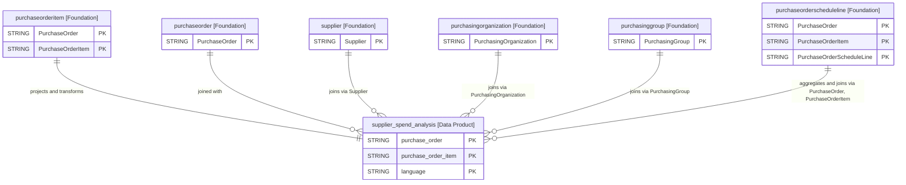

# Supplier Spend Analysis Data Product

This data product provides a comprehensive reporting view of supplier spend from the procurement domain in SAP Business Data Cloud (SAP BDC). It combines purchase order item and header details with supplier master data, purchasing organizations, purchasing groups, and calendar date dimensions to evaluate supplier spend, delivery fulfillment, and overdue tracking. By unifying operational procurement metrics and temporal dimensions into a single view, this product accelerates spend analytics, supplier performance dashboards, and AI-driven procurement forecasting.

## 1. Overview & Business Value

*   **Business Purpose:** Delivers a consolidated, reporting-ready data asset to track spend, analyze purchase order net values, monitor supplier delivery performance, and identify overdue purchase orders across purchasing organizations and groups.
*   **Key Metrics & Use Cases:**
    *   **Supplier Spend & Performance Analysis:** Evaluate purchasing volumes (`order_quantity`), item-level net amounts (`net_amount`), and average spend per unit (`average_spend_per_unit`) segmented by supplier, purchasing organization, and purchasing group.
    *   **Fulfillment & Overdue Tracking:** Monitor delivery completion status (`delivery_completed_flag`) and identify overdue purchase orders (`is_overdue`) when current dates exceed order dates.
    *   **Time-Based Reporting:** Analyze spend trends across purchase order years, quarters, and months (`year_of_purchase_order`, `month_of_purchase_order`, `quarter_of_purchase_order`).

## 2. Data Assets Catalog

This data product exposes the following BigQuery data assets:

| Data Asset | Description | Source Systems |
| :--- | :--- | :--- |
| `supplier_spend_analysis` | Supplier spend analysis reporting view integrating purchase order headers, order items, supplier details, purchasing organizations, and purchasing groups with date dimensions and overdue indicators. | `SAP BDC` (`SAP S/4HANA`) |

## 3. Data Foundation & Source Tables

To build these assets, the following source tables must be available in the data foundation layer:

| Source Table | Name / Description | System Source | Used by Asset(s) |
| :--- | :--- | :--- | :--- |
| `purchaseorderitem` | Purchase Order Item Data | `SAP BDC` | `supplier_spend_analysis` |
| `purchaseorder` | Purchase Order Header Data | `SAP BDC` | `supplier_spend_analysis` |
| `supplier` | Supplier Master Data | `SAP BDC` | `supplier_spend_analysis` |
| `purchasingorganization` | Purchasing Organization Data | `SAP BDC` | `supplier_spend_analysis` |
| `purchasinggroup` | Purchasing Group Data | `SAP BDC` | `supplier_spend_analysis` |
| `purchaseorderscheduleline` | Purchase Order Schedule Line Data | `SAP BDC` | `supplier_spend_analysis` |

### Entity-Relationship (ER) Diagram

<!-- ERD_START -->

<!-- ERD_END -->

## 4. Transformations & Design Decisions

This section details the critical engineering and design decisions behind the transformations.

### A. Granularity & Primary Keys

*   **`supplier_spend_analysis`**: The grain of this asset is one row per purchase order item (`purchase_order` + `purchase_order_item` + `language`). Row uniqueness is strictly enforced on `purchase_order`, `purchase_order_item`, and `language`.

### B. Joins & Relationship Logic

*   **`supplier_spend_analysis`**:
    *   Joined `purchaseorderitem` (`i`) with `purchaseorder` (`h`) on `i.PurchaseOrder = h.PurchaseOrder`.
    *   Left joined `supplier` (`v`) on `h.Supplier = v.Supplier`.
    *   Left joined `purchasingorganization` (`o`) on `h.PurchasingOrganization = o.PurchasingOrganization`.
    *   Left joined `purchasinggroup` (`pg`) on `i.PurchasingGroup = pg.PurchasingGroup`.
    *   Left joined `open_quantities` CTE (aggregated from `purchaseorderscheduleline`) on `i.PurchaseOrder = oq.PurchaseOrder AND i.PurchaseOrderItem = oq.PurchaseOrderItem` to get `open_po_net_amount`.
    *   Left joined `date_dimension` on `h.PurchaseOrderDate = dimensional_purchase_order_date.date`.
    *   *Rationale:* INNER JOIN between header and item ensures only valid line items are projected. LEFT JOIN to master/config tables (supplier, org, group, date) ensures purchase order data is preserved even if master data details are missing.
    *   *Gotchas & Filters:* Overdue flag (`is_overdue`) evaluates whether `COALESCE(i.IsCompletelyDelivered, false) = false` and `h.PurchaseOrderDate` is more than 30 days in the past.

### C. Incremental Load Strategy

*   **Supported Materialization Types:** `view`
*   **Incremental Logic:**
    *   **`supplier_spend_analysis`**: Deployed as a Dataform `view` due to BDC delta sharing patterns.

### D. ERP Source System Differences (ECC vs. S/4HANA)

*   **`supplier_spend_analysis`**:
    *   *Comparison:* Standardized SAP BDC schema abstraction maps S/4HANA underlying tables (e.g. `EKKO`, `EKPO`, `LFA1`, `T024E`) into unified camelCase BDC entities.

### E. Field Conversions & Calculations

*   **Calculated Fields:**
    *   `active_vendor_indicator`: `CASE WHEN v.DeletionIndicator = true THEN false ELSE true END`
    *   `delivery_completed_flag`: `CASE WHEN i.IsCompletelyDelivered THEN 'X' ELSE '' END`
    *   `is_overdue`: `CASE WHEN COALESCE(i.IsCompletelyDelivered, false) = false AND h.PurchaseOrderDate < DATE_SUB(CURRENT_DATE(), INTERVAL 30 DAY) THEN true ELSE false END`
    *   `average_spend_per_unit`: `SAFE_DIVIDE(i.NetAmount, i.OrderQuantity)`

## 5. Change Log

| Version | Type of change | Change details |
| :--- | :--- | :--- |
| 7.0.0 | Feature | Initial release of the SAP BDC Supplier Spend Analysis Data Product view. |
